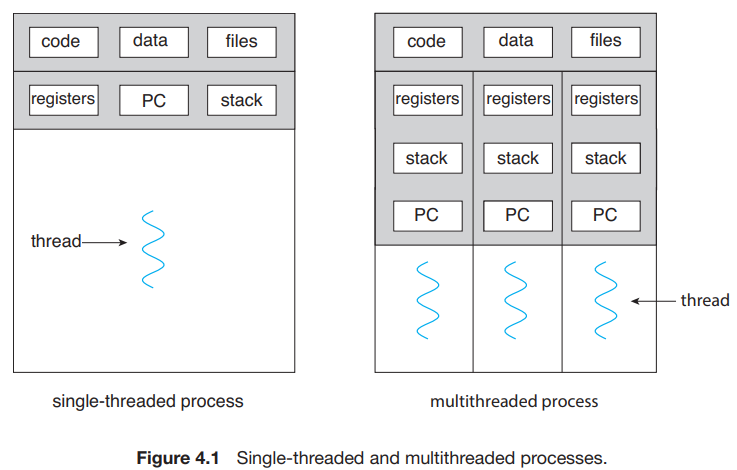
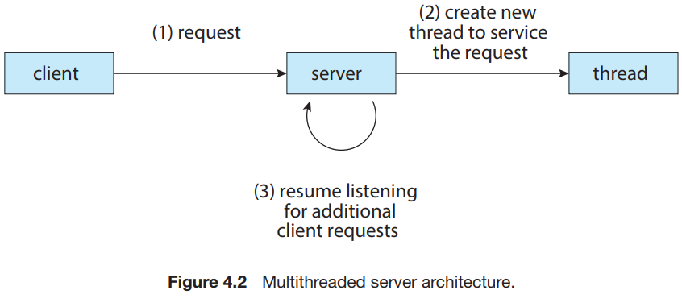

# 1. Overview

1. Motivation
2. Benefits

---

#### thread의 구성요소

- thread ID
- program counter PC
- register set
- stack

스레드는 같은 process 내의 다른 스레드와 code, data, OS resource를 공유한다.  
싱글 스레드보다 멀티스레드가 동시에 더 많은 일을 할 수 있다.

## 1. Motivation

#### multithreaded application 예시

- 썸네일 이미지 생성 프로그램 : 각 이미지 별로 thread를 만들어 thread 별로 이미지를 생성
- 웹 브라우저 : image 표시 중인 thread, 네트워크로부터 데이터를 받는 thread
- 워드 프로세서 : display thread, 키보드 입력을 받는 thread 등

### vs multi process

- 과거에 많이 쓰이던 방식
- process 생성에는 시간과 자원이 소모됨
- overhead : 중복된 process는 중복된 일을 하게됨

#### CPU-intensive

- multi-core 시스템에서는 multi-threaded program이 유리
- CPU를 많이 사용하여, 병렬적 parallel으로 실행되게 함
- e.g. 데이터 마이닝, 그래픽, AI 등

## 2. Benefits

- Responsiveness
- Resource Sharing
- Economy
- Scalability

#### Responsiveness

- 프로그램의 부분이 block 되어도 다른 스레드는 계속 실행됨
- user interface에 적합
- e.g. 사용자의 click 처리가 시간이 걸려도 block되지 않고 다른 thread를 통해 다른 업무는 계속될 수 있음

#### Resource Sharing

- 프로세스는 개발자가 명시적으로 shared memory, message passing 통해 resource를 공유해야함
- thread는 기본적으로 동일 프로세스 내에서 resource를 공유함

#### Economy

- 프로세스 생성보다 thread 생성이 더 경제적임
- context switch는 프로세스 간 보다 스레드 간이 더 빠름

#### Scalability

- multi-processor architecture에서는 병렬적으로 실행될 수 있음
