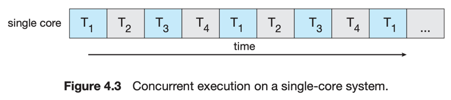
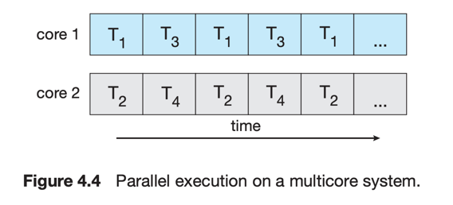
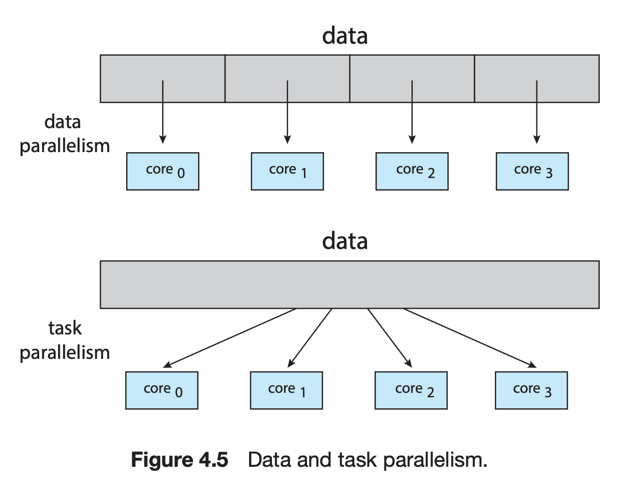

# 2. Multicore Programming

1. Programming Challenges
2. Types of Parallelism

---

### Concurrency vs Parallelism

- Concurrency : 1개 이상의 Task를 동시에 실행 상태에 놓는 것
- Parallelism : 1개 이상의 Task를 **동시에, 일제히** 실행하는 것

#### Multicore System

  

- 1개의 CPU Processor, 2개 이상의 CPU Core
- multithreaded programming에서 core의 활용성과 동시성을 향상시킴

#### singlecore 의 concurrency

  

- concurrency : Interleaving
- Core는 동시에 하나의 thread만 실행 가능

#### multicore 의 concurrency

  

- concurrency : Parallelism

## 1. Programming Challenges

- OS 개발자 : 각 core가 병렬적으로 실행하도록 scheduling algorithm 개발
- Application 개발자 : multithreaded application 개발

#### Multicore System 개발 요소

- Identifying tasks
    - application을 나눌수 동시성으로 나눌 수 있는 task로 나누는 것
    - 각 task는 독립적이고, 병렬적으로 실행 가능
- Balance
    - Core를 차지할 만큼 가치있는 Task를 찾아 분리
    - 특정 Task의 병렬실행이 도움이 큰 도움이 안될수도 있음
- Data Splitting : 각 Task의 데이터들도 분리되어야 함
- Data dependency : 데이터에 대한 Task들의 의존성
    - Task들이 서로 데이터를 공유하면서 실행되는 경우
    - 동기화 필요
- Testing and Debugging : 의도대로 동작하는지 확인 single-threaded보다 어려움

## 2. Types of Parallelism

  

- data parallelism : 데이터를 나눔
- task parallelism : Task를 나눔
- 보통 2가지 전략을 혼합해서 사용

#### Data Parallelism

- Data를 나누어 각 Core에 할당하고, 동일한 task를 실행
- ex. 사이즈 N 배열의 모든 원소의 합
    - a core : 1 ~ N/2-1
    - b core : N/2 ~ N-1

#### Task Parallelism

- 각 thread는 서로 다른 task를 실행
