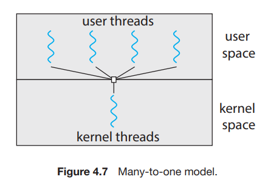
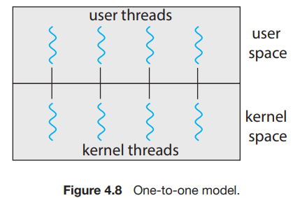
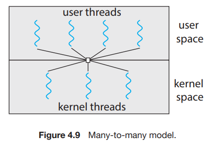
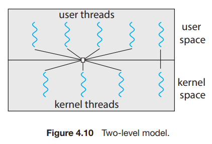

# 3. Multithreading Models

1. Many-to-One Model
2. One-to-One Model
3. Many-to-Many Model

---

#### user threads, kernel threads

- user level : user threads
    - kernel의 지원 없음
- kernel level : kernel threads
    - kernel이 지원하고, OS가 직접적으로 관리

## 1. Many-to-One Model

- Many user-level threads, one kernel thread
- thread library가 user thread를 관리
- kernel thead 가 하나여서
    - blocking system call이 있으면, 모든 thread가 block됨
    - user space thread 병렬 실행 불가능
- 병렬 실행이 불가능해서 잘 쓰이지 않음
- ex) Solaris Green Threads, JAVA early version

## 2. One-to-One Model

- many-to-one 보다 동시성이 뛰어남
- blocking system call에도 다른 thread blocking 되지 않음
- multi processor system에서 병렬 실행 가능
- application에서 user thread 개수에 민감
    - user thread마다 kernel thread를 만들어야함
- ex) Windows, Linux

## 3. Many-to-Many Model

- user thread 개수 이하의 kernel thread
- 개발자는 user thead를 필요한 만큼 만들 수 있음
- blocking system call에도 다른 thread blocking 되지 않음
- 구현이 복잡함
- 현대 CPU core 수가 증가함에 따라 kernel thread 수에 그리 민감하지 않음

#### Two-level model

- one-to-one처럼 kernel thread에 바인딩이 가능하게 함
