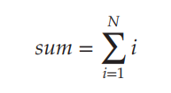

# 4. Thread Libraries

1. Pthreads
2. Windows Threads
3. Java Threads

---

#### thread library

- 프로그래머에게 제공하는 thread를 만들고 관리할 수 있는 API
- user-level library
    - kernel의 지원 없음
    - system call 이 없음
- kernel-level library
    - kernel이 지원
    - API 실행으로 kenel에 system call

##### library 종류

- POSIX Pthreads, Windows, JAVA
- Pthreads
    - POSIX standard 확장
    - user-level, kernel-level 둘 다 존재
- Windows Thread library
    - Windows API
    - kernel-level library
- Java Thread API
    - Java Program에서 직접 thread를 생성하고 관리
    - OS의 Thread library를 사용하여 구현 <sub>Window API, UNIX Pthreads</sub>

##### Multithreaded Programming 예시 (누적합, 시그마)



- asynchronous 방법 : 생성한 자식 thread와 독립적으로 연산
- synchronous 방법 **(적합)**: 자식 thread가 종료될 때까지 기다림
    - 자식 thread가 종료되면 부모 thread에 join

## 1. Pthreads

- POSIX standard API
- thread에 대한 규약
- OS 설계자는 이 규약을 목적에 맞게 구현
- 사용 OS : UNIX-type system, Windows third-party 구현

<details>
    <summary>예제</summary>

```c
#include <pthread.h
#include <stdio.h>

#include <stdlib.h>


int sum;

void *runner(void *param); /* the thread */

int main(int argc, char *argv[])

{
    pthread_t tid; /* the thread identifier */
    pthread attr t attr; /* set of thread attributes */
    
    pthread_attr_init(&attr); /* get the default attributes */
    pthread_create(&tid,&attr,runner,argv[1]); /* create the thread */
    pthread_join(tid, NULL); /* wait for the thread to exit */
    
    printf("sum = %d\n",sum);
}

/* The thread will begin control in this function */
void *runner(void *param)
{
    int i, upper = atoi(param);
    sum = 0;
    
    if (upper > 0) {
        for (i = 1; i <= upper; i++)
            sum += i;
    }
    
    pthread_exit(0);
}
```

- `pthread.h` : pthread library의 header file
- `pthread_t tid` : 생성할 thread identifier
- `pthread_attr_t attr` : thread attribute, stack size, scheduling information 등
- `pthread_create()` : thread 생성
- `runner()` : thread가 실행할 함수

#### 실행 결과

- 총 2개 thread 생성
- `main()` 실행 thread, `runner()` 실행 thread
- create/join 전략
    - runner thread를 만들고 부모가 자식을 기다림
    - `pthread join()` : 부모가 자식의 종료를 기다림
    - `pthread exit()` : 자식이 종료되면 부모에게 종료를 알림

</details>

## 2. Windows Threads

<details>
    <summary>예제</summary>

```c
#include <windows.h>
#include <stdio.h>

DWORD Sum; /* data is shared by the thread(s) */

/* the thread runs in this separate function */
DWORD WINAPI Summation(LPVOID Param) {
    DWORD Upper = *(DWORD *) Param;
    for (DWORD i = 0; i <= Upper; i++)
        Sum += i;
    return 0;
}

int main(int argc, char *argv[]) {
    DWORD ThreadId;
    HANDLE ThreadHandle;
    int Param;

    Param = atoi(argv[1]);

    /* create the thread */
    ThreadHandle = CreateThread(
            NULL, /* default security attributes */
            0, /* default stack size */
            Summation, /* thread function */
            &Param, /* parameter to thread function */
            0, /* default creation flags */
            &ThreadId); /* returns the thread identifier */

    /* now wait for the thread to finish */
    WaitForSingleObject(ThreadHandle, INFINITE);

    /* close the thread handle */

    CloseHandle(ThreadHandle);

    printf("sum = %d\n", Sum);
}
```

</details>

- `windows.h` : windows thread library의 header file
- `DWORD Sum` : thread가 공유하는 data
- `Summation()` : thread가 실행할 함수
- `CreateThread()` : thread 생성
- `WaitForSingleObject()` : 자식 thread 종료를 기다림
    - `WaitForMultipleObjects()` : 여러 thread의 종료를 기다림, e.g. `WaitForMultipleObjects(2, ThreadHandle, TRUE, INFINITE);`

## 3. Java Threads

- 모든 JAVA 프로그램은 최소 1개의 thread로 시작
    - `main()` 실행 thread
- JVM이 구동되는 모든 OS에서 Java thread 사용 가능

#### 구현 방법

- `Thread` class를 상속받아 구현
- `Runnable` interface를 구현
    - lamda 로 구현 가능 <sub>Java 8 이상</sub>

```java
class MyThread extends Thread {
    public void run() {
        System.out.println("MyThread running");
    }
}

class Task implements Runnable {
    public void run() {
        System.out.println("Task running");
    }
}

    Runnable task = () -> {
        System.out.println("Task running");
    };
```

##### thread 시작

````java
class Foo {
    public static void main(String[] args) {
        Thread worker = new Thread(new Task());
        worker.start();
        workder.join();
    }
}
````

- `start()`
    - thread를 JVM 메모리에 할당하고 초기화
    - `run()` method를 호출, JVM이 thread 실행 가능해짐
- `join()` : thread 종료를 기다림

### 3.1 Java Executor Framework

```java
class Foo {
    public static void main(String[] args) {
        ExecutorService executorService = new Executor();
        executorService.execute(new Task());
    }
}
````

- `java.util.concurrent` package <sub>Java 5 이상</sub>
- thread를 더 쉽게 관리할 수 있도록 제공해주는 framework
- producer-consumer model 기반
    - producer : `Runnamble`을 구현한 task
    - consumer :  task를 실행하는 threads
    - `Future` class : task의 결과를 저장

<details>
    <summary>예제</summary>

```java
import java.util.concurrent.Callable;
import java.util.concurrent.ExecutorService;
import java.util.concurrent.Executors;
import java.util.concurrent.Future;

public class ThreadEx01 {


    public static void main(String[] args) {
        int upper = Integer.parseInt(args[0]);
        ExecutorService pool = Executors.newSingleThreadExecutor();
        Future<Integer> result = pool.submit(new Summation(upper));
        try {
            System.out.println(result.get());
        } catch (Exception e) {
            e.printStackTrace();
        }
    }


    private static class Summation implements Callable<Integer> {
        private int upper;

        public Summation(int upper) {
            this.upper = upper;
        }

        @Override
        public Integer call() throws Exception {
            int sum = 0;
            for (int i = 0; i <= upper; i++) {
                sum += i;
            }
            return new Integer(sum);
        }
    }
}
```

- `Summation` : `Callable` interface를 구현한 class
- `newSingleThreadExecutor()` : thread pool 생성
- `submit()` : task를 thread pool에 전달
- `get()` : task의 결과를 `Future` 로 받음

</details>
