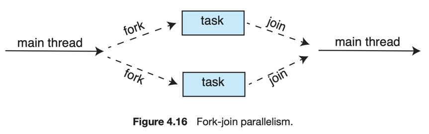
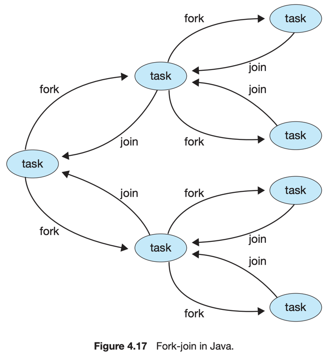
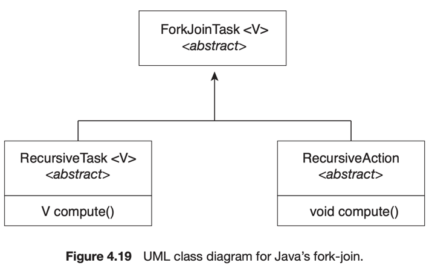

# 5. Implicit Threading

1. Thread Pools
2. Fork Join
3. OpenMP
4. Grand Central Dispatch
5. Intel Threading Building Blocks

---

Multicore Processing의 발전으로, 수백~수천개의 thread를 포함하는 application이 늘어나고 있음

#### implicit threading <sup>암묵적 스레딩</sup>

- compiler, runtime library에 의해 thread를 생성하고 관리하는 것.
    - **개발자가 아니라**
- implicit threading의 전략을 잘 사용하려면,
    - 개발자는 병렬으로 실행할 task를 잘 정의해야함
- 개발자가 Task를 잘 정의만하면, library가 thread를 생성하고 관리함

## 1. Thread Pools

#### thread pool이 해결한 것

- 시간 소모 : thread를 생성하는데 시간
- 리소스 <sub>CPU, Memory</sub> 소모 :  동시성의 요청을 많이 보내는만큼 thread가 생김. thread 수에 제한이 없음

#### thread pool 메커니즘

- 시스템 시작 시, 특정 수의 thread를 생성해 pool을 만들어둠
- pool에 배치된 thread들은 task를 기다림
- server가 요청하면, thread를 생성하지 않고, thread pool에 thread를 요청함
    - 가용할 수 있는 thread가 없다면 기다림
- thread가 task를 종료하면 pool에 돌아가 task를 기다림
- task가 비동기 작업일 때 효과적

#### thread pool의 장점

- thread 생성 시간이 없음
- 리소스 절약 : 존재하는 thread의 최대 개수에 제한을 둠
    - 시스템이 지원 불가능한 개수의 thread 생성을 방지
- task를 작성하는 것을 task를 실행하는 것으로부터 분리
    - 각각 다른 전략을 취할 수 있음 <sub>task 실행시간에 지연, 주기 등을 준다던가 등<sub>

#### pool 조절

- thread pool의 크기는 기본적으로 다음에 의존
    - CPU의 수, memory size, client의 동시성 요청 기대 수
- 복잡한 thread pool architecture에서는 사용자 패턴에 따라 조절하기도 함
    - 더 작은 pool을 제공하여 적은 memory 를 소모하게함
    - ex. Apple의 Grand Central Dispatch

#### Windows Thread Pool API

- LPWORKER_THREAD_ROUTINE : thread가 실행할 함수
- PVOID : 함수에 전달할 인자
- ULONG : thread pool의 생성과 thread 실행 방식 관리

```c
QueueUserWorkItem(&PoolFunction, NULL, 0);
```

- thread pool에 있는 thread가 `PoolFunciton()` invoke

### 4.1 Java Thread Pools

- Single thread executor `newSingleThreadExecutor()`
    - pool size 1 생성
- Fixed thread executor `newFixedThreadPool(int size)`
    - size 만큼의 thread 생성
- Cached thread executor `newCachedThreadPool()`
    - 많은 인스턴스에서 스레드를 재사용

```java
import java.util.concurrent.*;

public class ThreadPoolExample {
    public static void main(String[] args) {
        int numTasks = Integer.parseInt(args[0].trim());
        /* Create the thread pool */
        ExecutorService pool = Executors.newCachedThreadPool();
        /* Run each task using a thread in the pool */
        for (int i = 0; i < numTasks; i++)
            pool.execute(new Task());
        /* Shut down the pool once all threads have completed */
        pool.shutdown();
    }
}
```

## 2. Fork Join



- forks : main parent thread가 자식 thread를 생성하고 자식 thread의 종료를 기다림
- join : 자식 thread 가 task 완료되면 parent thread에 join
- synchronous model이지만 implicit threading 구현 가능
- thread pool을 synchronous로 구현함

### 2.1 Fork Join in Java <sub>java 1.7 이상</sub>



- Java의 fork-join library는 divide-and-conquer algorithms <sub>QuickSort, MergeSort</sub>에 사용될 수 있음
- work stealing algorithm을 통해 부하 균형을 맞춤
    - `ForkJoinPool`마다 작업 큐를 사용하여 fork된 task를 관리
    - 큐가 비어있다면 다른 스레드의 큐에서 task를 가져와 실행

````
Task(problem)
  if problem is small enough
    solve the problem directly
  else
    subtask1 = fork(new Task(subset of problem)
    subtask2 = fork(new Task(subset of problem)
    result1 = join(subtask1)
    result2 = join(subtask2)
    return combined results
````

<details>
    <summary>작성 예시</summary>

```java
ForkJoinPool pool=new ForkJoinPool();
// array contains the integers to be summed
        int[]array=new int[SIZE];
        SumTask task=new SumTask(0,SIZE-1,array);
        int sum=pool.invoke(task);

import java.util.concurrent.*;

public class SumTask extends RecursiveTask<Integer> {
    static final int THRESHOLD = 1000;
    private int begin;
    private int end;
    private int[] array;

    public SumTask(int begin, int end, int[] array) {
        this.begin = begin;
        this.end = end;
        this.array = array;
    }

    protected Integer compute() {
        if (end - begin < THRESHOLD) {
            int sum = 0;
            for (int i = begin; i <= end; i++)
                sum += array[i];
            return sum;
        } else {
            int mid = (begin + end) / 2;
            SumTask leftTask = new SumTask(begin, mid, array);
            SumTask rightTask = new SumTask(mid + 1, end, array);
            leftTask.fork();
            rightTask.fork();
            return rightTask.join() + leftTask.join();
        }
    }
}
```



</details>

## 3. OpenMP

- C, C++ 로 작성된 컴파일러 지시문, API
- shared memory 환경에서 parallelism을 위한 library
- parallel region
    - 병렬 실행하려는 코드블럭
    - OpenMAp 런타임 라이브러리에 해당 영역을 병렬로 실행

```c
#include <omp.h>
#include <stdio.h>
int main(int argc, char *argv[])
{
  /* sequential code */
  
  #pragma omp parallel
  {
    printf("I am a parallel region.");
  }
  /* sequential code */
  
  return 0;
}
```

- `#pragma omp parallel` : parallel region 시작
    - core 수 만큼 thread를 생성함 <sub>dual-core 면 2개의 thread</sub>
- `#pragma omp parallel for` : parallel region 내에서 반복문 for를 병렬로 실행

## 4. Grand Central Dispatch <sup>GCD</sup>

- Apple의 macOS, ios OS에서 사용
- run-time library + API + language extensions
- 개발자가 task를 정의하고, 병렬로 실행 가능하게 함

#### dispatch queue

- GCD는 dispatch queue를 사용하여 task를 scheduling
- serial queue <sup>private dispatch queue</sup>
    - FIFO
    - Task가 dequeue되면 다른 task가 dequeue될기 전까지 반드시 실행을 완료해야함
    - main queue : 모든 process가 가지는 고유의 serial queue
    - 순차적인 task를 실행해야하는 경우 사용
- concurrent queue <sup>global dispatch queue</sup>
    - FIFO
    - 동시에 여러 task가 dequeue될 수 있음 : 병렬 실행이 가능

#### concurrent queue의 class

- QOS_CLASS_USER_INTERACTIVE : user-interactive class
    - 사용자와 상호작용하는 task 담당, user interface, event handling
    - 이 class의 작업량이 적은 것이 중요
- QOS_CLASS_USER_INITIATED : user-initiated class
    - user-interactive와 비슷
    - 더 긴 시간이 필요한 작업을 담당 <sub>networking, file I/O</sub>l
- QOS_CLASS_UTILTY : utility class
    - 더 긴 작업을 수행하지만, 즉각적인 result를 반환하지 않음
    - data import
- QOS_CLASS_BACKGROUND : background class
    - 사용자가 직접적으로 인지하지 않고, 시간이 중요치 않음
    - indexing mailbox, backup

## 5. Intel Threading Building Blocks <sup>TBB</sup>

- C++ parallel application을 위한 library
- task scheduler는 로드밸런싱을 제공하고, 캐시를 인식하여 캐시메모리에 있을 것 같은 작업을 우선처리
- 상호 배제 locking, 원자적 연산, 병렬 반복문 구조를 지원
- 병렬화해야하는 TASK의 개수 지정 필요 없음
    - core수를 명시하지 않아도 알아서 thread를 생성함

````
parallel for (range body )
````

- `range` : 반복되어야하는 요소의 범위
- `body` : 반복문의 본문

````
for (int i = 0; i < n; i++) {
    apply(v[i]);
}

parallel for (size t(0), n, [=](size t i) {apply(v[i]);});
````
