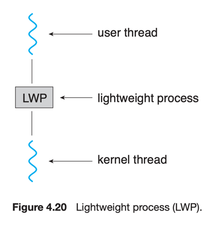

# 6. Threading Issues

1. the fork() and exec() System Calls
2. Signal Handling
3. Thread Cancellation
4. Thread-Local Storage
5. Scheduler Activations

---

mulithreaded program을 설계할 때 고려해야할 몇가지 issue

## 1. the fork() and exec() System Calls

- `fork()` 시 2가지 버전으로 일할 수 있음
    1. parent process의 thread 전체 복사해서 process 생성
        - `fork()` 후 `exec()` 바로 호출하지 않을 때 적합
    2. paretn process의 `fork()` 호출한 thread만 복사하여 single-threaded process 생성
        - `fork()` 후 바로 `exec()` 호출할 때 적합

## 2. Signal Handling

#### signal

- Unix System에서 process에게 이벤트가 발생했음을 알리는 것
- signal은 동기/비동기적으로 수신할 수 있음
- 동작순서
    1. signal 발생 : 특정 이벤트에 의해 생성됨
    2. signal 전달 : process에게 전달됨
    3. signal 처리 : process가 signal을 처리함

#### synchronous signal

- process가 잘못된 메모리 접근이나 0으로 나누기와 같은 오류를 발생시키고,
- signal을 해당 process에게 전달

#### asynchronous signal

- 외부 process에 의해 발생
    - e.g. ctrl + c 로 종료

#### signal을 처리하는 handler

- default signal handler
    - 모든 signal에 대해 default handler가 존재
    - kernel이 signal을 처리할때 사용
- user-defined signal handler
    - default singal handler를 재정의
    - signal이 무시되거나, 잘못된 실행에 대해서는 process를 종료시킬 수 있음

#### multi-thread 환경에서 signal 처리하기

- single-threaded program은 signal이 생기면 항상 process에게 전달됨
- multi-threaded program은 signal이 생기면 process, thread에게 전달할 수 있음
    - signal을 적용할 thread에 전달
    - process의 모든 thread에게 전달
    - process의 특정 thread에 전달
    - process의 특정 thread를 signal 수신전용으로 할당
- synchronous signal은 항상 thread에게 전달하면 됨
- asynchronous signal은 signal에 따라 다름
    - ctrl + c : 모든 thread에게 전달해야함

#### Unix System signal

```c
// Unix System signal을 보낼 process를 정하는 함수
kill(pidt pid, int signal);
```

- `pid` : signal을 전달할 process의 pid
- `signal` : 전달할 signal
- multithreaded Unix System은 thread가 어떤 signal을 받을지 말지 판단함

```c
// POSIX Pthread signal
pthread_kill(pthread_t thread, int signal);
```

#### Window asynchronous procedure calls <sup>APC</sup>

- Window는 명시적으로 signal을 지원하지 않음
- APC를 사용하여 signal을 구현함

## 3. Thread Cancellation

- task가 완료되기 전에 thread를 종료하는 것
- target thread : 종료되어야 하는 thread

#### e.g.

- 여러 thread 가 동시에 data를 찾고 하나의 thread만 찾아도 나머지 thread는 종료
- 웹 브라우저에서 페이지 로딩 중 user가 stop 버튼을 누르면 thread 종료
    - 보통 웹 페이지 로딩 시 여러 thread가 동시에 작업을 수행함

#### Asynchronous Cancellation

- thread 하나가 즉시 target thread를 종료시킴
- thread가 리소스를 할당받았거나, data를 다른 thread와 공유중인 상황에서 종료시 문제될 수 있음

#### Deferred Cancellation

- target thread가 종료 여부를 주기적으로 체크
- thread의 종료 여부를 판단한 뒤 종료함 <sub>안전하게 종료 가능</sub>

#### `pthread_cancel()`

```c
pthread_t id;

/* create the thread */
pthread_create(&tid, 0, worker, NULL);
...
/* cancel the thread */
pthread_cancel(tid);

/* wait for the thread to terminate */
pthread_join(tid,NULL);
```

- `pthread_cancel()` : target thread를 종료시킴
- `pthread_join()` : target thread가 종료될 때까지 기다림
- 3가지 종료 모드
    - `Off` : thread 종료 불가능, 종료 요청은 pending 상태로 남아있다가, 종료가 가능해지면 종료시킴
    - `Deferred` : default, cancellation point에서만 종료 가능
        - `pthread_testcancel()` : 종료 지점 명시
        - cleanup handler : thread 종료시 호출되는 함수, thread 종료 이전 리소스 정리 작업을 수행
    - `Asynchronous`i
        - Pthread 에서 비추

#### java

- Pthreads의 defeered cancellation과 유사
- `interrupt()` : target thread를 종료시킴, target thread의 interruption status를 true로 설정
- `isInterrupted()` : target thread의 interruption status를 반환

````
Thread worker;
...
worker.interrupt();
````

## 4. Thread-Local Storage <sup>TLS</sup>

- process내의 thread 들은 process의 데이터를 공유 중
- TLS : 공유 중인 data의 thread 내 복사본
- local variable보다는 static data와 유사
    - 그러나 TLS data는 각 thread마다 별도의 복사본을 가짐
- Java의 `ThreadLocal<T>` class의 `set()`과 `get()` method를 사용하여 TLS data를 설정하고 읽음
- Pthread의 `pthread_key_create()` 함수를 사용하여 TLS data에 접근

## 5. Scheduler Activations

#### lightweight process <sup>LWP, 경량 프로세스</sup>

  

- many-to-many model과 two-level model 둘다 구현
- usser thread library는 LWP를 가상 프로세서로 인식
    - 가상 프로세서를 활용해서 user thread를 scheduling
- 각 LWP는 kernel thread에 할당됨
    - kernel thread는 실제 processor를 scheduling하는 OS scheduling
    - kernel thread blocked -> LWP blocked -> user thread blocked
- 효율을 위해 하나의 application이 여러개의 LWP가 필요할 수 있음

### scheduler activations

- kernel이 application에게 LWP set 제공
- upcall : kernel이 application에게 event를 알리는 것
    - upcall handler : upcall을 처리하는 thread library
    - application thred가 block되려할 때 upcall 발생

#### upcall scenario

1. application thread가 block되려함
2. kernel은 upcall을 발생시킴
3. kernel은 application에게 새로운 virtual processor를 할당
4. application은 새로운 virtual processor에서 upcall handler를 실행
    - upcall handler에 차단된 thread 상태를 저장
    - block된 thread가 실행 중인 virtual processor 양도
5. upcall handler는 새로운 virtual processor에서 실행 가능한 thread를 scheduling
6. bllocke된 thread가 기다리던 이벤트가 발생하면, kernel은 또다른 upcall 발생시킴
    - upcall 내용 block된 thread가 실행 가능함을 알림
7. unblock된 thread가 실행 가능상태가 되면 application은 virtual processor에 thread를 sheduling
