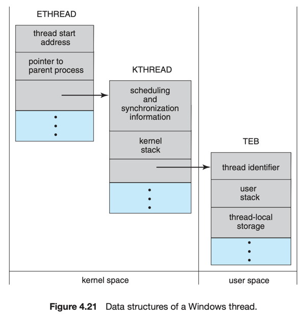

# 7. Operating-System Examples

1. Windows Threads
2. Linux Threads

---

## 1. Windows Threads

- One-to-One model
- application을 분리된 proceess에서 실행, 각 process는 1개 이상의 thread를 가짐

#### thread 가 가지는 정보

- thread ID : unique identifier
- program counter PC
- context
    - register set : processor의 상태 정보
    - user stack, kernel stack
    - private storage area

#### thread 자료구조

- ETHREAD : executive thread block
- KTHREAD : kernel thread block
- TEB : thread environment block

## 2. Linux Threads

- Task : Linux는 process와 thread를 구분하지 않음
- `fork()`, `clone()` : task 생성
- `clone()` 호출 시 parent task와 child task 간에 어떤 정보를 공유할지 flag로 전달
    - `CLONE_FS` : file system 정보 공유 working directory 등
    - `CLONE_VM` : 같은 memory 공간 공유
    - `CLOEN_SIGHAND` : signal handler 공유
    - `CLONE_FILES` : open files set 공유
    - flag 가 없으면 `fork()`처럼 동작

#### `fork()` vs `clone()`

- 리눅스는 task 마다 고유한 kernel 자료구조를 가짐
    - task에 대한 data를 직접 저장하지 않고, data가 저장된 자료구조를 가리키는 pointer를 저장해둠
    - e.g. : open files 목록, signal handler 정조, virtual memory 정보 등
- `fork()` : parent task의 모든 자료구조를 child task로 복사
- `clone()` : parent task의 자료구조를 가리키는 pointer를 child task로 복사
    - container, 가상화 등으로 확장 가능
  
