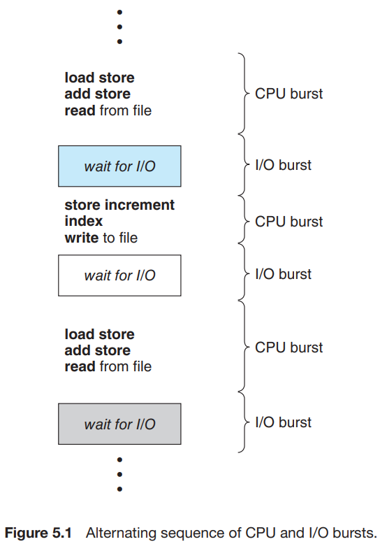
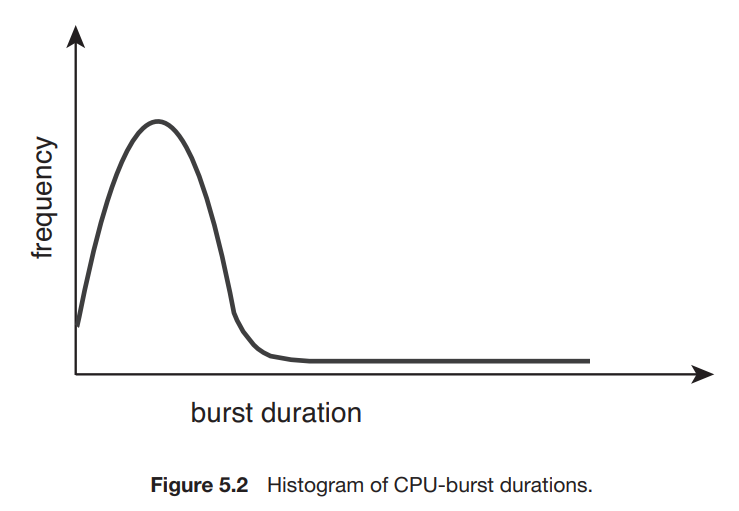

# 1. Basic Concepts

1. CPU-I/O Burst Cycle
2. CPU Scheduler
3. Preemptive and Nonpreemptive Scheduling
4. Dispatcher

---

#### multiprogramming의 이점

- 몇개의 process를 메모리에 동시에 올려두고,
- 하나의 porcess가 wait 중이면 CPU는 다른 process를 가져가서 실행
- Multi-core에서는 여러 process가 동시에 실행될 수 있어 효과 극대화

모든 resource와 동일하게 CPU도 Scheduling 대상이고, OS 의 핵심이다

## 1. CPU-I/O Burst Cycle



- CPU는 실행과 I/O wait 두가지 상태를 교차하는 사이클을 가짐
- CPU burst
- I/O burst

### CPU Burst 빈도



- I/O bound program은 짧은 CPU burst를 가지고, 자주 I/O wait 상태로 전환
- CPU bound program은 긴 CPU burst를 가짐

## 2. CPU Scheduler

- CPU Schduler는 유휴 상태의 CPU가 있을 때,
    - ready queue에서 어떤 process를 실행시킬지 결정

#### ready queue

- 실행을 기다리는 proecss queue
- record는 PCB
- 자료구조 : FIFO, priority queue, tree, 정렬되지 않은 linked list 등으로 구현될 수 있음

## 3. Preemptive and Nonpreemptive Scheduling

#### CPU Scheduling 발생 조건

1. process가 running 상태에서 waiting 상태로 전환
    - e.g. `wait()`으로 자식 process의 종료를 기다리는 경우, I/O 요청 결과를 기다리는 경우
2. process가 running 상태에서 ready 상태로 전환
    - e.g. interrupt 발생
3. process가 waiting에서 ready 상태로 전환
    - e.g. I/O 요청이 완료
4. process가 종료됨

2, 3은 Scheduling의 대상이 됨

### nonpreemptive scheduling <sup>cooperative, 비선점</sup>

- 1, 4는 Scheduling의 대상이 아님. 언제나 새로운 process가 실행되어야 함
- process가 CPU에 할당되면, 종료되거나, waiting으로 switching 될 때까지 CPU를 반환하지 않음

### preemptive scheduling <sup>선점</sup>

- 2, 3 : scheduling의 대상
- 대부분의 현대 OS들이 사용하는 shceduling algorithm <sub>Windows, Linux, macOS</sub>
- race condition 발생 가능 <sup>경쟁상태</sup>
    - e.g. 하나의 data를 두 process가 공유 중일떄, udpate 중인 process와 read하려는 process

### OS kernel

- 비선점 혹은 선점으로 설계될 수 있음
    - 비선점 kernel
        - 구조가 단순
        - system call이 완료되기를 기다리거나, process가 block 상태가 될 때까지 기다림
        - 실시간 컴퓨팅에는 부적합
    - 선점 kernel
        - mutex lock과 같은 메커니즘을 통해 경쟁상태를 방지해야함
        - 대부분의 OS는 kernel mode에서 완전히 선점적임

## 4. Dispatcher


- Dispatcher는 CPU Scheduler가 선택한 process를 CPU core에게 제어권을 주는 모듈
    - process 간의 context switch를 수행
    - user mode 로 switching
    - program을 이어나가기 위해 user program의 특정 포인트로 이동
- dispatch latency : distpacher가 process를 stop하고 다른 process를 실행하기 위해 걸리는 시간
    - 이 시간은 매우 짧아야 함

#### Context Switch 예시 (Linux System)

`vmstat`으로 context switch를 확인할 수 있음

````
vmstat 1 3

... (1 secnods 후)
-------cpu-------
24
225
339
````

- 1 lines : system이 부팅된 이후 1초동안 일어난 context switch 횟수의 평균
- 2~3 lines :  wlsks 1초 간격동안 일어난 context switch 횟수

````
cat /proc/2166/status

...

voluntary ctxt switches 150
nonvoluntary ctxt switches 8
````

- 2166 pid에서 발생한 context switch 횟수
- `voluntary ctxt switches` : blocking I/O와 같이 resoucre 요청으로 인해 발생한 context switch
- `nonvoluntary ctxt switches` : time slice가 끝나서 더 높은 우선순위 process가 CPU를 선점해가서 발생한 context switch 
