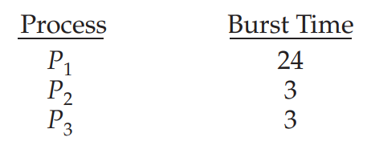

# 3. Scheduling Algorithms

1. First-Come, First-Served Scheduling
2. Shortest-Job-First Scheduling
3. Round-Robin Scheduling
4. Priority Scheduling
5. Multilevel Queue Scheduling

---

- CPU Scheduling : ready queue에 있는 process 중 CPU core를 할당해줄 process를 선택하는 것
- CPU Scheduling Algorithm : CPU Scheduling에 사용되는 알고리즘

## 1. First-Come, First-Served Scheduling FCFS

- 비선점
- 요청 순서대로 process가 CPU를 할당받음
- FIFO queue로 의해 관리
- ready queue에 들어온 PCB는 FIFO queue에 링크됨
- 실행상태에 돌입하면 FIFO queue에서 dequeue
- 장점 : 단순함

#### 단점

- process 별 CPU Burst time의 variation이 크면 평균 대기시간이 길어짐

  

- 위에서 평균 대기시간은 17ms
- p2 -> p3 -> p1 순이면 평균 대기시간이 3ms

- convoy effect : CPU burst time이 긴 process가 ready queue에 들어오면, 그 process를 기다리는 process들이 모두 대기시간이 길어짐
    - burst time이 짧은 process가 먼저 들어와야 해결할 수 있는 문제
- interactive system에서는 사용하기 어려움
    - interactive system 는 Process가 CPU를 적절한 간격으로 나눠써 할당받음

## 2. Shortest-Job-First Scheduling

## 3. Round-Robin Scheduling

## 4. Priority Scheduling

## 5. Multilevel Queue Scheduling

## 6. Multilevel Feedback Queue Scheduling
