# 3. Scheduling Algorithms

1. First-Come, First-Served Scheduling
2. Shortest-Job-First Scheduling
3. Round-Robin Scheduling
4. Priority Scheduling
5. Multilevel Queue Scheduling

---

- CPU Scheduling : ready queue에 있는 process 중 CPU core를 할당해줄 process를 선택하는 것
- CPU Scheduling Algorithm : CPU Scheduling에 사용되는 알고리즘

## 1. First-Come, First-Served Scheduling FCFS

- 비선점
- 요청 순서대로 process가 CPU를 할당받음
- FIFO queue로 의해 관리
- ready queue에 들어온 PCB는 FIFO queue에 링크됨
- 실행상태에 돌입하면 FIFO queue에서 dequeue
- 장점 : 단순함
- 단점 : process 별 CPU Burst time의 variation이 크면 평균 대기시간이 길어짐

#### 동작 예시

| Process | Burst Time |
|:-------:|:----------:|
|   P1    |     24     |
|   P2    |     3      |
|   P3    |     3      |

- 평균 대기시간 :  17ms
- p2 -> p3 -> p1 순이면 평균 대기시간 3ms

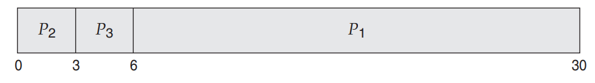

- convoy effect : CPU burst time이 긴 process가 ready queue에 들어오면, 그 process를 기다리는 process들이 모두 대기시간이 길어짐
    - burst time이 짧은 process가 먼저 들어와야 해결할 수 있는 문제
- interactive system에서는 사용하기 어려움
    - interactive system 는 Process가 CPU를 적절한 간격으로 나눠써 할당받음

## 2. Shortest-Job-First Scheduling SJF

- shortest-next-CPU-burst algorithm
- 선점, 비선점 가능
- 다음 실행할 process 중 가장 짧은 CPU Burst time을 가지는 process를 선택
    - 같을 시 FCFS를 사용
- 평균 대기시간을 줄이고 싶을 때 적합
- 단점 : 다음 CPU Burst time을 알 수 없을 때
    - 예측을 통해 해결

#### 동작 예시

| Process | Burst Time |
|:-------:|:----------:|
|   P1    |     6      |
|   P2    |     8      |
|   P3    |     7      |
|   P4    |     3      |

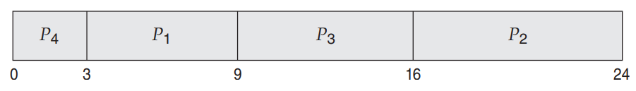

- 평균 대기시간 : 7ms
    - FCFS 일 때는 10.25 ms

#### CPU Burst time 예측 방법 : exponential average

- exponential average 지수 평균을 활용하여 다음 CPU Burst time을 모를 때 예측
    - 다음 process의 CPU Burst time은 이전 process의 CPU Burst time과 비슷

#### 선점, 비선점 둘다 가능

실행 중인 process가 있는 상황에서 새로운 process가 ready queue에 들어오면

- 선점 : 현재 실행 중인 process를 선점할 수 있음
    - shortest-remaining-time-first SRTF라고도 함
- 비선점 : 현재 실행 중인 process가 CPU Burst를 완료할 떄까지 기다림

#### 선점 SJF 예시

| Process | Arrival Time | Burst TIme |
|:-------:|:------------:|:----------:|
|   P1    |      0       |     8      |
|   P2    |      1       |     4      |
|   P3    |      2       |     9      |
|   P4    |      3       |     5      |

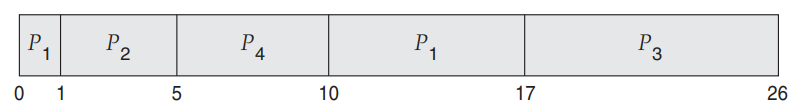

## 3. Round-Robin Scheduling RR

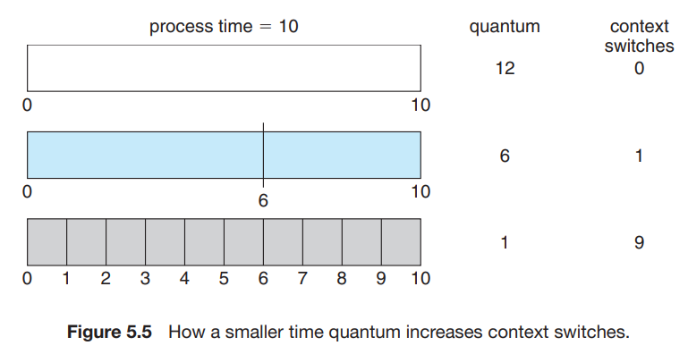

- FCFS + 선점
- time quantum time slice : 10~100 ms 의 시간단위
- process 실행시간이 1 time quantum이 초과되면 즉시 선점되어 ready queue에 enqueue됨
- 평균 대기시간이 김
- 알고리즘 성능이 time quantum 크기에 의존함
    - time quantum이 너무 크면, FCFS와 같아짐
    - time quantum이 너무 작으면, context switch가 너무 자주 일어나 성능이 떨어짐

#### time quantum 크기 결정

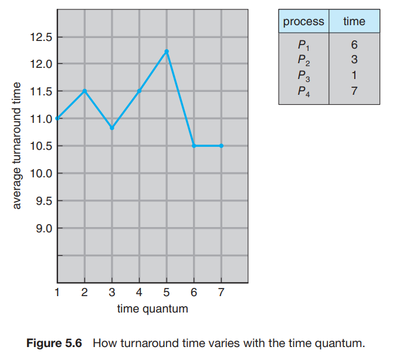

- 현대 OS는 일반적으로 10~100ms의 time quantum을 사용
- context switch 시간과 Turnaround time을 고려하여 결정
- context swtich 시간은 일반적으로 10ms 미만이므로 time quantum의 작은 부분임
- 평균 Turnaround time
    - time quantum 사이즈에 비례하지 않음
    - single time quantum에 process가 완료되는 것이 중요

#### 알고리즘

- CPU가 ready queue를 돌면서 각 process에 1 time quantum씩 할당
- ready queue는 Circular queue로 관리
    - FIFO 방식, 새로운 process가 ready queue 끝에 enqueue
- 첫번째 process를 선점하고 1 time quantum 뒤 interrupt를 발생시킬 timer 설정
    - 1 time wuantum 안에 process가 끝나면, process가 자발적으로 CPU를 반납
        - scheduler는 다음 procees를 실행하기 위해 ready queue에서 dequeue
    - 1 time quantum 안에 process가 끝나지 않으면, timer interrupt 발생
        1. timer를 종료 시키고, OS에 interrupt 발생
        2. context switch 발생시키고, 현재 process를 ready queue 끝에 enqueue
        3. CPU는 ready queue에서 다음 porcess를 dequeue

#### 동작 예시

- P1 : 24ms
- P2 : 3ms
- P3 : 3ms
- 1 time quantum : 4ms

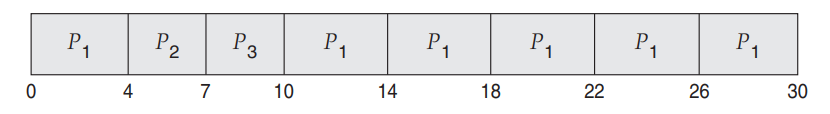

- 평균 대기시간 5.66ms

## 4. Priority Scheduling 우선순위 스케줄링

- process 별로 우선순위를 적용하여 순위가 높은 process에게 CPU 할당
    - 순위가 같으면 FCFS 알고리즘 적용
- SJF도 Priority Scheduling의 일종
    - CPU Burst time이 짧은 process에게 높은 우선순위를 부여

#### 동작 예시

| Process | Burst Time | Priority |
|:-------:|:----------:|:--------:|
|   P1    |     10     |    3     |
|   P2    |     1      |    1     |
|   P3    |     2      |    4     |
|   P4    |     1      |    5     |
|   P5    |     5      |    2     |

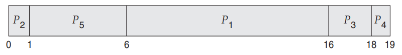

- 평균 대기시간 : 8.2ms

#### indefinit blocking, starvation

- 우선순위가 낮은 process 는 무기한으로 blocking 될 수 있음
- 해결방법 (1) aging
    - waiting 상태로 머무른 시간만큼 우선순위를 점차 높여줌
- 해결방법 (2) Round Robin 과 결합
    - 우선순위가 같을 때는 RR 알고리즘을 적용

| Process | Burst Time | Priority |
|:-------:|:----------:|:--------:|
|   P1    |     4      |    3     |
|   P2    |     5      |    2     |
|   P3    |     8      |    2     |
|   P4    |     7      |    1     |
|   P5    |     3      |    3     |

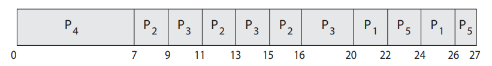

#### Priority

- 숫자로 매김
    - 시스템에 따라 낮은 숫자가 높은 우선순위일수도 있음
- 내부/외부 적으로 정의 가능
- 내부적 정의 : 시간 제한, 메모리 요구사항, open files, 평균 I/O Burst 시간 등을 이용
- 외부적 정의 : OS 외부에서 정의, Process 중요도, 컴퓨터 사용에 지불되는 유형, 금액, 정책 등

#### 선점, 비선점 둘다 가능

ready queue에 새로운 process가 enqueue되면,

- 선점 : 우선순위가 더 높다면, 현재 실행 중인 process를 선점할 수 있음
- 비선점 : 우선 순위에 따라 ready queue에 enqueue

## 5. Multilevel Queue Scheduling

single queue는 우선 순위가 높은 process 탐색 시 `O(n)` 시간복잡도를 가짐

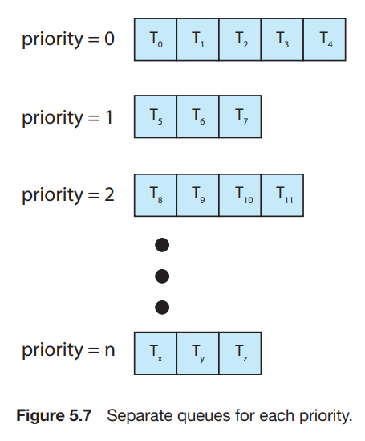

- Multilevel Queue는 우선순위 별로 queue를 배치
- RR 알고리즘과 결합했을 때 적합
- process의 우선순위는 정적으로 결정되어, runtime 동안 같은 queue에 머묾

#### partitioning processes

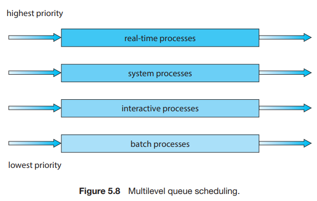

- process를 타입에 따라 partitioning하여 분리된 queue에 배치
- 각 queue 마다 적합한 알고리즘 적용
- queue 사이에도 절대적인 우선순위 있음
    - e.g. real-time queue가 batch-queue보다 절대적인 우선순위를 가짐
- e.g. foreground (interactive), background (batch)로 partiting
    - foreground interactive
        - RR 알고리즘 사용
        - background보다 우선순위 높고, 응답 시간이 짧아야 함
        - background보다
    - background : batch
        - FCFS 알고리즘 사용
- time-slice 방식 : 각 queue에 CPU 할당 시간을 분배할 수 있음
    - e.g. CPU 시간의 80%를 foreground에, 20%를 background에 할당

## 6. Multilevel Feedback Queue Scheduling

- MultiLevel Queue Scheduling에서 queue간에 process가 이동 가능하게 함
    - CPU time이 길면 우선순위를 낮춤 -> I/O bound, interactive process가 우선순위가 높아짐
    - waiting 시간이 길면 우선순위를 높임 -> starvation 방지
- 일반적으로 사용되는 알고리즘이지만, 복잡함
    - 파라미터 정의 등

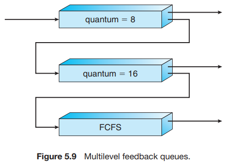

- 모든 process가 qeueue 0에 enqueue 되서 시작
- queue 1은 queue 0이 빈상태일때만 실행 가능
- queue 1이 실행 중이다가 queue 0에 enqueue되면, queue 1은 선점당함

1. queue 0에 enqueue
2. 8 quantum 동안 실행 후
    - 완료안되었으면 qeueue 1에 enqueue
3. queue 0이 비었다면 queue 1을 16 quantum 동안 실행
    - 완료안되었으면 queue 2에 enqueue
4. queue 0, 1 이 비었다면 queue 2를 FCFS로 실행
    - queue 2에 긴 시간 waiting하면 순차적으로 우선순위를 높여감

#### 파라미터

- queue의 수
- 각 queue의 scheduling algorithm
- process의 우선순위가 변경되는 기준 더 높거나 낮은 queue로 이동
- process가 queue에 enqueue되는 기준
