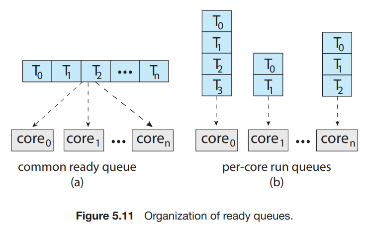
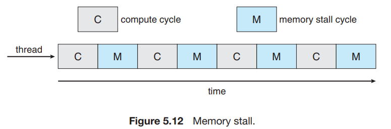
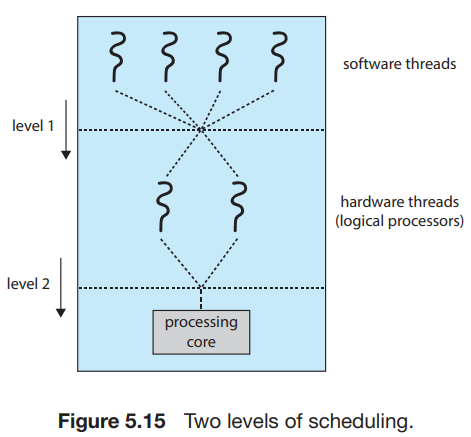
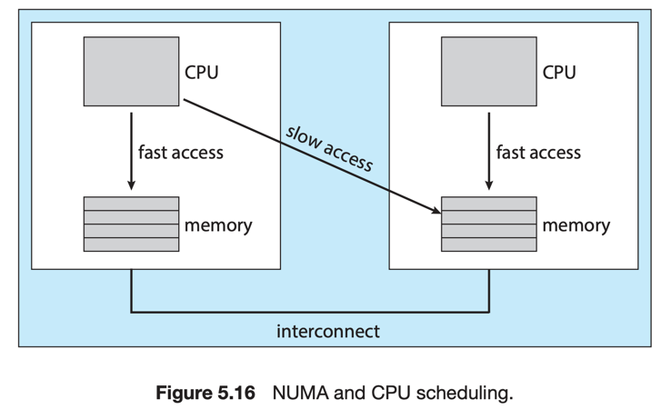

# 5.Multi-Processor Scheduling

1. Approaches to Multiple-Processor Scheduling
2. Multicore Processors
3. Load Balancing
4. Processor Affinity
5. Heterogeneous Multiprocessing

---

Multiple CPU 환경에서는 load sharing이 가능해짐

#### multiprocessor architecture

- multiple physical processors, each contained one single-core CPU
- Multicore CPUs
- Multithreaded cores
- NUMA systems
- Heterogeneous multiprocessing

## 1. Approaches to Multiple-Processor Scheduling

#### asymmetric multiprocessing

- 하나의 processor master server 모든 scheduling을 담당
- 다른 processor slave server는 user code 만 실행
- master server가 bottleneck 되어 전체적인 시스템 성능 저하 가능성

#### symmetric multiprocessing SMP

- 각 processor들이 스스로 scheduling
- processor의 scheduler는 ready queue 보고, 실행할 thread를 선택
- 거의 모든 modern OS에서 사용 Windows, Linux, Android, mac OS

#### SMP의 thread 관리 전략

1. common ready queue : 모든 thread를 공용 ready queue에 관리
    - race condition 발생 가능성
        - locking mechanism 필요
    - bottleneck
2. private queue : 각 processor마다 private ready queue를 관리
    - shared queue와 같은 성능 문제 없음
    - SMP 구현에 일반적으로 사용됨
    - cache memeory 사용에 효과적
    - balancing algorithm : processor 들 간의 업무량 조절 필요

## 2. Multicore Processors

#### n processors vs 1 processor with n cores

- Multicore Processor : 하나의 chip에 여러개의 core가 존재하는 CPU
- 각 core가 OS에게 독립된 가상의 CPU처럼 보임
- n 개의 processor보다 전력을 덜 소모하고 더 빠름

#### memory stall

- processor가 memory에 접근할 때 소모되는 시간 지연
- 현대 processor는 memory보다 속도가 빨라서 발생
- cache miss 때문에도 발생 가능
    - cache miss : cache memory에 없는 data에 접근하려하는 것

#### multithreaded processing core

- memory stall 해결 방안
- 각 core가 hardware thread를 2개 이상 가짐
- 하나의 thead가 memory stall에 빠지면 다른 thread로 switching

#### chip multi threading CMT

- multithreaded processing core의 또 다른 이름
- 각 thread는 독립된 register set, instruction pointer 등을 가짐
- OS 관점에서 하나의 논리적 CPU로 보임
- e.g. Intel의 hyperthreading, Oracle Sparc M7
    - Intel i7 : 각 core가 2개의 hardware thread를 가짐
    - Oracle Sparc M7 : 8 threads * 8 cores = 64개의 가상 CPU

#### 구현 방법

coarse-grained multithreading, fine-grained multithreading

- coarse-grained multithreading
    - memory stall 발생 시 다른 thread로 switching
    - switching overhead가 큼
        - instruction pipeline을 비우고, 다른 thread를 실행해야함
- fine-grained multithreading
    - thread switching overhead가 작음
        - thread switching을 위한 logic을 가지고 있음

#### multithreaded, multicore processor scheduling

- 두 레벨의 scheduling 필요
- OS가 하는 scheduling : software thread를 hardware threadlogical CPU에 mapping
    - 일반적인 CPU scheduling algorithm 사용
- 각 core가 하는 scheduling : 실행할 hardware thread를 선택
    - UltraSPARC T3의 RR algorithm
    - Intel Itanium의 dynamic urgency value
- 두 레벨이 서로 배타적이지 않음
    - processor의 resource 공유를 인식하여, 서로 다른 logical processor에 mapping할 수 있음

## 3. Load Balancing

SMP에서 모든 processor에게 부하량을 균등하게 분배하는 것  
asymmetric multiprocessing 환경에선 필요없음

#### load balancing 방법

- push migration, pull migration 2가지가 병렬적으로 적용됨
- push migration
    - 각 processor의 부하량을 주기적으로 확인
    - 불균형이 발견되면, 부하가 적은 processor에게 thread 를 이동시킴
- pull migration
    - 유휴 prossesor가 바쁜 processor로부터 thread를 가져옴
- e.g. Linux CFS scheduler, FreeBSD system ULE scheduler

## 4. Processor Affinity

processor에서 실행 중인 thread를 다른 processor로 옮기는 것을 방지하는 것  
즉 실행 중인 thread는 자신의 processor에 Affinity를 가짐

- load balancing 등의 이유로 thread를 옮기면 warm cache를 지우고 다시 채워야함
    - warm cache : thread가 실행되는 동안 processor cache memory에 저장된 data
- common ready queue는 매번 CPU의 cache를 비우고 다시 채워야함
- private ready queue는 cache warm을 유지하기 위해 thread를 다른 processor로 옮기지 않음

#### soft affinity, hard affinity

- soft affinit : OS는 Affinity를 유지하려하지만, load balancing에 따라 thread가 다른 processor로 옮겨질 수 있음
- hard affinit system call : process가 실행될 processor 하위 집합을 지정
- e.g. Linux는 soft affiniit을 지원하면서 `sched_setaffinity()` system call을 통해 hard affinity를 지원

#### non-uniform memory access NUMA

- 각 processor chip에 CPU와 local memory 존재
- CPU 자신의 local memory에 대한 접근이 다른 CPU의 local memory에 대한 접근보다 빠름
- NUMA-aware 알고리즘을 사용하는 OS CPU scheduler와 memory placement algorithm
    - 특정 CPU에 schedule된 thread는 해당 CPU의 local memory에 접근

#### load balancing vs processor affinity

- 한 CPU에 thread가 오래 머무는 것이 성능이 더 좋을 수 있음
- processor의 cache memory를 이용하기 때문
- load balancing과 affinity를 적절히 혼합하여 사용해야함

## 5. Heterogeneous Multiprocessing HMP, 이기종 컴퓨팅

- task의 특정 요구사항에 따라 특정 core에 할당하여 전력 소비를 줄이는 것

#### e.g. ARM big.LITTLE

- 고성능의 big core와 저전력의 LITTLE core를 혼합
- big core :  고전력을 소비하기 때문에 짧은 시간만 사용됨
    - 고성능을 요구하고, 실행시간이 짧은 작업 할당 e.g. foreground task, interactive application
- LITTLE core : 저전력을 소비하기 때문에 오래 사용됨
    - 고성능이 필요 없고 실행시간이 길어도 되는 작업 할당 e.g. background task
- power-save mode에 돌입하면 big core를 disabled
- Window 10은 HMP를 지원하여 thread가 전력 관리 설정에 부합하는 scheduling 정책을 사용