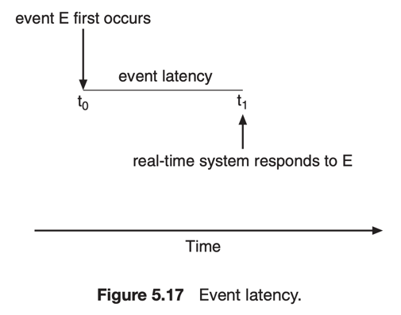
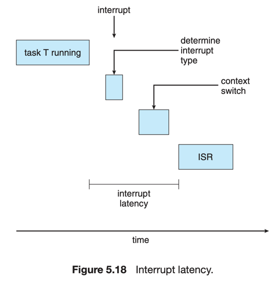
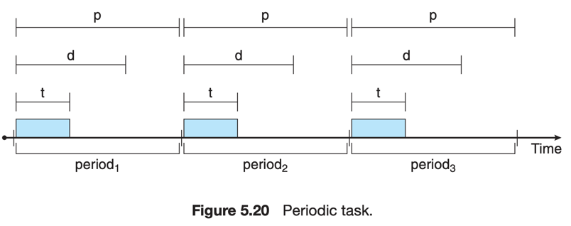
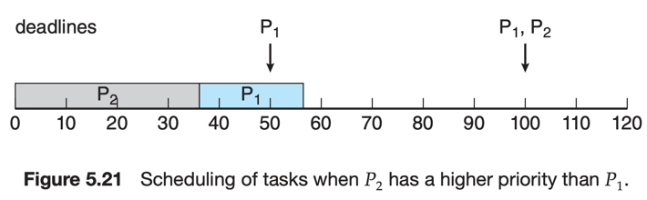
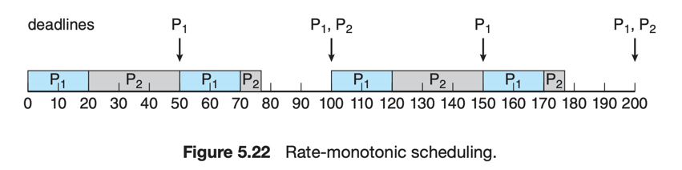
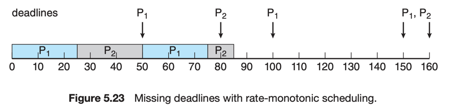

# 6. Real-Time CPU Scheduling

1. Minimizing Latency
2. Priority-Based Scheduling
3. Rate-Monotonic Scheduling
4. Earliest-Deadline-First Scheduling
5. Proportional-Share Scheduling
6. POSIX Real-Time Scheduling

---

#### Soft real-time system vs Hard real-time system

- Soft real-time system
    - real-time process의 schedule 시점을 보장하지 않음
    - 다른 process보다 우선순위를 가짐
- Hard real-time system
    - deadline을 보장해야 함
    - deadline을 넘어서면 service 제공하지 않은 것과 동일

## 1. Minimizing Latency

#### Event latency

- event latency : event가 발생한 시점부터 service가 가능한 시점까지의 시간
- real-time system은 event-driven nature
- event가 발생하면 system은 응답하고, service가 가능해야함
- event 마다 다른 latency를 요구함
- latency에 영향을 주는 요소
    - Interrupt latency
    - Dispatch latency

#### Interrupt latency

- interrupt가 CPU에 도착부터 interrupt를 처리하기 시작할 때까지의 시간
- interrupt latency = OS가 현재 실행중인 명령을 완료 + interrupt type을 결정 + 최근 process의 상태를 저장
- interrupt latency 이후 ISR interrupt service routine 을 사용하여 interrupt를 처리
- real-time system에서 interrupt latency를 최소화하는 것이 중요
    - hard real-time system에서는 엄격하게 제한

#### Dispatch latency

- Dispatcher가 현재 process를 stop하고, 다른 process를 실행하기까지 걸린 시간
- hard real-time system에선 몇 ms 정도
- confilct phase
    - kernel에서 실행 중인 모든 process에 대한 선점
    - 낮은 우선순위 process가 높은 우선순위 process에게 resource를 release

## 2. Priority-Based Scheduling

- real-time process의 CPU 요청에 빠르게 응답하는 것이 중요
- real-time OS는 priority-based scheduling을 사용
- 각 process에 우선순위를 할당
    - 더 중요한 task를 가진 process에 더 높은 우선순위를 할당
    - 선점을 지원할 시, 더 높은 우선순위를 가진 process가 CPU를 선점할 수 있음
- soft real-time system
    - 일반적인 CPU Priority
      Scheduling [참고](../3_Scheduling_Algorithms/README.md#4-priority-scheduling-sup-우선순위-스케줄링-sup) e.g. Linux,
      Windows
    - real-time process에 더 높은 우선순위 부여
    - 우선순위를 부여하는 것에 그침
- hard real-time system
    - real-time task가 deadline을 만족하도록 보장
    - 따라서 추가적인 scheduling 이 필요

#### Periodic task

- process은 주기적임 = processs는 일정한 주기로 CPU를 요청함
- `p` : 주기, `d` : deadline, `t` : fixed processing time

#### admission control algorithm

- process는 deadline을 scheduler에게 알려줘야함
- scheduler는 deadline을 보고 승인하거나 거절
    - 승인 : deadline 만족 가능할 때
    - 거절 : deadline 만족 불가능할 때

## 3. Rate-Monotonic Scheduling

task들에 정적으로 우선순위를 부여하고, task들의 실행 주기를 지정하여 scheduling

- 더 높은 우선순위 process가 더 낮은 우선순위 process를 선점
- 더 짧은 실행주기 process가 더 높은 우선순위를 가짐 CPU를 더 자주 요청하는 task에 더 높은 우선순위 할당
- process의 실행시간은 CPU Burst 마다 동일한 것으로 간주

#### 작동 예시

| Process | periods | processing time |
|:-------:|:-------:|:---------------:|
|   P1    |   50    |       20        |
|   P2    |   100   |       35        |

- P2가 P1보다 더 높은 우선순위를 가질 때
- **P1의 deadline을 만족하지 못함**
- CPU 사용률 : 75%

- Rate-Monotonic Scheduling
- P1이 P2보다 더 높은 우선순위를 가짐
    - P1의 period가 더 짧기 떄문
- CPU 사용률 : 75%

#### Rate-Monotonic Scheduling 최적이 아닌 경우

| Process | periods | processing time |
|:-------:|:-------:|:---------------:|
|   P1    |   50    |       25        |
|   P2    |   80    |       35        |

- **P2는 dealine 5ms 후에 완료됨**
- CPU 사용률 : 94%

## 4. Earliest-Deadline-First Scheduling EDF

우선순위를 deadline에 따라 동적으로 할당

- deadline에 가까울 수록 더 높은 우선순위를 가짐
- process가 runnable 상태가 되면 system에 자신의 deadline을 알림
- 새로운 process의 deadline을 반영하기 위해 우선순위가 수정될 수 있음

#### 작동 예시

| Process | periods | processing time |
|:-------:|:-------:|:---------------:|
|   P1    |   50    |       25        |
|   P2    |   80    |       35        |

- Rate-Monotonic Scheduling에서 실패함

- P1의 deadline이 가장 짧아서 가장 높은 우선순위 배정
- time 50 이후 : P2의 deadline이 P1보다 가깝기 때문에 P2의 우선순위가 더 높아짐
- time 100 : P1의 deadline이 P2보다 가까워서 P1의 우선순위가 더 높아지고, P1이 선점

## 5. Proportional-Share Scheduling

## 6. POSIX Real-Time Scheduling

