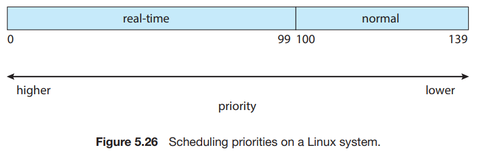
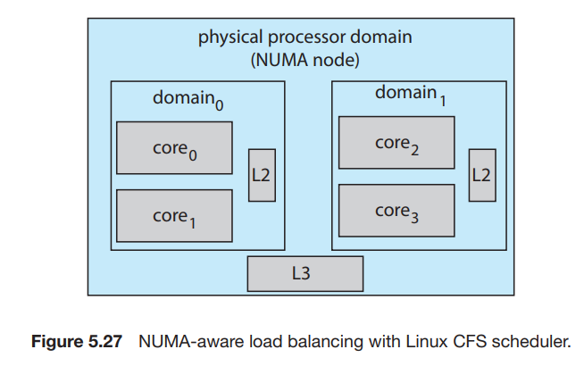
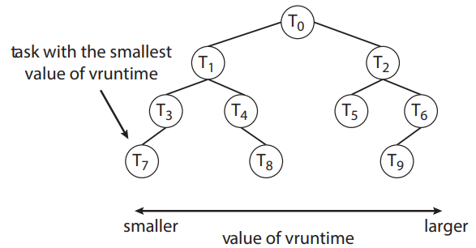

# 7. Operating-System Examples

1. Example: Linux Scheduling
2. Example: Windows Scheduling
3. Example: Solaris Scheduling

---

Linux의 Task Scheduling, Windows, Solaris의 kernel threads scheduling

## 1. Example: Linux Scheduling

- version 2.5
    - O(1) algorithm을 사용
    - SMP 에 대한 향상된 지원 processor affinity, load balancing
- version 2.6.23
    - Completely Fair Scheduler(CFS) 도입, 기본 algorithm으로 채택

#### scheduling classes

- Linux의 scheduling 기반
- 각 class가 특정 우선순위 할당 받음
- process와 system의 요구에 따라 다른 scheduling class를 사용
- 다음으로 실행할 task 선택 시 가장 높은 우선순위 class 속하는 가장 높은 우선순위 task 선택
- scheudling class
    - CFS scheduling을 활용한 default class
    - real-time scheduling class

#### CFS scheduling

- 각 task의 CPU 시간을 비율로 할당
- task 마다 nice value를 할당하여 priority를 계산
    - -20 ~ 19, 값이 작을수록 높은 우선순위, 많은 비율의 CPU 시간 할당
- target latency : 모든 runnuable task가 최소 한번씩 실행되는 시간
- `vruntime` : task 별 변수
    - 같은 실행시간에도 우선순위가 낮을수록 vruntime이 높아짐
    - 다음 작업 선택 시 vruntime이 가장 작은 작업 선택
    - runnuable task가 우선순위가 더 낮은 task를 선점 가능

##### 작동 예시

- I/O-Bound Task와 CPU-Bound Task가 동일한 nice value일 때
    - I/O-Bound Task의 `vruntime`이 더 낮아짐 = 우선순위가 더 높아짐
    - I/O-Bound가 실행 가능상태가 되면 CPU-Bound를 선점

#### real-time scheduling

- `SCHED_FIFO`, `SCHED_RR` 이 다른 일반 task보다 우선순위가 높음
- **작은 값이 우선순위가 높음**
- real-time task의 우선순위 값 : 0 ~ 99
- normal task의 우선순위 값 : 100 ~ 139
    - -20 => 100, +19 => 139

#### hierarchical system of scheduling domains

- NUMA aware, thread 이동 최소화
- scheduling domain : 상호 balancing이 가능한 CPU Core 집합
    - domain 안에서 L2 cache를 공유
- thread는 같은 domain안에서만 이동 가능
    - 심각한 load 불균형일 경우 domain을 넘어 이동 가능

### Linux CFS Performance

- queue가 아닌 red-black tree에 task를 저장
    - balanced binary search tree
- task가 runnable 상태가 되면 tree에 삽입
- leftmost node : 가장 높은 우선순위 task
- 탐색 속도 : O(log N)
- Linux는 `rb_leftmost` 에 leftmost node를 caching

## 2. Example: Windows Scheduling

Windows는 우선순위 기반의 선점형 scheduling을 사용

- Windows는 항상 가장 높은 우선순위의 thread가 실행 중
- dispatcher : Windows kernel에서 scheduling을 담당하는 부분
    - dispatcher가 실행할 thread를 선택하면 다음 시점까지 실행됨
        - 정상 종료
        - 더 높은 우선순위의 thread가 선점
        - 더 높은 우선순위의 real-time thread가 선점
        - time quantum이 끝남
        - blocking system call

#### 32-level priority scheme

- 32개의 priority-level로 thread 실행 순서를 정함
- 

## 3. Example: Solaris Scheduling

