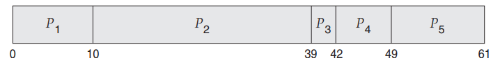
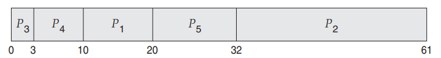
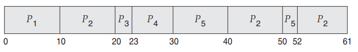
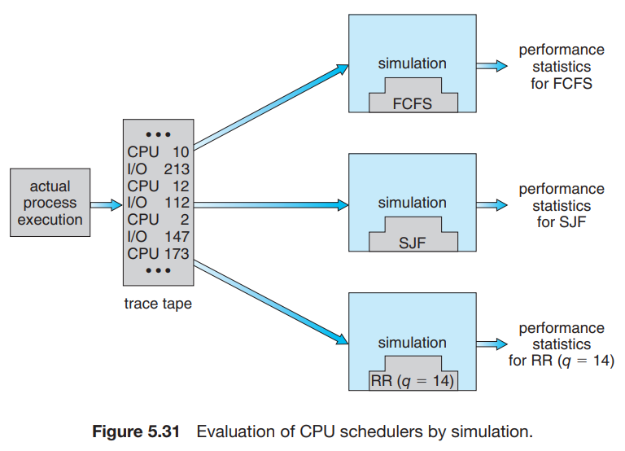

# 8. Algorithm Evaluation

1. Deteministic Modeling
2. Queueing Models
3. Simulations
4. Implementation

---

#### scheduling 알고리즘 평가 기준

- CPU utilization 최대화
    - 최장 응답 시간 300ms
- throughput 최대화
    - 전체 실행 시간 대비 turnarround 시간이 선형 비례

## 1. Deterministic Modeling

- analytic evaluation : 주어진 알고리즘과 작업량으로 성능을 나타내는 공식이나 숫자를 만듦
- Deterministic Modeling은 analytic evaluation의 한 종류
- 쉽고 빠르게 계산할 수 있음
- 숫자로 알고리즘 성능을 비교할 수 있음

#### modeling 방법

| Process | Burst Time |
|:-------:|:----------:|
|   P1    |     10     |
|   P2    |     29     |
|   P3    |     3      |
|   P4    |     7      |
|   P5    |     12     |

##### FCFS



- average waiting time = 28ms

##### SJF



- average waiting time = 13ms

#### RR (quantum = 10ms)



- average waiting time = 23ms

## 2. Queueing Models

- CPU Burst와 I/O Burst의 분포를 측정함
- 한계
    - 복잡한 알고리즘에 적용하기 힘듦
    - service rate, arrival rate 등이 숫자로서 다뤄질수 있어야함

#### queueing-network analysis

- CPU : ready queue를 가진 서버
- I/O : dvice queue를 가진 서버
- arrival rate, service rate를 사용하여 이용률, 평균 queue 길이, 평균 대기시간 등을 계산함

#### Little’s formula

````
n = λ × W.
````

- n : 평균 장시간 대기열 길이
- λ : 평균 도착 률 (3 : 초당 3개 프로세스 도착)
- W : 평균 queue에서 대기 시간

## 3. Simulations

- 컴퓨터 시스템의 모델을 프로그래밍해서 시뮬레이션
- 소프트웨어 자료구조 : 시스템의 주요 컴포넌트를 표현
- 시뮬레이션의 결과로 알고리즘의 성능을 나타내는 통계치가 나옴

#### distribution-driven simulation

- random-number generator
    - process, CPU burst time, arrivals 등을 확률분포에 따라 생성
- 실제 시스템의 연속적인 이벤트간의 관계 때문에 부정확함
- 따라서, trace file을 사용하여 시뮬레이션을 함
    - trace file : 실제 시스템에서 발생한 이벤트를 기록한 파일, 많은 storage가 필요함



## 4. Implementation

- 코딩하고, OS에 직접 구현해서 실제 어떻게 동작하는지 보는 것

#### 어려움

- 비용 : 코딩, OS에 구현, 테스트 후 수정
- 보통 가상 머신에서 테스트
    - Regression testing : 변경사항이 있는지 확인
- 알고리즘 구현 환경의 변경 가능성
    - 프로그램 다시 작성, 문제 유형 변경, scheduler 성능 등

#### 구현 방안

- scheduling algorithm 구현 우회
    - 단순하게 I/O 양을 확인하여 interactive/noninteractive 구분
- 유연하게 구현
    - 특정 applicatoin, 목적에 특화된 scheduler를 만듦
    - 고성능 그래픽 application, 실시간 application, web server 등 목적에 맞게
- API : process나 thread의 우선순위 수정 가능
    - e.g. Java, POSIX, Windows API


