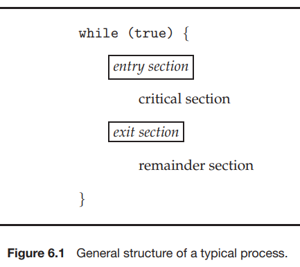
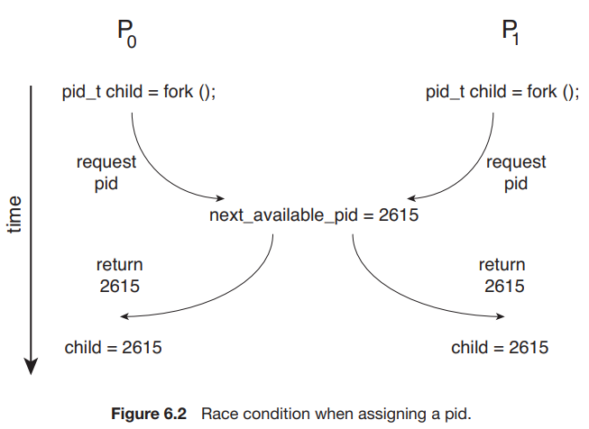

# 2. The Critical-Section Problem, 임계영역

### Critical-Section, 임계영역

- n개의 process
- 각 process에서 공유 데이터에 접근하는 코드
    - 공유 데이터 : 다른 process에 의해 접근될 수 있는 데이터
- 임계영역 : 공유 데이터에 접근하는 코드 영역

### Critical-Section Problem, 임계영역 문제

- 동시에 하나의 process만 임계 영역을 실행 할 수 있게하면 생산성이 떨어짐
- process의 동작을 동기화 하여 공유 데이터에 협동적으로 접근할 수 있게 함
- entry section : 각 process가 임계영역에 들어갈 떄 실행 허가를 요청
- remainder sectionA
- exit section

### 임계영역 요구사항

- Mutual exclusion, 상호배제
    - 임계영역을 실행 중인 process는 동시에 하나만 존재
- Progress, 진행 조건
    - 임계영역 실행 process가 없고, 임계영역에 들어가려는 process가 있으면
    - remainder section 실행 process가 다음 임계영역 실행 process를 결정
- Bound waiting, 유한대기
    - 임계영역에 들어가려는 process는 유한 시간 내에 들어갈 수 있어야 함

### race condition, 경쟁상태

- race condition 발생할 수 있는 kernel 자료구조
    - OS의 open files
    - pid
    - memory 할당
    - process list

### OS가 임계영역을 해결하는 방법

- single-core system
    - 공유 데이터가 수정 중일 때 interrupt 되는 것을 막음
    - 선점 없음
- multiprocessor environment
    - interrupt 방지는 시간이 소모되는 작업 : 모든 processor에게 disabled를 알려야함
- nonpreemptive kernels
    - kernel-mode의 process가 선점될 수 없음
    - process가 kernel-mode를 빠져나가거나, block 되거나, CPU 제어를 자발적으로 양도할 떄까지 실행됨
    - race condition이 발생하지 않음
- preemptive kernels
    - kernel-mode의 porcess가 선점될 수 있음
    - SMP architecture에서 구현이 복잡해짐
    - 더 반응성이 좋고, real-time process에 적합
