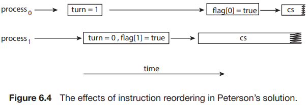

# 3. Peterson's Solution

- 가장 classic한 임계영역 해결방법
- 현대 컴퓨터 구조에서는 적합하지 않음
- 하지만, 임계영역 문제를 이해하는데 도움이 됨
    - 상호배제, progress, bounded waiting

### Pseudocode

````
int turn;
boolean flag[2];

while (true) {
  flag[i] = true;
  turn = j;
  
  while (flag[j] && turn == j)
  ;
  
  /* critical section */
    
    
  flag[i] = false;
    /*remainder section */
}
````

- `Pi`, `Pj` :  2개의 process만 있음
    - 내가 `Pi` 면 다른 하나는 `Pj`
- `turn` : 임계 영역에 들어갈 차례인 process
- `flag` array : process가 임계영역에 들어갈 준비가 되었는지 여부
    - e.g. `flag[0]` : process 0이 임계영역에 들어갈 준비가 되었는지 여부

#### Mutual Exclusion

- `Pi`가 임계영역에 들어가려면
    - `flag[j]` 가 false이거나,
    - `turn`이 `i`가 되어야 함

### Modern Architecture에서의 한계



- 시스템 성능 향상을 위해 processor나 compiler는 R/W 순서를 바꿈
- 공유 데이터를 사용하는 multithreaded app에서 순서를 바꾸는 것은 잘못된 결과를 만듦
- **processor가 threa의 명령을 재정렬 할 수 있음**
    - entry section의 명령 순서가 바뀌면 잘못된 결과가 나옴
