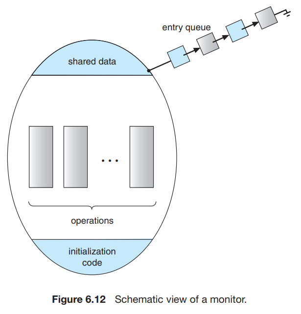
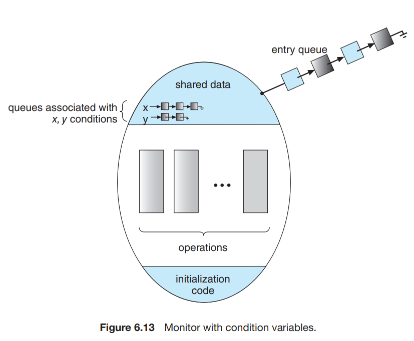

# 7. Monitors

1. Monitor Usage
2. Implementing a Monitor Using Semaphores
3. Resuming Processes within a Monitor

---

#### mutex lock과 semaphore의 오류 가능성

- `signal()`이 `wait()` 보다 먼저 실행되면, 동시에 2개이상의 프로세스가 임계영역 진행 가능
- 프로그램이 `signal()`을 `wait()` 으로 대체했을 때, 프로세스는 영구적으로 block
- `wait()`이나 `signal()` 중 하나라도 누락되면 상호 배제가 무시되고, 프로세스가 영구적으로 block

## 1. Monitor Usage

````
monitor monitor1{
    /* shared variable declarations */
    
    funtion P1(...){
           ...
    }
    
    funtion P2(...){
           ...
    }
    
    ...
    
    initialization code(...){
           ...
    }
}

````

- Abstract Data Type (ADT) : 프로그래머가 정의한 자료형
- ADT를 사용해서 함수와 데이터를 캡슐화
- `monitor type` :  프로그래머가 정의한 monitor와 함께 구현된 상호배제 명령 ADT
- 프로세스들이 `monitor type`을 직접 호출할 수 없음
    - 내부 지역변수, 함수에 접근 불가



- 동시에 하나의 프로세스만이 `monitor`와 함께 활동할 수 있음



- 프로그래머는 `contition` 구조를 추가로 정의해서 동기화 구현
    - `condition x, y;`
    - `x.wait()` : 다른 프로세스가 `x.signal()`을 호출할 때까지 프로세스를 block
    - `x.signal()` : `x.wait()`을 호출한 프로세스 중 하나를 재개

#### 상세 동작

- P : `x.signal()`을 호출한 프로세스
- Q : `x.wait()`을 호출한 프로세스
- 두가지 시나리오 가능
    - Signal and wait : P는 Q가 모니터를 떠날떄까지 기다리거나, 다른 condition을 기다림
    - Signal and continue : Q는 P가 모니터를 떠날때까지 기다거나, 다른 condition을 기다림

## 2. Implementing a Monitor Using Semaphores

- signal-and-wait 방식으로 구현
- `signal()` : `signal(x)`를 호출한 프로세스가 모니터를 떠날 때까지 기다림
- 변수 `next` : `signal`시 사용하는 세마포어, 초기값 0
- 변수 `next_count` : `signal`시 사용하는 카운터

````
wait(mutex);
  ...
  body of F
  ...
if(next_count > 0) 
  signal(next);
else signal(mutex);
````

- 변수 `x_sem`, `x_cound` : condition `x`를 위한 세마포어, 초기값 0

````
// x.wait() 구현
x_count++;
if(next_count > 0)
  sinal(next);
else
  signal(mutex);
wait(x_sem);
x_count--;

// x.signal() 구현
if(x_count > 0){
  next_count++;
  signal(x_sem);
  wait(next);
  next_count--;
}
````

## 3. Resuming Processes within a Monitor

- 다음 실행할 process를 정하는 기준
    - FCFS : 가장 간단한 방법
    - conditional-wait construct `x.wait(c);`
        - 변수 `c` : 숫자, 우선순위, 중단된 프로세스 이름
        - `x.sginal()` : 우선순위 숫자가 가장 작은 프로세스를 재개

````
monitor ResourceAllocator{
    boolean busy;
    condition x;
    
    void acquire(int time){
        if(busy) 
            x.wait(time);
        
        busy = true;
    }
    
    void release(){
        busy = false;
        x.signal();
    }
    
    initialization code(){
        busy = false;
    }
}

// access code
R.acquire(t);
  ...
  access the resource;
  ...
R.release();
````

### 문제점

- process가 resource에 접근을 허가받지 않고 접근 가능
- process가 resource에 접근을 허가받으면 절대 releas 못함
- process가 요청한적 없는 resource를 release 시도 가능
- process가 resource를 release하지 다시 같은 resource를 요청 가능
- 모든 프로그램이 `ResourceAllocator`를 사용해야함
- **liveness failure** : 프로세스가 영원히 block되는 경우

