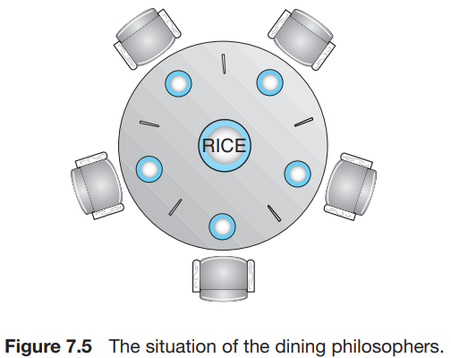

# 1. Classic Problems of Synchronization

1. The Bounded-Buffer Problem
2. THer Readers-Writers Problem
3. The DIning-Philosophers Problem

---

## 1. The Bounded-Buffer Problem

````
int n;
semaphore mutex = 1;
semaphore empty = n;
semaphore full = 0;
````

- buffer : n개의 고정된 크기를 가진 공유 메모리
- `mutex` : 공유 메모리에 대한 접근, 상호 배제를 제공하는 binary semaphore
- `empty` : buffer에 쓸 수 있는 공간의 수를 나타내는 semaphore
- `full` : buffer에 읽을 수 있는 공간의 수를 나타내는 semaphore

````
// producer
while(true){
    ...
    /* produce an item in next_produced */
    ...
    wait(empty);
    wait(mutex);
    ...
    /* add next_produced to the buffer */
    ...
    signal(mutex);
    signal(full);
}

// consumer
while (true) {
    wait(full);
    wait(mutex);
    ... 
    /* remove an item from buffer to next_consumed */
    ...
    signal(mutex);
    signal(empty);
    ...
    /* consume the item in next_consumed */
    ...
}

````

## 2. The Readers-Writers Problem

- data에 대한 행위를 ***reader***와 ***writer***로 구분
- writer와 다른 process (reader or writer)가 동시에 접근하면 문제 발생
- readers - writers problem : writer가 공유 데이터에 접근할 때는 배타적으로 접근
- first readers-writers problem : writer가 허가를 받으면, 다른 reader를 선점
- second readers-writers problem : writer가 ready 상태가 되면 가능한 빨리 접근하도록 함
    - writer가 waiting일 때는 reader가 접근 불가능

### starvation, 기아 상태

- first problem에서는 writer가 기아 상태에 빠질 수 있음
- second problem에서는 reader가 기아 상태에 빠질 수 있음

### reader-writer lock

- lock을 read-mode와 write-mode로 구분
- 유용한 app
    - process를 reader와 writer로 구분하기 쉬운 app
    - reader가 writer보다 많은 app
        - 세마포어, 상호 배제 lock보다 오버헤드가 있음

|        항목         |      read mode lock       |      write mode lock       |
|:-----------------:|:-------------------------:|:--------------------------:|
|       요청 시기       | shared data를 read 하려고 할 때 | shared data를 write 하려고 할 때 |
|   요청 가능 프로세스 수    |           1개 이상           |             1개             |
| concurrent access |            가능             |            불가능             |

````
// read process의 shared data structure
semaphore rw_mutex = 1;
semaphore mutex = 1;
int read_count = 0;

// writer process
while(true){
    wait(rw_mutex);
    ...
    /* writing is performed */
    ...
    signal(rw_mutex);
}

// reader process
while(true){
  wait(mutex);
  read_count++;
  if(read_count == 1)
      wait(rw_mutex);
  signal(mutex);
  
    ...
    /* reading is performed */
    ...
    
    wait(mutex);
    read_count--;
    if(read_count == 0)
        signal(rw_mutex);
    signal(mutex);    
````

- `mutex` :`read_count`가 업데이트 될 때 상호배제 제공
- `read_count` : object를 읽고 있는 reader process의 수
- `rw_mutex` : writer에게 상호배제 제공, reader가 첫번째나 마지막 임계영역을 진입/퇴장할 때 사용
- writer process가 임계영역에 있고, n개의 reader가 waiting 상태면,
    - 하나의 reader는 `rw_mutex`에 enqueue되고, 나머지 n-1개는 `mutex`에 enqueue
- writer가 `signal(rw_mutex)`를 호출하면 scheduler에 의해
    - waiting 상태의 reader가 실행 상태로 전환하고,
    - waiting 상태의 writer가 실행 상태로 전환됨

## 3. The Dining-Philosophers Problem



- 5명의 철학자가 원형 테이블에 앉아있음
- 철학자는 생각을 하거나, 식사를 함
- 철학자는 왼쪽과 오른쪽에 젓가락이 하나씩 있음
- 철학자는 젓가락을 2개 모두 들어야 식사를 할 수 있음
- 젓가락은 한 번에 한 명의 철학자만 사용 가능
- 철학자는 식사를 마치면 젓가락을 내려놓음

### 3.1 Semaphore Solution

- 젓가락을 들려할 때 `wait()`을 호출하고, 내려놓을 때 `signal()`을 호출
- Deadlock 가능성 : 모든 철학자가 동시에 왼쪽 젓가락을 들려서, 오른쪽 젓가락을 기다리는 상황

#### Deadlock 해결방안

- 최대 4명의 철학자만 앉게 함
- 철학자는 양쪽의 젓가락이 모두 사용 가능할 때만 식사를 시작
- 비대칭 전략
    - 홀수 번호의 철학자 : 왼쪽 젓가락 집은 다음 오른쪽 젓가락 집음
    - 짝수 번호의 철학자 : 오른쪽 젓가락 집은 다음 왼쪽 젓가락 집음

````
semaphore copstick[5];
````

````
while(true){
  wait(copstick[i]);
  wait(copstick[(i+1) % 5]);
    ...
    /* eat */
    ...
  signal(copstick[i]);
  signal(copstick[(i+1) % 5]);
    ...
    /* think */
    ...
}  
````

### 3.2 Monitor Solution

- deadlock 발생하지 않음
- 제한 사항 : 철학자는 양쪽 젓가락이 사용가능할때만 식사를 시작할 수 있음

````
enum {THINKING, HUNGRY, EATING} state[5];
condition self[5];
````

- 철학자 i는 `state[i]`를 사용하여 상태를 표현
    - `state[i] = EATING` : 이웃이 식사중이지 않을 때만 가능 (`state[(i+4) % 5] != EATING && state[(i+1) % 5] != EATING`)
- `condition` :  철학자 i는 배고프지만, 젓가락이 이용불가능일 때 자신을 지연시킴

````
DiningPhilosophers.pickup(i);
    ... 
    /* eat */
    ...
DiningPhilosophers.putdown(i);
````

````
monitor DiningPhilosophers {
  enum {THINKING, HUNGRY, EATING} state[5];
    condition self[5];
    
    void pickup(int i){
        state[i] = HUNGRY;
        test(i);
        if(state[i] != EATING)
          self[i].wait();
    }
    
    void putdown(int i){
          state[i] = THINKING;
          test((i+4) % 5);
          test((i+1) % 5);
    }
    
    void test(int i){
        if(state[(i+4) % 5] != EATING 
            && state[i] == HUNGRY && state[(i+1) % 5] != EATING){
            state[i] = EATING;
            self[i].signal();
        }
    }
    
    initialization code(){
        for(int i = 0; i < 5; i++)
            state[i] = THINKING;
    }

}
````
