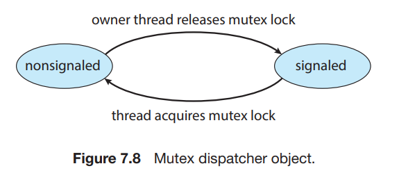

# 2. Synchronization within the Kernel

1. Synchronization in Windows
2. Synchronization in Linux

---

## 1. Synchronization in Windows

- Windows는 real-time app과 single-processor system을 위한 multithreaded kernel을 제공
- multiprocessor system에서 global resoource에 대한 spinlock을 사용
    - thread가 spinlock을 획득하면 선점되지 않음을 보장

#### kernel 밖에서 thread synchronization

- **dispatcher object**을 사용하여 다양한 동기화 메커니즘 사용 e.g. mutex lock, semaphore, event, timer
- **Events** : condition과 유사
- timer를 통해 time이 만료됨을 thread에게 통보

#### Dispatcher object의 상태



- **signaled state** : 사용 가능 상태, object를 요청해도 thread가 block하지 않음
- **nonsignaled state** : 사용 불가능 상태, object를 요청하면 thread가 block
- nonsignaled state에서 thread가 block되면 thread는 **wait state**로 들어감
    - waiting queue에 enqueue
- object가 nonsignaled state에서 signaled state로 바뀌면 waiting queue확인
    - kernel이 waiting queue에서 하나를 dequeue하고 실행

#### critical-section object

- user-mode mutex, kernel 개입 없이 사용 가능
- multiprocessor system에서 spinlock을 사용해 구현
    - spin이 너무 길면 kernel mutext로 전환

## 2. Synchronization in Linux

- 2.6 이전까지는 비선점 kernel 이었음
    - kernel-mode에서 running 상태의 process를 선점할 수 없음 (우선순위가 높아도)
- 2.6 이후부터 선점 kernel

#### Atomic Integer

- 가장 단순한 lock 메커니즘을 제공
- 더 복잡한 상황에선, race condition이 발생할 수 있음

````
atomic_t counter; // atomic integer를 표현하는 구조체
int value;
````

| Atomic Operation                 | Description     |
|----------------------------------|-----------------|
| `atomic_set(&counter, 5);`       | counter = 5     |
| `atomic_add(10, &counter);`      | counter += 10   |
| `atomic_sub(10, &counter);`      | counter -= 10   |
| `atomic_inc(&counter);`          | counter++       |
| `value = atomic_read(&counter);` | value = counter |

#### mutex

- `mutex_lock()` : 임계영역 진입 직전 실행
- `mutex_unlock()` : 임계영역을 빠져나온 직후 실행

#### spinlocks, semaphores

- spinlock : SMP Machine에서 사용
- lock을 오래 보유해야한다면 semaphore, mutex를 사용하는 것이 적합
- kernel preemption을 enable/disable 하는 방법
    - single processor에서 사용
    - `preempt_disable()` : preemption을 disable
    - `preempt_enable()` : preemption을 enable
    - `thread_info` : task가 가지는 구조체
    - `preempt_count` : `thread_info`에 있는 lock 획득 시도 수

| Single Processor     | Multiprocessor   |
|----------------------|------------------|
| preemption : disable | acquire spinlock |
| preemption : enable  | release spinlock |

