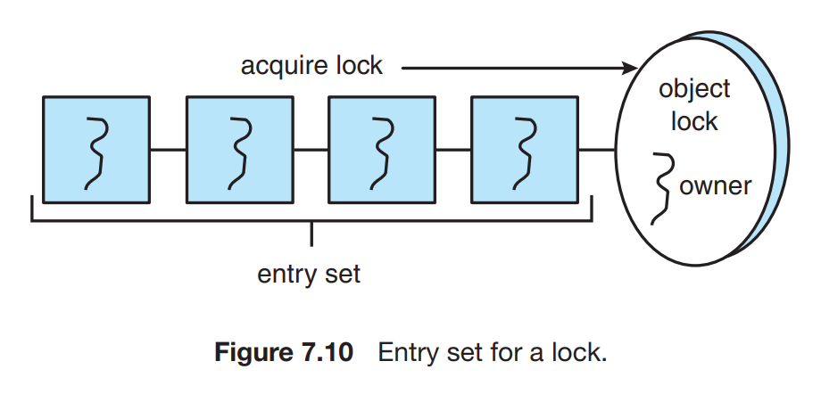
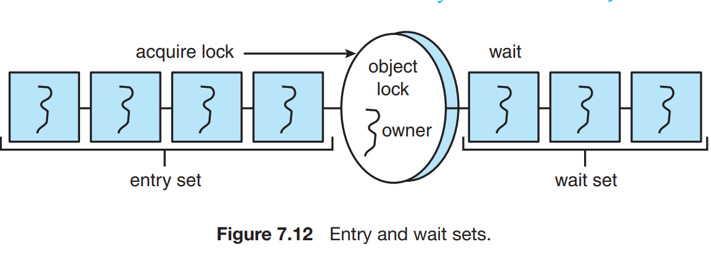

# 4. Synchronization in Java

1. Java Monitors
2. Reentrant Locks
3. Semaphores
4. Condition Variables

---

## 1. Java Monitors

```java
public class BoundedBuffer<E> {
    private static final int BUFFER_SIZE = 5;
    private int count, in, out;
    private E[] buffer;

    public BoundedBuffer() {
        count = 0;
        in = 0;
        out = 0;
        buffer = (E[]) new Object[BUFFER_SIZE];
    }

    /* Producers call this method */
    public synchronized void insert(E item) {
        /* See Figure 7.11 */
    }

    /* Consumers call this method */
    public synchronized E remove() {
        /* See Figure 7.11 */
    }
}
```

- `synchronized` 키워드가 있으면, 해당 method 사용시 lock 필요
- lock 획득 못하면 block되고, **entry set**에 위치 시킴
    - entry set : lock을 획득하기 위해 기다리는 thread들의 집합
- **wait set** : lock을 획득 했지만, 더이상 진행이 불가능한 thread들
    - e.g. producer가 `insert()`에 진입했지만, buffer가 가득 찬 경우
    - lock 해제 -> blocking -> wait set에 `add()`
    - _FIFO_ 방식으로 wait set에 추가




````
/* Producers call this method */
public synchronized void insert(E item) {
    while (count == BUFFER SIZE) {
        try {
            wait();
        }
        catch (InterruptedException ie) { }
    }
    
    buffer[in] = item;
    in = (in + 1) % BUFFER SIZE;
    count++;
    
    notify();
}

/* Consumers call this method */
public synchronized E remove() {
    E item;
    while (count == 0) {
        try {
        wait();
        }
        catch (InterruptedException ie) { }
    }
    
    item = buffer[out];
    out = (out + 1) % BUFFER SIZE;
    count--;
    
    notify();
    
    return item;
}
````

- `notify()` : wait set의 thread 중 하나를 entry set으로 이동 & _runnable_ 로 변경

#### 동작 방식

- producer :  `insert()` 후 lock 획득 가능 여부 체크 `synchronized`
    - lock 획득하여 method 진입 후 buffer 사이즈 체크
    - `wait()` : lock을 해제하고, blocking & wait set `add()`
    - `notify()` : wait set에 thread가 없으면 무시
- consumer : `remove()` 후 lock 획득 가능 여부 체크 `synchronized`
    - lock 획득하여 method 진입 후 buffer 사이즈 체크
    - `wait()` : lock을 해제하고, blocking & wait set `add()`
    - `notify()` : wait set의 producer 에게 entry set으로 이동 & _runnable_ 로 변경하라고 알림
    - `remove()`를 빠져나가고 lock을 해제

## 2. Reentrant Locks

## 3. Semaphores

## 4. Condition Variables
