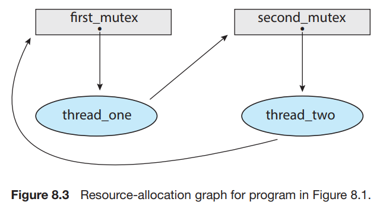
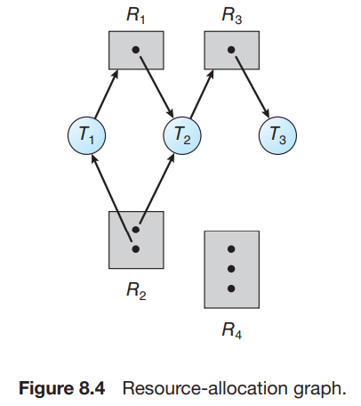
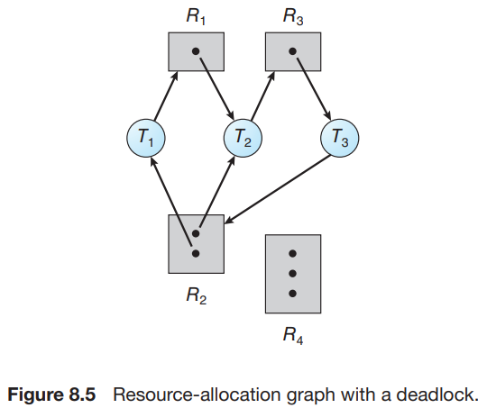
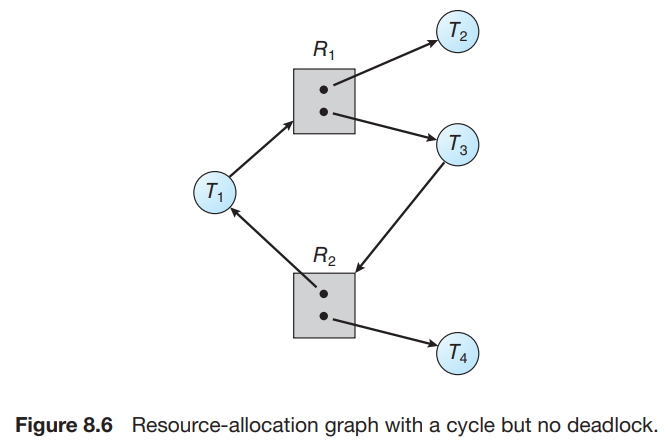

# 3. Deadlock Characterization

1. Necessary Conditions
2. Resource Allocation Graph

---

## 1. Necessary Conditions

1. **Mutual Exclusion** : 최소 1개의 resource가 non-shareable
    - 동시에 오직 한개의 thread만 resource 접근 가능
2. **Hold and wait** : 최소 1개의 resource를 가지고 있는 thread가 다른 resource를 기다림
3. **No preemption** : resource는 선점당할 수 없음
4. **Circular wait** : {T0, T1, ... Tn} waiting thread set이 있을 때,
    - T0은 hold한 채로 T1의 resource를 기다리고, T1은 hold한 채로 T2의 resource를 기다리고, ...
    - Tn은 hold한 채로 T0의 resource를 기다림

## 2. Resource Allocation Graph

- resource-allocation graph에서 cycle이 형성되면 deadlock이 발생할 수 있음
- **system resource-allocation graph**
    - _V_ : 정점 집합 V
    - _E_ : 간선 집합 E
    - T = {T0, T1, ... Tn} : system의 active thread 집합
    - R = {R0, R1, ... Rm} : system의 resource 집합
    - Ti -> Rj : **request edge**
        - Ti가 Rj를 요청, _waiting_
    - Rj -> Ti : **assignment edge**
        - Ti가 Rj를 할당받음, _holding_

#### 예시

- T = {T1, T2, T3}
- R = {R1, R2, R3, R4}
- E = {T1 -> R1, T2 -> R3, R1 -> T2, R2 -> T2, R2 -> T1, R3 -> T3}
- Resource instance
    - R1 : 1개
    - R2 : 2개
    - R3 : 1개
    - R4 : 3ro
- Thread state
    - T1 : _holding_ (R2), _waiting_ (R1)
    - T2 : _holding_ (R1, R2), _waiting_ (R3)
    - T3 : _holding_ (R3)

#### Deadlock : cycle이 형성되어 deadlock 발생

- T3가 R2를 요청하면, T3 -> R2 간선이 추가되고, cycle이 형성되어 deadlock 발생
- Cycle
    - **T1** -> R1 -> T2 -> R3 ->  T3 -> R2 -> **T1**
    - **T2** -> R3 -> T3 -> R2 -> **T2**

#### Deadlock X : cycle 있어도

- **T1** -> R1 -> T3 -> R2 -> **T1**

