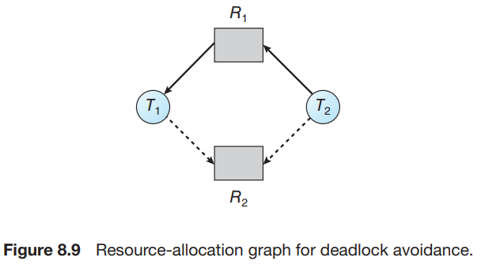
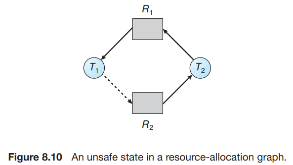

# 6. Deadlock Avoidance

1. Safe State
2. Resource-Allocation-Graph Algorithm
3. Banker's Algorithm

---

- Deadlock을 방지하는 것은, 시스템 전반 성능을 저하시킬 수 있음
- resource 요청 시 추가 정보를 담는 방법
    - 시스템이 각 thread의 resource 요청순서를 미리 파악, thread의 waiting 여부 결정
    - e.g. 각 스레드에게 필요한 resoure type의 최대 개수를 선언, resource 할당 상태 정보 유지

## 1. Safe State

|    구분    |                _safe_                 |     _unsafe_      |
|:--------:|:-------------------------------------:|:-----------------:|
|    순서    | resource 할당 순서 존재 (**safe sequence**) | resource 할당 순서 없음 |
| deadlock |              deadlock 없음              |  deadlock **가능**  |

단점 : resource가 사용가능해도, thread는 순서에 따라 기다려야함 (resource 사용률 낮음)

### sequence

- thread set _<T1, T2, T3, ... Tn>_ 이 있을 때,
    - Ti가 요청할 수 있는 resource 개수 < 사용가능한 resource 수 + Tj가 가지고 있는 resource 수 (j < i)
- Ti는 Tj가 가지고 있는 resource를 요청 시 _waiting_

### 예시 (12 resource, 3 thread)

| thread | Maximum Needs | Current Needs |
|:------:|:-------------:|:-------------:|
|  _T0_  |      10       |       5       |
|  _T1_  |       4       |       2       |
|  _T2_  |       9       |       2       |

|    _safe_    | time |     _T0_      |     _T1_      |       _T2_        | **free** resource |
|:------------:|:----:|:-------------:|:-------------:|:-----------------:|:-----------------:|
|  _**safe**_  |  t0  | 5 (_holding_) | 2 (_holding_) |   2 (_holding_)   |    3 (_free_)     |
| _**unsafe**_ |  t1  | 5 (_holding_) | 2 (_holding_) | **3** (_holding_) |    2 (_free_)     |

- t0 (_safe_) : _T1_ -> _T2_ -> _T0_ 순서로 실행
- t1 (_unsafe_) : **_T2_ resource 1개 추가 할당** (순서 어김)
    - _T1_ 이 리소스를 모두 반환하면, 4 (_free_)
    - _T0_, _T2_ 가 4개의 리소스를 요청하면, deadlock 발생
- 원인 : **T2**를 t1 시점에 _waiting_ 하지 않고 1개를 할당함

## 2. Resource-Allocation-Graph Algorithm (자원 할당 그래프 알고리즘)

  

- 각 resource type당 하나의 instance만 존재할 경우 사용 가능
- **claim edge** : _Ti -> Rj_ (Ti가 Rj를 미래 언젠가 요청 가능, 점선)
    - thread가 자원을 요청하면 **claim edge**가 request edge로 변환
- thread 실행 전 모든 claim edge가 그래프에 나타나야함
- _Ti_ 가 _Rj_ 를 요청하면,
    - _Ti -> Rj_ 가 cycle을 형성하지 않는 경우에만 할당
    - cycle-detection algorithm 사용 (n2 시간 소요)
    - cycle이 없으면, 할당
    - cycle이 감지되면, _unsafe_ 상태로 두고, thread _waiting_

### 예시

  

위 그림에서 _T2_ 가 _R2_ 를 요청하면, cycle이 형성되므로 할당하지 않음

_R2_ 를 _T2_ 에게 할당하면, _T1_ 이 _R2_ 를 요청하는 순간 deadlock 발생

## 3. Banker's Algorithm

- resource type마다 instance가 여러개일 경우 사용 가능
- Resource-Allocation-Graph Algorithm보다 덜 효율적
- 은행에서 현금을 할당하는 것과 유사

#### 동작

- 새로운 thread가 생기면, resource type마다 필요한 최대 instance 수를 선언 (system의 총 resource instance 수보다 작아야함)
- resource 요청시 system은 _safe_ state를 벗어나는지 판단
    - _safe_ state를 벗어나면, thread _waiting_ (다른 thread가 release할 때까지)

#### 자료구조 (thread 수 _n_, resource type 수 _m_)

|    자료구조    |                                설명                                |                                  e.g.                                   |
|:----------:|:----------------------------------------------------------------:|:-----------------------------------------------------------------------:|
| Available  |        각 resource type마다 사용가능한 instance 수, vector 길이 _m_         |         _Available[j]_ = resource type _Rj_ 의 사용가능한 instance 수          |
|    Max     | _n * m_ matrix,  각 thread가 resource type별로 필요한 최대 instance 수 |   _Max[i][j]_ = thread _Ti_ 가 resource type _Rj_ 를 요청할 최대 instance 수    |
| Allocation |        _n * m_ matrix,  각 thread가 현재 할당받은 resource 수         | _Allocation[i][j]_ = thread _Ti_ 가 사용 중인 resource type _Rj_  instance 수 |
|    Need    |          _n * m_ matrix,  각 thread가 필요한 resource 수           | _Need[i][j]_ = thread _Ti_ 가 요청해야하는 남은 resource type _Rj_ 의 instance 수  |

### 3.1 Safety Algorithm

1. vector **_Work_** 길이 _m_ , vector  **_Finish_** 길이 _n_ 선언
    - **_Work_** = **_Available_**
    - **_Finish[i]_** = _false_ (i=0, 1, ..., n-1)
2. (**_Finish[i]_** = _false_) && (**_Need[i]_** <= **_Work_**) 인 _Ti_ 를 찾음
    - 없으면 go to 4
3. **_Work_** = **_Work_** + **_Allocation[i]_**
    - **_Finish[i]_** = _true_
    - go to 2
4. (**_Finish[i]_** = _true_) 인 _i_ 가 존재하면, _safe_ state

### 3.2 Resource-Request Algorithm

- **_Request[i]_** = request vector
    - _Requesti[J]_ = thread _Ti_ 가 resource type _Rj_ 를 요청하는 instance 수

1. _Requesti <= Needi_ 라면, go to 2
    - 아니면, error (thread가 필요한 resource보다 많이 요청)
2. _Requesti <= Available_ 라면, go to 3
    - 아니면, _Ti_ 는 _waiting_
3. 다음처럼 가장해봄
    - _Available_ = _Available_ - _Requesti_
    - _Allocationi_ = _Allocationi_ + _Requesti_
    - _Needi_ = _Needi_ - _Requesti_
4. _safe_ state인지 확인
    - _safe_ state라면, _Requesti_ 를 할당
    - 아니면, _Ti_ 는 _waiting_

### 3.3 An Illustrative Example

| resource type | instance 수 |
|:-------------:|:----------:|
|       A       |     10     |
|       B       |     5      |
|       C       |     7      |

| thread | _Allocation_ | _Max_ | _Available_ | _Need (Max - Allocation)_ |
|:------:|:------------:|:-----:|:-----------:|:-------------------------:|
|  _T0_  |    0 0 1     | 7 5 3 |    3 3 2    |           7 4 3           |
|  _T1_  |    2 0 0     | 3 2 2 |             |           1 2 2           |
|  _T2_  |    3 0 2     | 9 0 2 |             |           6 0 0           |
|  _T3_  |    2 1 1     | 2 2 2 |             |           0 1 1           |
|  _T4_  |    0 0 2     | 4 3 3 |             |           4 3 1           |

- _<T1, T3, T4, T0, T2>_ 순서로 실행하면 _safe_ state
- T1에게 request 할당
- **_Request1_** = (1, 0, 2)라면,
    - Resource-Request Algorithm 1번 check 통과

| thread |          _Allocation_          | _Max_ |          _Available_          | _Need (Max - Allocation)_ |
|:------:|:------------------------------:|:-----:|:-----------------------------:|:-------------------------:|
|  _T0_  |             0 0 1              | 7 5 3 | **2 3 0 = (3 3 2) - (1 0 2)** |           7 4 3           |
|  _T1_  | **3 0 2 =  (2 0 0) + (1 0 2)** | 3 2 2 |                               |           0 2 0           |
|  _T2_  |             3 0 2              | 9 0 2 |                               |           6 0 0           |
|  _T3_  |             2 1 1              | 2 2 2 |                               |           0 1 1           |
|  _T4_  |             0 0 2              | 4 3 3 |                               |           4 3 1           |

- _<T1, T3, T4, T0, T2>_ 순서로 실행하면 _safe_ state
    - T1에게 request 할당
