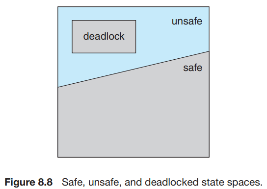

# 6. Deadlock Avoidance

1. Safe State
2. Resource-Allocation-Graph Algorithm
3. Banker's Algorithm

---

- Deadlock을 방지하는 것은, 시스템 전반 성능을 저하시킬 수 있음
- resource 요청 시 추가 정보를 담는 방법
    - 시스템이 각 thread의 resource 요청순서를 미리 파악, thread의 waiting 여부 결정
    - e.g. 각 스레드에게 필요한 resoure type의 최대 개수를 선언, resource 할당 상태 정보 유지

## 1. Safe State

|    구분    |                _safe_                 |     _unsafe_      |
|:--------:|:-------------------------------------:|:-----------------:|
|    순서    | resource 할당 순서 존재 (**safe sequence**) | resource 할당 순서 없음 |
| deadlock |              deadlock 없음              |  deadlock **가능**  |

단점 : resource가 사용가능해도, thread는 순서에 따라 기다려야함 (resource 사용률 낮음)

### sequence

- thread set _<T1, T2, T3, ... Tn>_ 이 있을 때,
    - Ti가 요청할 수 있는 resource 개수 < 사용가능한 resource 수 + Tj가 가지고 있는 resource 수 (j < i)
- Ti는 Tj가 가지고 있는 resource를 요청 시 _waiting_

### 예시 (12 resource, 3 thread)

| thread | Maximum Needs | Current Needs |
|:------:|:-------------:|:-------------:|
|  _T0_  |      10       |       5       |
|  _T1_  |       4       |       2       |
|  _T2_  |       9       |       2       |

|    _safe_    | time |     _T0_      |     _T1_      |       _T2_        | **free** resource |
|:------------:|:----:|:-------------:|:-------------:|:-----------------:|:-----------------:|
|  _**safe**_  |  t0  | 5 (_holding_) | 2 (_holding_) |   2 (_holding_)   |    3 (_free_)     |
| _**unsafe**_ |  t1  | 5 (_holding_) | 2 (_holding_) | **3** (_holding_) |    2 (_free_)     |

- t0 (_safe_) : _T1_ -> _T2_ -> _T0_ 순서로 실행
- t1 (_unsafe_) : **_T2_ resource 1개 추가 할당** (순서 어김)
    - _T1_ 이 리소스를 모두 반환하면, 4 (_free_)
    - _T0_, _T2_ 가 4개의 리소스를 요청하면, deadlock 발생
- 원인 : **T2**를 t1 시점에 _waiting_ 하지 않고 1개를 할당함

## 2. Resource-Allocation-Graph Algorithm

## 3. Banker's Algorithm
