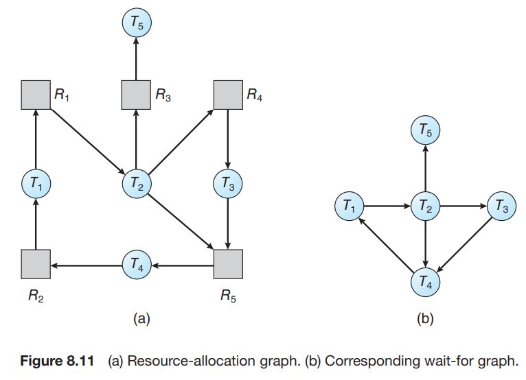

# 7. Deadlock Detection

1. Single Instance of Each Resource Type
2. Several Instances of a Resource Type
3. Detection Algorithm Usage

---

- deadlock 이 발생할 수 있는 상태인지 검사하는 알고리즘
- deadlock 으로부터 복구하는 알고리즘

## 1. Single Instance of Each Resource Type

- 모든 resource가 하나의 instance만 가지는 경우
- **wait-for** 그래프를 사용해서 deadlock을 감지
- system은 cycle이 있는지 주기적으로 알고리즘을 실행하여 검사
    - 알고리즘 복잡도 _O(n2)_ (n = thread 수)

### wait-for 그래프

- resource-allocation 그래프에서 resource node를 제거
    - edge _Ti -> Tj_ 가 존재하면,
        - thread _Ti_ 가 thread _Tj_ 를 기다리고 있음
    - resource-allocation의 _Ti -> Rq, Rq -> Ti_ 상황

### BCC toolkit

- Linux system은 BCC toolkit을 사용하여 감지
- `deadlock_detector` 구조체
- user process의 `pthread_mutex_lock`, `pthread_mutex_unlock` 호출을 추적
    - `deadlock_detector` 로 wait-for 그래프를 만들고, deadlock 가능성을 보고

## 2. Several Instances of a Resource Type

- Available : _m_ 길이의 vector로 각 resource type마다 사용가능한 instance 수를 나타냄
- Allocation : _n * m_ matrix로 각 thread가 현재 할당받은 resource 수를 나타냄
- Request : _n * m_ matrix로 각 thread가 요청한 resource 수를 나타냄
    - _Request[i][j] = k_ 라면, thread _Ti_ 가 resource type _Rj_ 를 _k_ 개 요청함

### 알고리즘

- 복잡도 _m * n2_ (_m_ = resource type 수, _n_ = thread 수)

1. _Work, Finish_ 는 각각 _m, n_ 길이의 vector
    - _Work = Available_
    - _i = 0, 1, ..., n-1_ 에 대해
        - _Allocationi = 0_ 이면, _Finishi = true_
        - 아니면, _Finishi = false_
2. 다음 2가지를 만족하는 index _i_ 찾음 (없으면, **go to 4**)
    - _Finishi = false_ (thread _Ti_ 가 종료되지 않음)
    - _Requesti <= Work_ (thread _Ti_ 가 필요한 resource를 모두 얻을 수 있음)
3. _Work = Work + Allocationi_
    - _Finishi = true_
    - **go to 2**
4. _Finishi = false_ 인 _i_ 가 존재하면, deadlock 상태
    - thread _Ti_ deadlock 상태

##### 예시

- resource type _A, B, C_ 가 각각 7, 2, 6 개의 instance를 가지고 있음

|     thread      | _Allocation_ | _Request_ | _Available_ |
|:---------------:|:------------:|:---------:|:-----------:|
|                 |    A B C     |   A B C   |    A B C    |
| _T0_ |    0 1 0     |   0 0 0   |    0 0 0    |
| _T1_ |    2 0 0     |   2 0 2   |             |
| _T2_ |    3 0 3     |   0 0 0   |             |
| _T3_ |    2 1 1     |   1 0 0   |             |
| _T4_ |    0 0 2     |   0 0 2   |             |

- _<T0, T2, T3, T1, T4>_ 순서로 실행

|     thread      | _Request_ |
|:---------------:|:---------:|
|                 |   A B C   |
| _T0_ |   0 0 0   |
| _T1_ |   2 0 2   |
| _T2_ | **0 0 1** |
| _T3_ |   1 0 0   |
| _T4_ |   0 0 2   |

- thread _T2_ 의 _Request_ 가 수정되면 system은 deadlock 상태
    - _C_ 의 _Available_ 수가 thread들의 _Request_ 수보다 작음
    - _T0_ 의 자원을 회수해도 deadlock 상태

## 3. Detection Algorithm Usage

- detection 알고리즘 호출 시점 판단 기준
    1. _얼마나 자주 deadlock이 일어나는가_
    2. _deadlock이 일어나면 몇개의 thread에 영향이 가는가_
- deadlock이 자주 일어나면,
    - 탐지 알고리즘이 자주 호출되어야함
    - deadlock 상태의 thread는 deadlock이 해결될 때까지 idle

### allocation 요청 실패시마다 호출

- Deadlock은 thread가 즉시 권한을 받지 못할 요청을 할때 발생
- 이 요청은 waiting thread cycle의 가장 마지막 요청
- 따라서 탐지 알고리즘을 권한 요청이 수락되지 않을떄마다 호출하면 됨
    - deadlock을 탐지 + deadlock을 일으키는 thread 특정 가능
- 오버헤드 발생

### 대안

- interval을 정의해서 간격마다 호출
    - e.g. 1시간에 1번, CPU 활용도가 40% 이하일 때마다
- deadlock을 일으킨 thread 특정 불가

---

## Managing Deadlock in Databases

- DB는 open source, 상업 software가 deadlock을 다루는 방법에 좋은 교본
- **_transaction_** : database의 udpate 작업
    - 데이터 통합 (integrity)를 위해 lock 사용
- 여러 동시성 transaction이 활동하면 deadlock 발생 가능
- DB system은 deadlock을 감지, 복구 매커니즘을 가짐
    - 감지 : server가 주기적으로 wait-for graph를 탐색
    - 복구 : 희생할 transaction을 선정, 작업 취소 & rollback
        - 해당 transaction은 lock을 해제하고, 다른 transaction은 deadlock으로부터 자동 복구
    - e.g. MySQL은가장 작은 Row를 대상으로 DML을 일으킨 Transaction을 희생자로 선정
