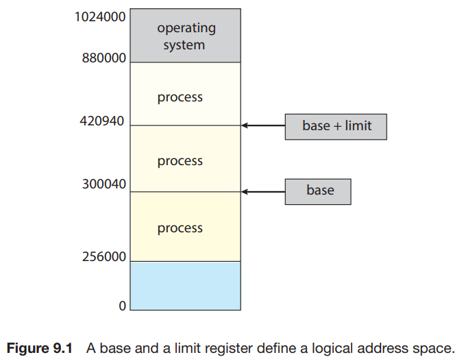
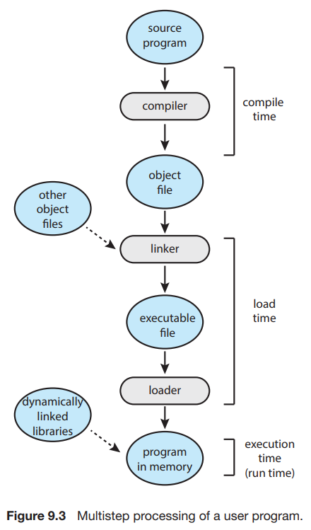
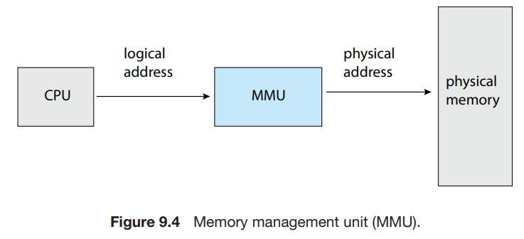
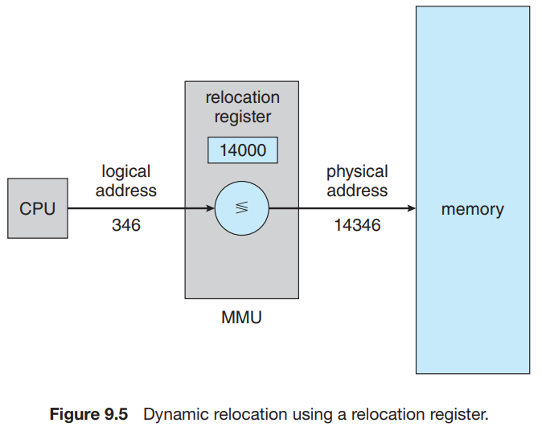

# 1. Background

1. Basic Hardware
2. Address Binding
3. Logical vs Physical Address Space
4. Dynamic Loading
5. Dynamic Linking and Shared Libraries

---

### instruction-execution cycle

- 메모리는 byte 배열로 구성 각 요소는 고유의 주소를 가짐
- CPU 는 program counter 값에 따라 메모리로부터 명령 fetch
- cycle
    1. 메모리로부터 instruction fetch
    2. instruction decode
    3. operand fetch
    4. instruction execute
    5. 결과를 메모리에 저장

## 1. Basic Hardware

- main memory, register : CPU가 직접 접근 가능한 저장소
- 실행 중인 명령어, 데이터는 main memory, register에 있어야함
    - 없으면, 실행 전에 main memory에 올려야함

### Register, Main mememory, Cache

- 각 CPU core에 내장
- CPU clock cycle 마다 접근 가능
- 몇 CPU는 register 명령어를 해석, 간단한 작업 실행을 clock 한 tick 당 함
    - main memory 에서는 불가능
- 메모리 액세스 완료에는 CPU clock 여러 cycle 이 필요
    - **stall** 필요
- **cache** : register와 main memory 사이에 위치
    - 빠른 메모리 액세스를 위해

### memory space 보호

- 올바른 연산을 위해 다른 user process로부터 OS 보호 필요
- 하드웨어 단에서 보호 구현
- 보호 방법 1. : 각 process가 분리된 메모리 공간을 가짐
    - 1개 이상의 프로세스를 **동시에** 메모리에 load 할 수 있게함
    - 각 process가 접근 가능한 메모리의 범위를 정해야함
    - base register, limit register 사용
        - base register : 가장 작은 접근 가능 물리 메모리주소를 가짐
        - limit register : 범위의 크기 지정
        - e.g. base register = 300040, limit register 120900,
            - 프로그램은 300040 ~ 420940 사이의 메모리만 접근 가능
- 보호 방법 2 : CPU 하드웨어가 user mode에서 실행되는 모든 프로그램의 주소를 register와 비교
    - OS 메모리나 다른 user의 memory에 접근하려는 user-mode의 모든 시도는 OS가 error로 처리

### base, limit register

- 오직 OS만 load 가능
- base, limit register load 명령어 : special privileged instruction
    - kernel mode 에서만 실행 가능
    - OS 만이 kernel mode에서 실행 가능
    - OS는 base, limit register 값 변경 가능
    - 다른 user process는 base, limit register 값 변경 불가

### OS는 kernel mode에서 OS 메모리, user 메모리에 접근 가능

- OS는 user 프로그램을 user memory에 load
- error 가 발생한 프로그램 dump out
- system call 파라미터 수정
- user memory에 I/O 가능
- 다른 service 제공
    - e.g. multiprocessing system에서 context switch
        1. 현재 process의 context를 register에서 main memory로 저장
        2. 다음 process의 context를 main memory에서 register로 load

## 2. Address Binding

1. 실행 파일로 disk에 높인 프로그램을 실행하기 위해
    - 프로그램을 memory로 가져와 load해야함
2. process가 실행되면, memory의 명령어, 데이터에 접근
3. process가 종료되면, 다른 process가 memory를 가져감

### 명령어, data를 memory에 binding 하는 방법

- Compile time : compile time에 process가 memory에 놓일 위치를 알 수 있으면,
    - **absolute code** : memory의 특정 위치에 위치하는 코드
    - e.g. user process가 location _R_에 놓일 것이라면,
        - compile time에 _R_에 접근하는 코드 생성
        - 나중에 _R_이 변경되면, 코드 재compile 필요
- Load time : compile time에 process가 memory에 놓일 위치를 알 수 없으면,
    - **relocatable code** : process가 memory에 놓일 위치를 알 수 없는 코드
    - relocatable code 생성
    - starting address가 변경되면, code를 reload 필요
- Execution time : 실행 중에 memory의 다른 segment로 이동하는 process
    - binding이 runtime까지 미루어짐
    - 대부분의 OS는 이 방법을 사용

## 3. Logical vs Physical Address Space

- **logical address** (virtual address) : CPU가 참조하는 주소
- **physical address** : memory에 실제로 존재하는 주소
    - memory가 참조하는 주소
- compile-time, load-time 바인딩은 logical address와 physical address가 같음
- execution-time 바인딩은 logical address와 physical address가 다름
    - logical address를 가상 주소로서 사용
    - **logical address space** : program이 생산한 logical address 집합
    - **physical address space** : logical address space의 각 주소가 memory에 mapping되는 physical address 집합ㅣ

### memory-management unit (MMU)

- logical address <-> physical address 매핑하는 하드웨어 장치 (device)
- 매핑하는 방식은 여러가지
- 가장 간단한 방법 : base register (relocation register) 사용
    - logical address _x_ 를 physical address _y_ 로 변환
    - _y_ = _x_ + base register
    - e.g. base register = 300040, logical address = 120900
        - physical address = 300040 + 120900 = 421940

#### user program은 logical address만 사용

- program은 120900 주소에 접근할 pointer 생성, 120900에만 접근 가능
- pointer가 사용될 때 logical address를 physical address로 변환
- base value _R_ 에 대해서 user process는 logical address _0 ~ max_ 에만 접근
    - 실제 physical address _0+R ~ max+R_ 에 접근

## 4. Dynamic Loading

- data의 크기가 memory 사이즈보다 크면, 프로그램을 실행할 수 없음
- **Dynamic Loading** : 루틴을 호출하기 전까지 메모리에 load하지 않음
    - memory 효율 올림
- user가 dydnamic loading을 사용할 수있도록 program 개발
    - program 에서 OS가 제공하는 라이브러리 루틴 호출

### 동작

1. 모든 루틴은 relocatable load 형태로 disk에 저장
2. main program을 memory에 load, 실행
3. 루틴이 필요해지면 memory에 루틴이 load 되었는지 확인
    - load 되지 않았다면, relocatable linking loader를 호출
    - 루틴을 memory에 load, program address table 업데이트

### 이점

- 루틴이 필요할 때만 loadl
- 대량의 code가 특정 조건에만 필요한 경우 유용
    - e.g. error 루틴

## 5. Dynamic Linking and Shared Libraries

### Dynamically linked libraries (DLLs)

- system libraries
- program 실행 시 user program에 linking
- dynamic loading과 비슷
    - linking을 execution time에 수행
    - e.g. C 표준 system library

#### static linking

- system libraries가 lodader에 의해 binary program image에 linking
- program 실행 시 system libraries가 program image에 포함
- system library를 다른 object module처럼 취급

### 이점

- dynamic linking이 없으면 executable image에 language library 복사본이 포함되어야함
    - executable image가 커짐
    - main memory 사용량 증가
- library를 다른 process들과 공유 가능
    - main meomory에 DDL의 한 instance만 있으면 됨
    - DDL은 **shared library**라고도 불림

### DDL 확장 : library udpate 시 (e.g. bug fix)

- DDL을 참조하는 모든 프로그램이 새로운 버전을 참조하게됨
    - DDL이 아니라면, 다시 linking하는 작업이 필요
- 자동으로 참조하여 버전호환이 안되는 경우를 방지
    - 프로그램, library 양쪽에 version number를 지정
    - 새로운 version number를 지정하여 compile한 프로그램은 새로운 version의 library를 참조
