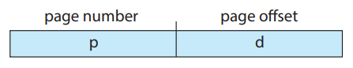
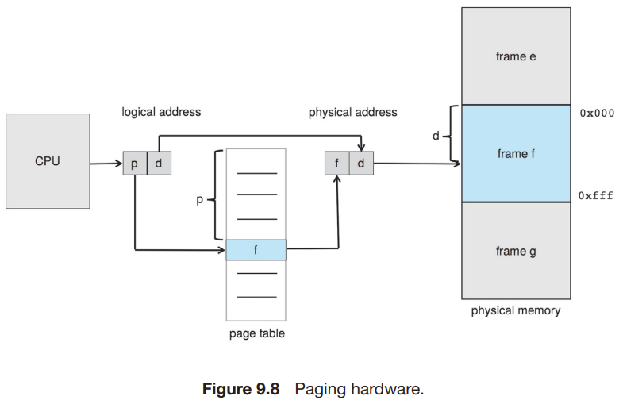
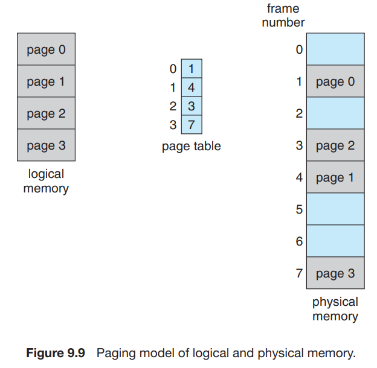
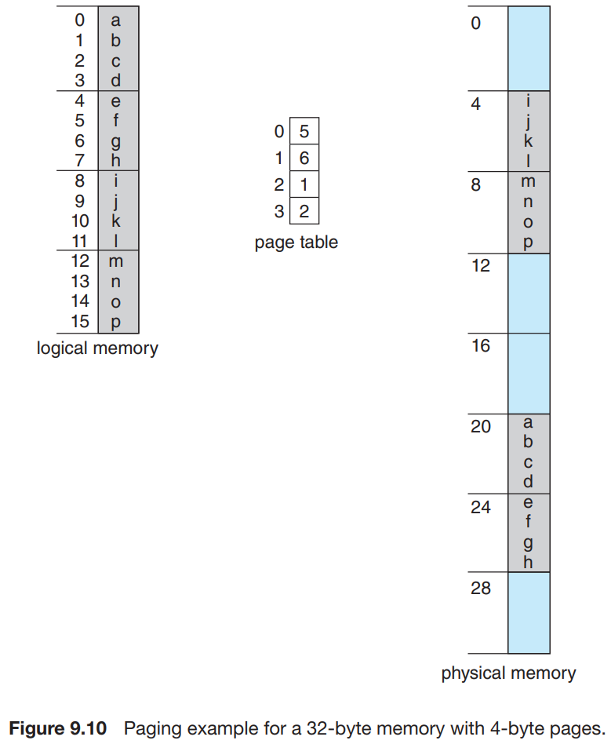
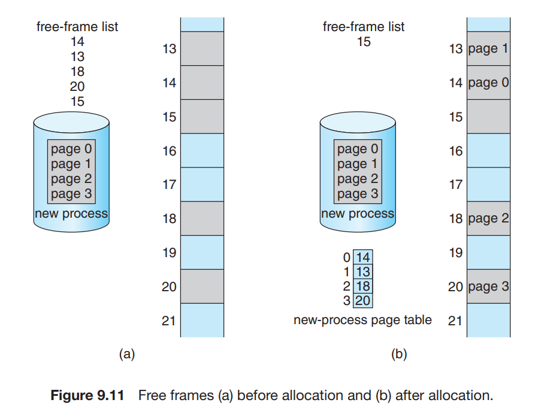

# 3. Paging

1. Basic Method
2. Hardware Support
3. Protection
4. Shared Pages

---

- paging : 프로세스의 physical address 공간이 연속적이지 않아도 되는 메모리 관리 기법
- external fragmentation과 compaction 문제를 해결
- 대부분의 OS에서 paging의 변형을 사용중

## 1. Basic Method

- **frame** : physical memory 를 고정된 사이즈로 자른 block
- **page** : logical memory 를 동일한 사이즈로 자른 block
- 프로세스가 실행될 때 메모리의 사용 가능 frame에 load

### CPU가 생성한 logical address 구조

  

- CPU가 생성한 모든 주소는 **page number(p), page offset(d)** 로 구성
- page number : **page table** 의 프로세스별 인덱스로 사용됨
    - page table에서 프로세를 특정
- page table : 각 frame의 base address를 저장
- offset : frame 안의 주소를 특정

### MMU가 logical address를 physical address로 변환

  

1. page number _p_ 추출 후 page table 인덱스로 사용
2. page table에서 frame number _f_ 를 추출
3. logical address page number _p_ -> physical address frame number _f_ 로 변환
4. frame number _f_ 와 offset _d_ 를 결합하여 physical address 생성

### page 사이즈

- apge size는 하드웨어에 의해 결정
- 보통 4KB ~ 1GB 정도의 크기로 2의 거듭제곱으로 정의
    - e.g. 4KB = 2^12
- 위 그림은 logical address 공간이 2^m, page size 2^n bytes인 경우
    - page number : _m - n_ bits
    - offset : _n_ bits
    - _p_ : page table index
    - _d_ : page의 offset

#### 예시

- _n = 2, m = 4_ 인 경우
- logical address = 0, page = 0, frame = 5
    - 20 = (5 * 4) + 0
- logical address 4, page = 1, frame = 6
    - 24 = (6 * 4) + 0

### fragmentaion

- external fragmentation 없음 : free frame 공간은 필요한 process에게 할당됨
- internal fragmentation 있음 : page size는 고정, 프로세스가 필요한 메모리 사이즈는 유돟
    - e.g. page size : 2,048 bytes, 프로세스는 72,766 bytes 필요 (35 page + 1,086 bytes)
        - 36 frame 할당, internal fragmentation : 962 bytes

#### internal fragmentation 극복

- process의 사이즈르 page size로부터 독립 : internal fragmentation가 프로세스당 평균 1/2 page size로 감소
    - page table enttry 마다 오버헤드가 발생하지만, page의 사이즈가 늘어나면 감소함
- 데이터 전송량이 클수록 disk I/O가 효율적
- 일반적으로 page size는 4 KB or 8 KB
    - **huge page** : 아키텍처에 따라 정의된 큰 페이지 사이즈
    - 몇 시스템에서는 더 큰 사이즈
    - e.g. x86-64 Windows 10 : 4KB and 2MB, Linux : 4KB

### physical memory 사이즈와 logical memory 사이즈는 다를 수 있다

- page-table entry : 4 bytes이면, 232 frames를 가리킬 수 있음
    - frame size가 4 KB이면, 2<supb>44 bytes의 physical memory를 가리킬 수 있음

### proces 메모맇 할당

- 프로세스가 실행하렬할 때 page를 요청함
- _n_ 개의 page를 요청하면, 최소 _n_ 개의 free frame을 찾아 할당
    - 즉 요청한 _n_ 개만큼의 사용가능 메모리 frame이 있어야 함
- 프로세스가 요청한 frame들은 연속적이지 않음

### OS의 역할

- 실제 physical memory로부터 프로그래머를 분리
    - 프로그래머의 뷰 : program memory 공간은 단일 (single)
    - 실제 physical memory : program memory 공간은 연속적이지 않음
- OS가 address 변환 하드웨어를 통해 프로그래머의 뷰를 실제 physical memory로 변환
- **frame table** : OS가 사용가능한 frame 목록 관리를 위해 사용하는 단일 자료구조
    - frame마다 프로세스 할당 여부를 관리
- process 마다 page table 사본 유지
    - OS가 logical address -> physical address 변환을 위해 사용
    - e.g. 사용자 process가 system call (disk I/O) 를 요청할 때 주소 (e.g. buffer) 를 전달하면
        - OS는 page table을 통해 physical address를 찾아 disk I/O를 수행

## 2. Hardware Support

- 페이지 테이블은 프로세스 별로 가지는 자료구조
- PCB에 다른 register value들과 함께 페이지 테이블 pointer를 저장
- CPU 스케줄러가 실행할 프로세스를 선택하면,
    - 적절한 하드웨어 page table 을 읽어야함
- 하드웨어 page table 구현 방법
    - 방법 1 : page table 전용 고속 하드웨어 레지스터 집합으로 구현
        - page address 변환은 빠르지만, context switch 비용 증가
        - 페이지 테이블이 작은 경우 적합
    - 방법 2 : **page-table base register (PTBR)** 사용
        - 페이지 테이블을 main memory에 저장
        - PTBR이 페이지 테이블을 가리키는 pointer
        - context switch 시 PTBR만 swtich

## 3. Protection

## 4. Shared Pages
