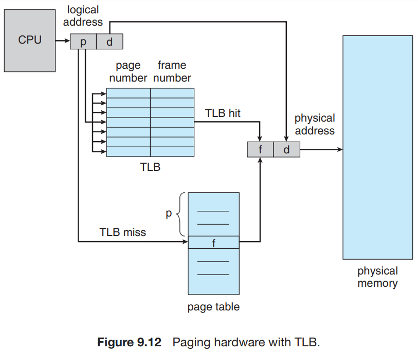
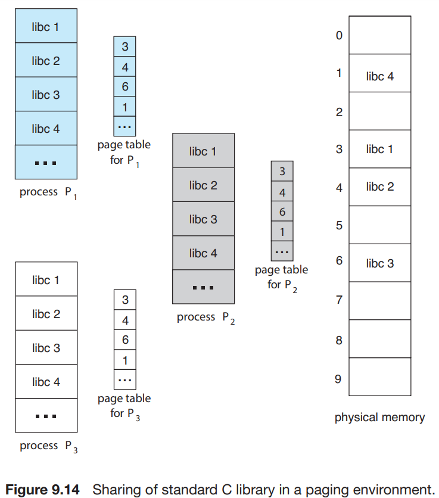

# 3. Paging

1. Basic Method
2. Hardware Support
3. Protection
4. Shared Pages

---

- paging : 프로세스의 physical address 공간이 연속적이지 않아도 되는 메모리 관리 기법
- external fragmentation과 compaction 문제를 해결
- 대부분의 OS에서 paging의 변형을 사용중

## 1. Basic Method

- **frame** : physical memory 를 고정된 사이즈로 자른 block
- **page** : logical memory 를 동일한 사이즈로 자른 block
- 프로세스가 실행될 때 메모리의 사용 가능 frame에 load

### CPU가 생성한 logical address 구조

  

- CPU가 생성한 모든 주소는 **page number(p), page offset(d)** 로 구성
- page number : **page table** 의 프로세스별 인덱스로 사용됨
    - page table에서 프로세를 특정
- page table : 각 frame의 base address를 저장
- offset : frame 안의 주소를 특정

### MMU가 logical address를 physical address로 변환

  

1. page number _p_ 추출 후 page table 인덱스로 사용
2. page table에서 frame number _f_ 를 추출
3. logical address page number _p_ -> physical address frame number _f_ 로 변환
4. frame number _f_ 와 offset _d_ 를 결합하여 physical address 생성

### page 사이즈

- apge size는 하드웨어에 의해 결정
- 보통 4KB ~ 1GB 정도의 크기로 2의 거듭제곱으로 정의
    - e.g. 4KB = 2^12
- 위 그림은 logical address 공간이 2^m, page size 2^n bytes인 경우
    - page number : _m - n_ bits
    - offset : _n_ bits
    - _p_ : page table index
    - _d_ : page의 offset

#### 예시

- _n = 2, m = 4_ 인 경우
- logical address = 0, page = 0, frame = 5
    - 20 = (5 * 4) + 0
- logical address 4, page = 1, frame = 6
    - 24 = (6 * 4) + 0

### fragmentaion

- external fragmentation 없음 : free frame 공간은 필요한 process에게 할당됨
- internal fragmentation 있음 : page size는 고정, 프로세스가 필요한 메모리 사이즈는 유돟
    - e.g. page size : 2,048 bytes, 프로세스는 72,766 bytes 필요 (35 page + 1,086 bytes)
        - 36 frame 할당, internal fragmentation : 962 bytes

#### internal fragmentation 극복

- process의 사이즈르 page size로부터 독립 : internal fragmentation가 프로세스당 평균 1/2 page size로 감소
    - page table enttry 마다 오버헤드가 발생하지만, page의 사이즈가 늘어나면 감소함
- 데이터 전송량이 클수록 disk I/O가 효율적
- 일반적으로 page size는 4 KB or 8 KB
    - **huge page** : 아키텍처에 따라 정의된 큰 페이지 사이즈
    - 몇 시스템에서는 더 큰 사이즈
    - e.g. x86-64 Windows 10 : 4KB and 2MB, Linux : 4KB

### physical memory 사이즈와 logical memory 사이즈는 다를 수 있다

- page-table entry : 4 bytes이면, 232 frames를 가리킬 수 있음
    - frame size가 4 KB이면, 2<supb>44 bytes의 physical memory를 가리킬 수 있음

### proces 메모맇 할당

- 프로세스가 실행하렬할 때 page를 요청함
- _n_ 개의 page를 요청하면, 최소 _n_ 개의 free frame을 찾아 할당
    - 즉 요청한 _n_ 개만큼의 사용가능 메모리 frame이 있어야 함
- 프로세스가 요청한 frame들은 연속적이지 않음

### OS의 역할

- 실제 physical memory로부터 프로그래머를 분리
    - 프로그래머의 뷰 : program memory 공간은 단일 (single)
    - 실제 physical memory : program memory 공간은 연속적이지 않음
- OS가 address 변환 하드웨어를 통해 프로그래머의 뷰를 실제 physical memory로 변환
- **frame table** : OS가 사용가능한 frame 목록 관리를 위해 사용하는 단일 자료구조
    - frame마다 프로세스 할당 여부를 관리
- process 마다 page table 사본 유지
    - OS가 logical address -> physical address 변환을 위해 사용
    - e.g. 사용자 process가 system call (disk I/O) 를 요청할 때 주소 (e.g. buffer) 를 전달하면
        - OS는 page table을 통해 physical address를 찾아 disk I/O를 수행

## 2. Hardware Support

- 페이지 테이블은 프로세스 별로 가지는 자료구조ㅣ
- PCB에 다른 register value들과 함께 페이지 테이블 pointer를 저장
- CPU 스케줄러가 실행할 프로세스를 선택하면,
    - 적절한 하드웨어 page table 을 읽어야함
- 하드웨어 page table 구현 방법
    - 방법 1 : page table 전용 고속 하드웨어 레지스터 집합으로 구현
        - page address 변환은 빠르지만, context switch 비용 증가
        - 페이지 테이블이 작은 경우 적합
    - 방법 2 : **page-table base register (PTBR)** 사용
        - 페이지 테이블을 main memory에 저장
        - PTBR은 페이지 테이블을 가리키는 pointer
        - context switch 시 PTBR만 swtich

### 2.1 Translation Look-aside Buffer (TLB)

- 접근 성능 저하 : 2번의 memory access가 필요
    - 1번째 : PTBR을 통해 page table 접근
    - 2번째 : page table entry를 통해 frame number를 찾아 physical address에 접근
- 극복방안 : **translation look-aside buffer (TLB)** 사용
    - search 속도가 매우 빠른 하드웨어 cache
    - TLB의 entry는 key-value 쌍으로 구성
        - key : page number
        - value : frame number
    - 32 ~ 1,024 개의 entry를 가질 수 있음

#### 동작 방식

- TLB에 몇몇의 page-table entry를 저장
- CPU가 logical address를 생성하면,
    - MMU가 먼저 TLB를 검색
        - 있으면, TLB의 frame number를 사용
        - TLB에 해당 page number가 없으면, page table을 검색 (**TLB miss**)
            - page table에서 frame number를 찾아 TLB에 저장 (다음 접근을 위해)
- TLB가 꽉차면 entry 교체
    - CPU가 LRU (least recently used) 정책에 따라 교체
    - 몇 CPU는 OS가 직접 교체에 관여할 수 있음
    - 몇 TLB는 제거대상에서 제외되기도 함 (e.g. kernel code)

#### address-space identifier (ASID)

- 몇 TLB는 각 entry에 **address-space identifier (ASID)** 를 가짐
- ASID : process 식별값
- 다중 프로세스 환경에서 process의 주소공간을 보호하기 위한 목적
    - ASID를 저장하지 않는다면, context switch마다 TLB를 **flush** 해야함
- ASID를 통해 process 일치 여부를 먼저 검사하고, 맞지 않으면 **TLB miss**로 처리

| TLB 여부 | ASID | logical address | physical address |
|:------:|:----:|:---------------:|:----------------:|
|   O    |  1   |   0x1000 (중복)   |      0x2000      |
|   O    |  1   |     0x1004      |      0x2004      |
|   O    |  2   |   0x1000 (중복)   |      0x2008      |

- 위와 같이 logical address가 중복되어도 ASID가 다르면,
    - 같은 TLB 안에서 데이터를 유지할 수 있음

#### hit ratio

- TLB에서 찾고자 하는 page number가 맞은 비율
- e.g. hit ratio = 80%, 80% 비율로 page number가 TLB에 있었음
- TLB, memory 접근에 각각 10ns가 소요된다고 할 때,
    - 메모리 접근 시간 = 0.8 * 10 + 0.2 * 20 = (hit ratio) + (TLB miss ratio) = 12ns

## 3. Protection

- 페이징 환경에서 메모리 보호는 각 frame 별 보호 비트로 구현
- page table에 보호 비트 보관
- 비트가 page의 read-write or read-only 정의
    - physical address에 접근할 때, CPU가 비트를 검사
    - read-only page에 write 시도 시, **trap to OS** 발생
    - read-only, read-write, execute-only로 세분화 가능

### valid-invalid bit

  

- page table에 추가적인 비트
- _valid_ : 해당 page가 logical address 공간에 있고, legal
- _invalid_ : 해당 page가 logical address 공간에 없음
- 잘못된 주소는 valid-invalid bit를 통해 판단 가능
- OS가 각 page 별로 valid-invalid bit를 설정해 access를 제어

#### internal fragmentation 발생

- page 크기가 2KB일 때, page 5 이상은 무효
- 12,288 ~ 16,383 bytes의 메모리가 낭비됨

### page-table length register (PTLR)

- page table의 크기를 저장하는 register
- page table에 logical address 모든 범위에 대한 entry를 저장하는건 낭비
- PTLR에 프로세스의 유효 범위인지만 체크

| process | 주소 범위 (KB) | PTLR (KB) |
|:-------:|:----------:|:---------:|
|    A    |  0 ~ 4095  |   4095    |
|    B    |  0 ~ 8191  |   8191    |
|    C    | 0 ~ 16383  |   16383   |

## 4. Shared Pages

  

- 프로세스간의 공통 코드를 공유하는 것
- 스레드 간의 주소 공간을 공유하는 것과 유사 (**공유 메모리**)
    - 몇 OS는 공유 메모리를 Shared page로 구현
- e.g. C 언어에서 `libc`를 사용하는 프로세스들은 `libc`를 공유
- physical memory에는 `libc` 하나만 존재 (frame 1, 3, 4, 6)
- 각 프로세스는 page table에 동일한 physical address를 가리키는 entry를 가짐
- run-time library 외에도 무거운 프로그램들도 공유 가능
    - e.g. compiler, window systems, database systems
- 반드시 reentrant code여야 함

### reentrant code

- 실행 중 상태가 변하지 않는 코드
- 따라서 여러 프로세스가 동시에 접근해도 문제가 없는 코드
