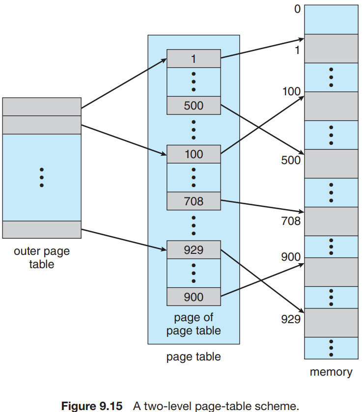
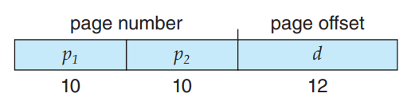
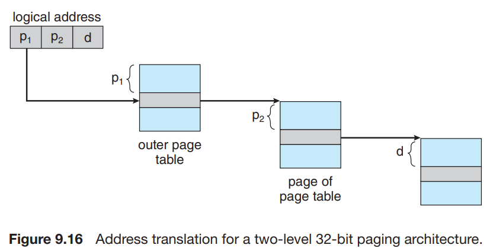
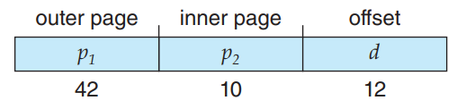
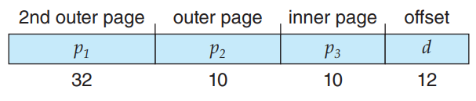
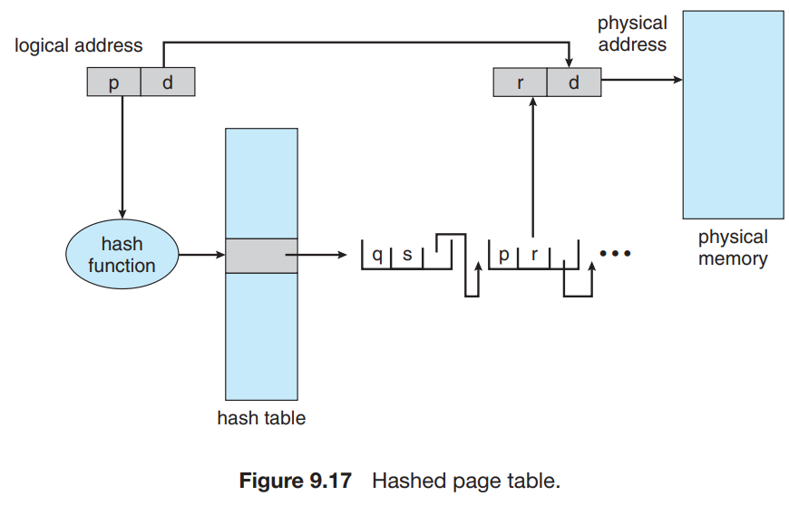
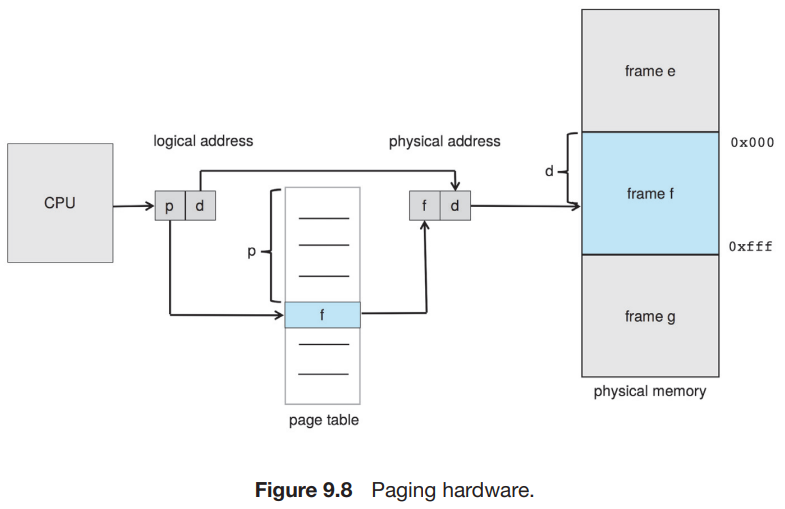
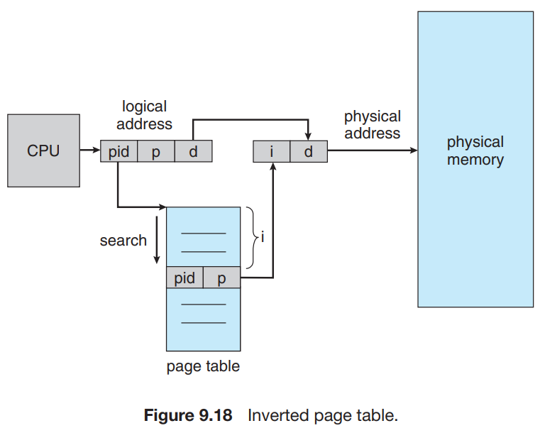

# 4. Structure of the Page Table

1. Hierarchical Paging
2. Hashed Page Tables
3. Inverted Page Tables
4. Oracle SPARC Architecture

---

- page table 구조 종류 : hierarchical paging, hashed page tables, inverted page tables

## 1. Hierarchical Paging (계층적 페이징)

- 현대 컴퓨터는 아주 큰 logical address space를 가짐 (232 ~ 264)
- 따라서 page table도 매우 커짐
    - e.g. 32-bit logical address space, 4KB page size, 1 million entry page table
        - 페이지 수 = logical address space / page size = 232 / 212 = 220 = 1 million
        - 각 entry는 4 bytes일때, 4MB의 page table이 필요
- **해결책 : page table을 더 작은 조각으로 나눔**

### Two-Level Paging (이중 페이징)

- page table을 더 작은 page로 나눔
- 32-bit logical address space, 4KB page size일 때,
- logical address 를 20-bit page number, 12-bit page offset으로 나눔
    - 10 bit page number, 10 bit page offset으로 한번 더 나눔

- _p1_ : outer page table index
- _p2_ : inner page table index

### 주소 변환 방법

- **forward-mapped** page table : 바깥에서 안쪽으로

### three-level paging (삼중 페이징)

- 64-bit logcial address psace 에서는 두번의 page table을 사용해도 부족 (위 그림)
    - 264 / 212 = 252 개의 page table entry 구성
    - 이중 페이징 적용 시, 242 개의 outer page entry

- outer page를 한번 더 나눔 (**three-level**)
- 234 bytes = 16GB의 page table이 필요
- 2nd outer page를 한번 더 나눌 수 있음 (**four-level**)
- 64-bit UltraSPARC architecture는 7-level paging을 사용

## 2. Hashed Page Tables (해시 테이블)

- hash 결과 값 : 가상 page number
- hash table 구조 : linked list
    - 가상 page number
    - 매핑될 page frame number
    - linked list의 다음 entry를 가리키는 pointer

### 동작

1. hash function을 사용해 가상 page number를 hash value로 변환
2. linked list의 field 1 (가상 page number)과 비교
    - field 1이 매치되면, field 2 (page frame number)를 사용해 physical address 생성
    - field 1이랑 매치되지 않으면, 다음 entry로 이동

### clustered page tables

- 64-bit logical address space를 위한 Hashed page table 변형
- page table의 entry가 1개 이상의 frame을 가리키도록 함
- **sparse** address space 적합
    - **sparse** address space : 주소 공간에서 메모리 참조가 연속적이지 않고, 흩어져 있음

## 3. Inverted Page Tables (역 테이블)

### 프로세스마다 페이지 테이블의 단점

- 각 프로세스마다 page table을 memory에 load 해야함
- 페이지 테이블의 physical address들을 계속 추적하고 있어야함

### 해결책 : Inverted Page Table

- 전체 시스템에서 하나의 page table을 사용
- pysical memory의 페이지마다 하나의 page table entry를 가짐
    - page table에 memory의 실제 page (or frame)을 참조하는 entry 하나만 가짐
- entry에 실제 memory의 가상 주소, page를 가진 프로세스 정보 저장
- address-space 식별자 : 각 entry에 저장하는 주소 공간 식별자
    - 서로 다른 physical memory에 매핑될 경우 필요

### 예시 : IBM RT

- IBM은 가장 먼저 inverted page table을 사용한 메이저 회사
- 가상 주소 구성 : _<process-id, page-number, offset>_
- page table entry 구성 : _<process-id, page-number>_ 쌍
- 주소 변환 방법
    - CPU가 가상 주소 생성
    - 가상 주소에서 process-id, page-number 추출
    - process-id, page-number 쌍을 inverted page table에서 검색
    - page table entry에서 physical page frame number 추출

### hash table과 조합

- page table entry를 검색하는데 많은 시간 소요
    - 매치하는 entry를 찾을 때까지 모든 entry를 검색해야함
- 해결책 : Hash table과 조합
    - 검색 범위를 줄임

### 이슈 : shared memory

- 기본적인 paging table은 프로세스마다 page table을 가지므로, 2개 이상의 가상 주소가 같은 physical address를 가질 수 있음
- Inverted page table은 하나의 물리 주소에 하나의 가상 주소만 가능
- **한계 : shared memory를 지원하지 않음**

## 4. Oracle SPARC Architecture (오라클 SPARC 아키텍쳐)
