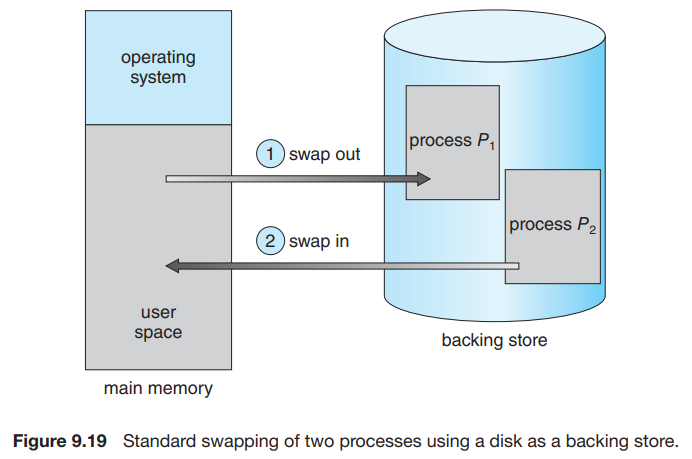
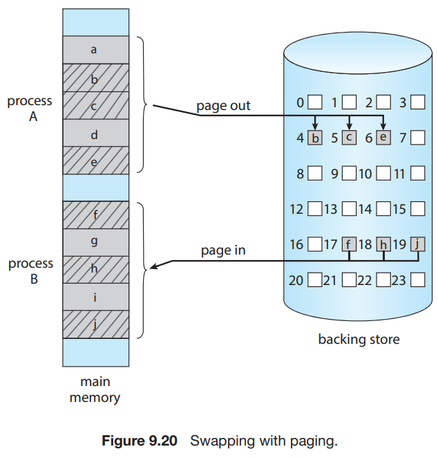

# 5. Swapping

1. Standard Swapping
2. Swapping with Paging
3. Swapping on Mobile Systems

---

- **Swapping** : 프로세스 일부를 임시로 메모리 밖으로 스왑해서 backing store에 저장
- physical memory 공간 확보 효과

## 1. Standard Swapping

- **전체 프로세스**를 메모리에서 backing store로 스왑
    - 멀티 스레드 프로세스면 해당 스레드 모두가 스왑됨
    - backing store는 일반적으로 빠른 2차 저장소
- OS는 swap된 프로세스에 대한 메타데이타 정보 유지
- 전통적인 UNIX 시스템에서 쓰였음
- **현대 OS에서는 거의 쓰이지 않음**
    - 전체 프로세스를 스왑하는 비용이 큼

### 이점

- 실제 physical memory 용량보다 많은 프로세스를 실행 가능
- Idle 프로세스가 스와핑 후보로 적합

## 2. Swapping with Paging

- 프로세스 전체가 아닌 일부 페이지만 스왑
- 용어 정리
    - _swapping_ : standard swapping
    - _paging_ : swapping with paging
- **page out** : 메모리에서 backing store로 page를 스왑
- **page in** : backing store에서 메모리로 page를 스왑

## 3. Swapping on Mobile Systems

- 모바일은 스와핑을 지원하지 않음
- 모바일 장치는 플레시 메모리를 비휘발성 메모리로 사용
- Apple iOS
    - 여유 메모리 공간이 임계값 밑으로 떨어지면, 어플리케이션에게 메모리를 반납하도록 요청
    - Read-only 데이터(코드)는 반납되고, 필요해지면 다시 플레시 메모리로부터 load
    - 수정된 데이터 (Stack) 는 반납되지 않음
    - 메모리 반납량이 충분하지 못한 경우 애플리케이션을 종료
- Android
    - 메모리가 부족하면 application을 종료
    - **종료 전에 어플리케이션 상태를 플레시메모리에 쓰기**
        - 다시 실행할 때 플레시 메모리에서 읽어옴

---

> ### Swapping과 성능
>
> - Swapping이 이점을 가져다 주지만,
> - Swapping이 발생한다는 것은 process가 너무 많거나, physical memory를 더 필요로 한다는 것을 의미