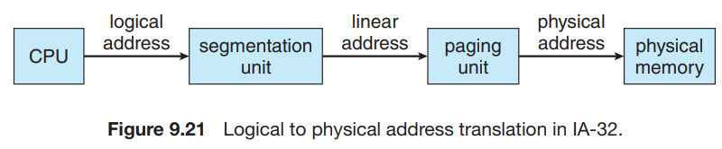

# 6. Example: Intel 32- and 64-bit Architectures

1. IA-32 Architecture
2. x86-64

--- 

- Intel CPU의 메모리 관리 방법

## 1. IA-32 Architecture

- segmentation, paging으로 메모리 관리

1. CPU가 logical address를 생성 후 segmentation unit에 전달
2. segmentation unit은 linear address를 생성 후 paging unit에 전달
3. paging unit은 physical address를 생성

### 1. IA-32 Segmentation

### 2. IA-32 Paging

## 2. x86-64 Architecture
