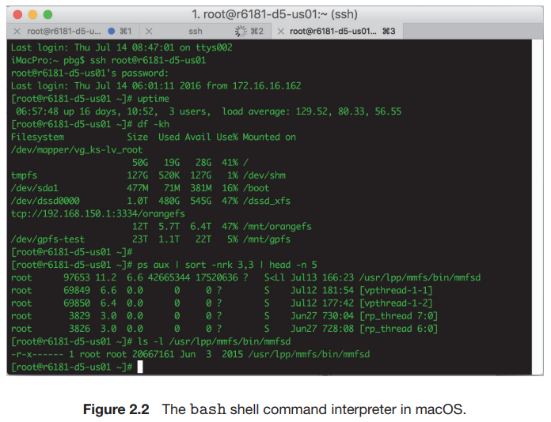

# 2. User and Operating-System Interface

1. Command Interpreters
2. Graphical User Interface
3. Touch-Screen Interface
4. Choice of Interface

--- 

## 1. Command Interpreters <sup>CLI</sup>



- Command Interpreter <sup>명령어 인터프리터</sup>
- 대부분의 OS가 Command Interpreter를 대화식 시스템에 제공
- ex. c-shell, bash, ksh, tcsh, zsh, Windows PowerShell 등

### 주요 기능

- 사용자의 다음 명령어를 받고 실행
- ex. create, delte, list, print, copy, exceute 등

### Command Interpreter의 분류

- Command Interpreter 자체적으로 실행코드를 가짐
    - 파일 삭제 명령어를 받으면 자체 코드 섹션으로 이동하여 system call
- 시스템 프로그램을 통해 명령을 실행
    - 인터프리터는 명령어 해석 못함
    - 명령을 메모리에 로딩, 실행할 파일을 식별

```shell
## usr/bin/rm 프로그램 실행
$ rm myfile.txt
```

## 2. Graphical User Interface <sup>GUI</sup>

- 데스크탑의 마우스, 키보드 기반 메뉴 조작
- 아이콘을 통해 파일, 이미지 프로그램 등 조작
- 그 외 KDE, GNOME, Windows 10, macOS 등

## 3. Touch-Screen Interface


- 터치 제스쳐로 조작
- 모바일기기에 특화

## 4. Choice of Interface

- CLI
    - 시스템 관리자
    - 빠른 접근과 명령어 수행
    - shell scripts : 반복 작업에 유용, 명령어를 프로그램화
- GUI : MacOS, Window 등 PC OS
- Touch-Screen Interface : 모바일 기기
