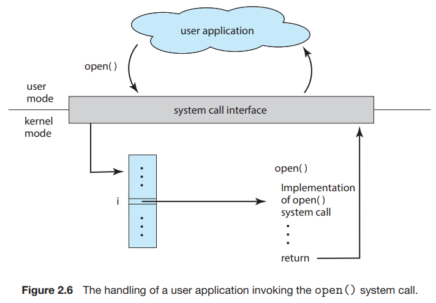
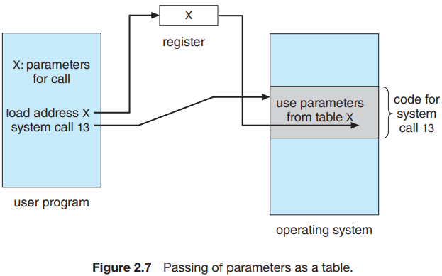
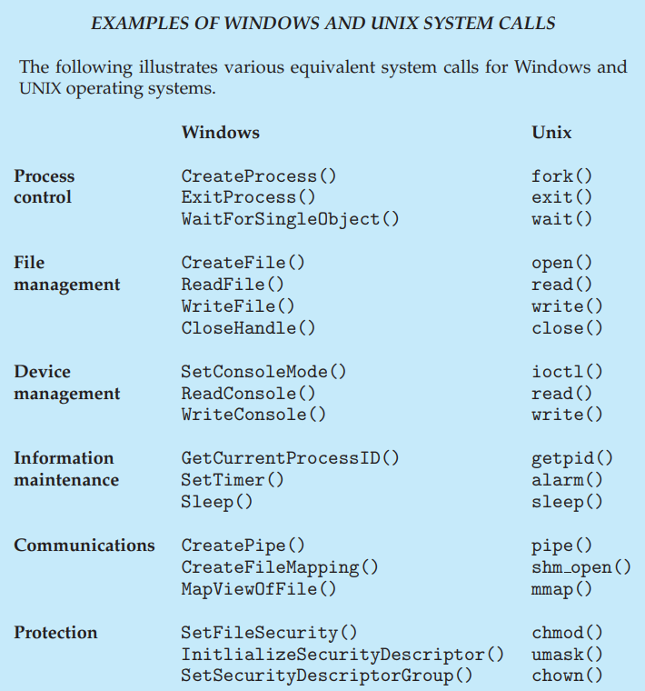

# 3. System Calls

1. Example
2. Application Programming Interface
3. Types of System Calls

---

- System Call은 OS에서 제공하는 서비스에 대한 인터페이스를 제공
- C, C++ 로 작성한 함수 형태로 제공
- 하드웨어에 직접 접근 작업의 경우 어셈블리어 명령어 작성 필요

## 1. Example

#### 파일 복사

```shell
cp in.txt out.txt
```


1. 프로그램 입력에 input 파일, output 파일 지정
    - UNIX : 파일명, 와일드 카드 등의 형태로 지정 가능
    - 대화형 OS :  프로그램이 사용자에게 파일명 물어봄
    - 마우스/키보드 기반 OS : 파일 목록을 디스플레이로 표시, 사용자가 입력장치로 선택, 많은 I/O 발생
2. 파일 세팅 :  프로그램이 input 파일을 열고 <sup>1</sup>, output 파일을 만들고 엶 <sup>2</sup>
    - 각자 system call 발생하고, 각자 에러 핸들링 필요
        - input 파일 : 파일이 없거나, 사용자가 읽기 권한이 없거나 등, 비정상 종료 시킴
        - output 파일 : 파일이 이미 있으면 삭제 후 생성 등
3. 파일 복사 : input을 읽고 <sup>system call</sup> output에 쓰기<sup>system call</sup> 반복
    - 각 작업에서 상태 정보를 반환해야함
    - 읽기 : 파일의 끝에 도달했는지, 파일의 끝에 도달했다면 EOF 반환 등
    - 쓰기 : 디스크가 가득 찼는지, 가득 찼다면 에러 반환 등
4. 복사 완료 : 두 파일을 닫고,메시지를 콘솔에 출력

## 2. Application Programming Interface <sup>API</sup>

- 간단한 프로그램 실행에 많은 system call이 필요
- 그 내용을 알지 않고 API를 통해 사용
    - API : fntion, 매개변수, 결과 기대값 들의 집합 <sub>ex. POSIX API, Windows API, Java API 등</sub>
- libc : C 언어로 작성된 Unix, Linux, macOS의 API
- API의 함수들이 system call을 호출 <sub>프로그래머 대신</sup>
    - ex. Window funciton CreateProcess()는 Window Kernel의 system call NTCreateProcess()를 호출

#### API를 통해 system call을 호출하는 이유

- portability <sup>이식성</sup> : API를 지원하는 시스템이 바뀌어도, 컴파일된 API가 실행 가능
- 복잡성 : System call이 API보다 복잡하고 자세함

#### run-time environment <sup>RTE, 실행환경</sup> 과 system-call interface



- RTE : 응용프로그램이 실행되는 환경
    - 실행에 필요한 소프트웨어, 컴파일러, 라이브러리, 로더 등 포함
- RTE는 System call에 대한 인터페이스 역할
    - API 가 호출한 System call을 가로채고, OS의 system call을 호출
- 이 인터페이스는 각 System call에 번호 할당하여 번호를 인덱스로 테이블 유지
- API 사용자는 System call 내부 구현을 모름
- System call 내용을 숨기고, RTE가 관리

#### OS에 파라미터를 보내는 방법



- 레지스터
- 블록, 테이블, 메모리 : 레지스터 수보다 파라미터가 많을 때
- Linux는 두 방법을 혼용
    - 5개 정도의 파라미터면 레지스터, 아니면 블록 메서드
- 블록메서드 외에도 stack을 사용
    - stack이나 블록은 파라미터수 제한이 없는 장점

## 3. Types of System Calls

#### System cll 6가지 분류

- process control
    - 프로세스 생성 / 종료, 로드, 실행
    - 프로세스 속성 설정, 조회
    - wait, signal 이벤트
    - 메모리 할당, 해제
- file management
    - 파일 생성, 삭제, 열기, 닫기
    - 읽기, 쓰기, 보관
    - 파일 속성 설정, 조회
- device management
    - 장치 요청, 해제
    - 장치 읽기, 쓰기, 보관
    - 디바이스 속성 설정, 조회
    - 논리적인 연결, 분리
- information maintenance
    - 시간 / 날짜 조회, 설정
    - 시스템 정보 조회, 설정
      -프로세스, 파일, 디바이스 속성 조회, 설정
- communication
    - 통신 커넥션 생성, 삭제
    - 메시지 송/수신
    - 상태 정보 송/수신
    - 원격 장치 연결/해제
- protection
    - 파일 권한 조회, 설정



### 3.1 Process Control

- command interpreter : 명령어 해석기를 통해 계속 명령 입력 가능
- end() : 프로세스 정상 종료
- abort() : 프로세스 비정상 종료
    - 메모리 덤프, 에러 메시지 생성
    - dump : 디스크에 쓰여진 로그 파일
        - 차후 디버거 시스템 프로그램이 분석, 에러, 버그를 찾고, 바로 잡음
    - GUI는 팝업창으로 에러 알림
- create process() : 새로운 프로세스 생성, 멀티 프로그래밍 가능
- load(), execute() : 프로세스 생성, 실행
- create process() : 프로세스 생성, 실행, 제어
    - 다중 프로그래밍도 가능
- get_process_attribute() : 프로세스 속성 조회
- set_process_attribute() : 프로세스 속성 설정
- terminate_process() : 프로세스 종료
- wait_time() : 프로세스 생성 시 다른 명령이 종료되기를 특정 시간동안 기다림
- wait_event() : 프로세스 생성 시 특정 이벤트가 발생할 때까지 기다림
- signal_event() : 프로세스가 이벤트 발생을 알림

#### C 라이브러리 printf()


- C 라이브러리를 통해 sytstem call 가능

#### 공유 데이터

- 보통 2가지 이상의 프로세스가 데이터를 공유 중
- 프로세스는 공유데이터에 lock을 걺
- lock이 종료될 때 까지 다른 프로세스는 데이터에 접근 불가
- acquire_lock() : 공유 데이터에 lock을 걺
- release_lock() : 공유 데이터에 lock을 해제

#### single-tasking 프로세스 제어 예시 - Arduino


- Arduino : 마이크로 컨트롤러 + 입력 센서 <sup>빛, 온도, 기압 등의 이벤트에 대응</sup>
- Boot loader : 운영체제 역할
    - sketch를 메모리 영역에 로드
- sketch가 로드되면 프로그램은 응답할 이벤트 기다림
- **한번에 하나의 sketch만 메모리에 존재**
- 다른 sketch가 로드되면 기존 sketch 대체

#### multi-tasking 프로세스 제어 예시 - FreeBSD


- FreeBSD : Berkley UNIX 기원, 로그인하면 사용자의 쉘이 실행되어 사용자 명령 기다림
- command interpreter 가 다른 프로그램이 실행중이어도 명령을 입력 받음
- fork() : 새로운 프로세스 시작
- exec() : 새로운 프로그램 실행, 메모리 로드
    - 쉘 명령어에 따라 백그라운드로 실행 가능
    - **백그라운드로 실행시 쉘은 다른 명령을 받기위해 대기**
- exit() : 시스템 종료

### 3.2 File Management

- create() and delete() : 파일 생성, 삭제
- open() : 파일 열기
- read() and write() : 파일 읽기, 쓰기
- reposition() : 파일 내에서 위치 이동
- close() : 파일 닫기
- 디렉터리에 대해 사용 가능
- get file attributes() and set file attributes()
    - 파일 속성 : 파일명, 타입, 보호 코드, 계정 정보 등
- move(), copy(), ...

### 3.3 Device Management

- 프로세스는 실행을 위해 리소스가 필요
    - 리소스 : 메인 메모리, 디스크, 파일 등
- 리소스가 할당되지 않는다면 기다려야 함
- request() : 배타적 리소스 요청
- release() : 리소스 해제
- read() and write() : 리소스 읽기, 쓰기
- reposition() : 리소스 내에서 위치 이동

### 3.4 Information Maintenance

- 사용자 프로그램과 OS 간의 정보를 전송하기 위한 System call
- time(), date() : 현재 시간, 날짜
- single step : CPU mode, CPU가 명령어를 실행할 떄마다 trap에 걸려 디버거에 알림
- OS가 프로세스에 대한 정보를 가지고, System call이 이 정보를 사용
- get_process_attribute() : 프로세스 속성 조회
- set_process_attribute() : 프로세스 속성 설정

### 3.5 <sup>(interporcess)</sup> Communication

- 프로세스 간에 정보를 교환하기 위한 방식
- message-passing model <sup>메시지 교환</sup>
- shared-memory model <sup>공유 메모리</sup>

#### message-passing model

- client : 송신 프로세스
- daemon, server : 수신 프로세스
- 프로세스 간에 정보를 담은 메시지를 교환
- 프로세스는 동일 host 혹은 네트워크로 연결된 다른 host의 프로세스
- process name : 프로세스를 식별하기 위한 고유 이름 <sub>host 의 IP 주소</sub>
- get_hostid(), get_processid() : host, process id 조회
- open(), close(), open_connection(), close_connection() : 메시지 교환을 위한 연결
- accept_connection() : 수신 프로세스로부터의 연결 수락
- await_for_connection() : 송신 프로세스로부터의 연결 기다림
- read_message() and write_message() : 메시지 읽기, 쓰기
- close_connection() : 연결 종료

#### shared-memory model

- 공유 메모리를 두고 2가지 이상의 프로세스가 읽고 씀
- 프로세스가 메모리의 동일한 위치에 쓰지 않도록 보장
- shared_memory_create() : 공유 메모리 생성
- shared_memory_attach() : 공유 메모리에 접근

#### message-passing model vs shared-memory model

- message-passing
    - 작은 양의 데이터 교환시 유용
    - 충돌 없음
- shared-memory
    - 교환 속도, 편의성
    - 메모리 공유 시간에 대한 프로세스간의 보호 메커니즘, 동기화 필요

### 3.6 Protection

- 컴퓨터 자원이 제공하는 자원에 대한 엑세스 제어 메커니즘
- set_permission(), get_permission() : 자원에 대한 접근 권한 설정, 조회
- allow_user(), deny_user() : 사용자에 대한 접근 권한 설정
