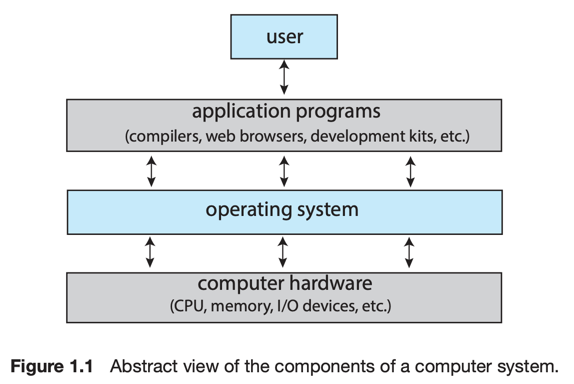

# 4. System Services

### System service a.k.a system utility

System Service는 프로그램 개발과 실행에 편리한 환경을 제공한다.  
System call을 위한 유저 인터페이스 등

- File management : 파일 or 디렉터리 생성, 삭제, 읽기, 쓰기, 재배치, 검색, 열기, 닫기 등
- Status information
    - 시스템에게 날짜, 메모리 공간, 사용자 수 등과 같은 상태 정보를 요청 가능
    - 더 복잡한 정보도 가능 : 퍼포먼스, 로깅, 디버깅 정보
    - 레지스트리를 사용하여 정보를 저장하기도 함
- File modificatio : 텍스트 에디터로 파일을 수정, 디스크에 저장 가능
- Programming-language support
    - 컴파일러, 어셈블러, 디버거 등의 프로그램을 제공
    - C, Java 같은 언어 지원
- Program loading and execution
    - 메모리에 프로그램을 로드하고 실행
    - 시스템은 absolute loader, relocatable loader, linkage editor 등을 제공
- Communications
    - 프로세스 사용자, 컴퓨터 시스템 간 통신을 위한 가상 통신 연결 제공
    - 스크린, 웹페이지, 이메일, 로깅, 파일 등으로 메시지 전송
- Background services
    - 부팅시 필요한 시스템 프로그램 프로세스 : services, subsystems, daemons
    - 시스템은 일반적으로 다수의 데몬을 가짐

### application programs

- 사용자의 공통적인 요구를 실행하는 프로그램
- ex. 웹 브라우저, 스프레드시트, 테스트 편집기, 데이터베이스 시스템, 컴파일러 등

