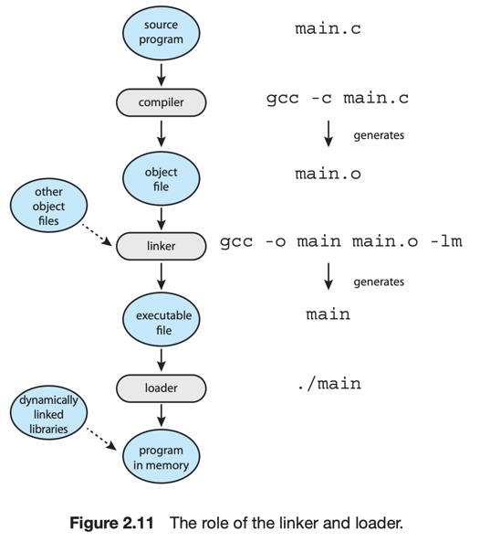

# 5. Linkers and Loaders

프로그램은 디스크에 바이너리 실행가능 파일로 위치한다. <sub>ex. prog.exe, prog.out, a.out, prog</sub>  
CPU는 프로그램을 실행하기위해 메모리에 로드하고, 프로세스의 context에 위치시킨다.

- 프로그램 실행을 위해 소스를 compiling <sup>1</sup>, 메모리에 로드해서 <sup>2</sup>
- CPU core가 실행 가능 상태로 만드는 과정



--- 

1. compile : object file 생성
    - 소스 파일을 object file로 변환
    - object file <sup>relocatable object file</sup> : 메모리의 어느 물리적 위치에든 로드될 수 있도록 설계된 파일
2. link : executable file 생성
    - linker가 single binary executable 파일로 변환
    - 다른 object file과 라이브러리 <sub>ex. standard C library</sub>를 결합하여 실행 가능한 파일을 생성
3. load : executable file을 메모리에 로드
    - loader가 메모리에 로드
    - binary executable 파일을 메모리에 로드
    - reloaction
        - linking & loading 과정에서 프로그램 파트에게 최종 주소 할당
        - 주소와 매치가 가능하게 코드, 프로그램의 데이터 조정
        - 코드가 라이브러리 함수 호출, 실행을 위해 변수에 접근 가능하게 함

```c

// 1. main.c 컴파일
gcc -c main.c

// 2. main.o 링크
gcc -o main main.o -lm

/* 
3. main 실행
fork() -> exec()
*/
./main
```

### 라이브러리 동적 링크

- link 과정에서 모든 라이브러리가 프로그램에 포함되는 것은 비효율적
- 대부분의 시스템들은 로드 단계에서 동적으로 라이브러리 링크
    - ex. Window의 DLL
- 아직 사용하지 않을 라이브러를 미리 링크하지 않도록 함
- 실행 중 필요한 경우에만 로딩

### object, executable file format

- 파일에는 컴파일된 기계어, 심볼 테이블 <sub>함수, 변수에 대한 메타데이터</sub> 포함
- Executable and Linkable Format <sup>ELF</sup> : Linux의 실행 파일 포맷
    - entry point : 프로그램이 시작되는 메모리 주소
- Portable Executable <sub>PE</sub> : Windows의 실행 파일 포맷
- Mach-O : macOS의 실행 파일 포맷