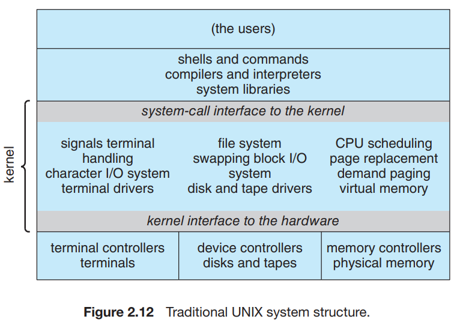
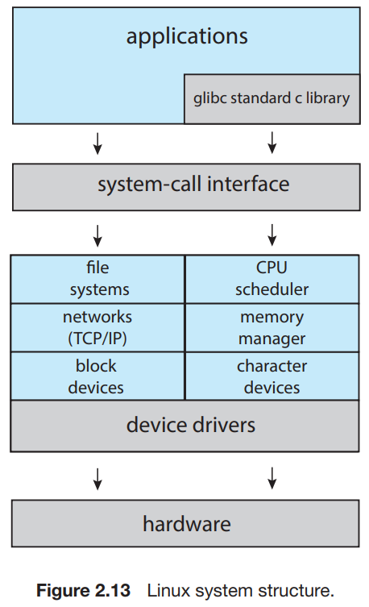

# 8. Operating-System Structure

1. Monolithic Structures
2. Layered Approach
3. Microkernels
4. Modules
5. Hybrid Systems

---

### 최근의 OS 구조 동향

- 태스크를 작은 컴포넌트, 모듈, 싱글 시스템 등으로 분할
- 각 모듈들은 인터페이스와 기능이 정의됨
    - such as, main()에 모든 코드보다, 메서드로 모듈화 하는 것

--- 

OS의 컴포넌트들이 상호작용하는 법과 커널에 녹아드는 법

## 1. Monolithic Structures

- tightly coupled system 강결합 시스템
- 구조가 없음
- 커널의 모든 기능 배치, 하나의 주소 공간에서 정적 바이너리파일 실행

#### 원조 UNIX OS

- 2 부분으로 이루어짐 : 커널, 시스템 프로그램
- 커널 : 파일시스템, CPU 스케쥴링, 메모리 관리와 같은 기능을 system call을 통해 제공
- 많은 양의 기능이 단일 주소 공간에서 실행

#### Linux OS based on UNIX

- 어플리케이션은 `glbc` 표준 C 라이브러리를 이용해 system call
- 커널 모드에서는 모놀리식 단일 주소공간을 사용
- 모듈러 설계 : 커널이 실행 중에 수정될 수 있음

### Monolithic Systems의 특징

- 단순함, 빠름
    - 아직도 Linux, Winodw 에서 사용하는 이유
- 구현과 확장에 어려움
- 오버헤드 : System call 인터페이스, 커널에서의 상호 작용

## 2. Layered Approach

- loosely coupled system 약결합 시스템
- 모듈러 방식
- 커널 : 작은 기능을 하는 컴포넌트들의 집합
- 컴포넌트 하나의 영향이 다른 곳에 미치지 않음
- OS를 몇 개의 레벨로 나눔
    - 0은 하드웨어, 높이 갈수록 유저 인터페이스
- 컴퓨터 네트워크 TCP/IP, 웹 어플리케이션에서 쓰임

### Layered Approach의 특징

- 구조와 디버깅이 단순함
- 각 레이어는 자신보다 낮은 레벨의 레이어에 대한 기능과 서비스만 사용
    - ex. level 0은 하드웨어만 사용하기 때문에 디버깅 대상이 단순함
- 각 레이어는 자신보다 낮은 레이어가 제공한 기능으로 그현
    - 기능의 내부 구현은 알 필요가 없음
- 모든 레이어는 자료구조, 기능, 하드웨어를 상위 레이어로부터 숨김
- 순수 Layered는 사용하기 힘듦
    - 각 계층 기능을 명확히 정의하기 어려움
    - 계층을 가로질러 통신하는 것의 오버헤드
- 일반적으로 레이어 수를 줄이고, 레이어가 가진 기능을 늘려서
    - Layered의 단점을 보완함

## 3. Microkernels

## 4. Modules

## 5. Hybrid Systems

