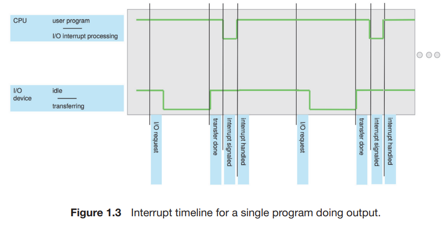
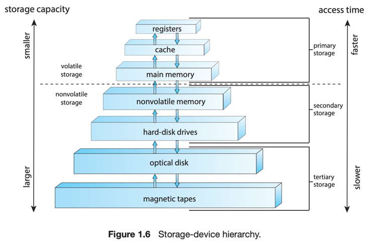

# 2. Computer-System Organization

1. Interrupts
    1. Overview
    2. Implementation
2. Storage Structure
3. I/O Structure

---

#### device controller 장치 제어기

- 하나의 컴퓨터 시스템, 여러 개의 장치 제어기와 디바이스 컴포넌트
- Bus 를 통해 연결
    - Bus : 공유 메모리와 컴포넌트 연결
- 각 장치 제어기는 특정 유형의 디바이스 장치를 담당
    - ex.
        - disk controller : disks
        - USB controller : USB devices
        - graphics adapter : monitor
- 장치 제어기에 따라 여러개의 컴포넌트 연결 가능
    - ex. USB port는 USB hub를 통해 여러 장치와 연결
- 장치 제어기는 일부 로컬 버퍼 저장소와 특수 목적의 레지스터 세트를 유지
- 장치 제어기 주변 장치와 로컬 버퍼 저장소 간의 데이터 이동 책임

#### device driver 장치 드라이버

- 일반적으로 각 장치 제어기 마다 존재
- 장치 제어기를 이해하고, OS 에게 장치에 대한 적절한 인터페이스 제공
- CPU와 장치 제어기는 병렬로 실행 가능 메모리 사이클에서 경쟁
- 공유 메모리에 접근 순서를 올바르게 하기 위해, memory controller 는 메모리의 접근을 동기화

#### 시스템의 3가지 지점

- Interrupt
- storage structure
- I/O structure

---

## 2.1 Interrupts

인터럽트는 현대 OS에서 비동기 이벤트 처리 I/O 입력과 같은를 할 수 있게 해준다.  
인터럽트는 장치 제어기, 하드웨어 오류가 발생 시킬 수 있다.
높은 우선순위 연산을 하기 위해 컴퓨터는 인터럽트 우선순위 시스템을 사용한다.

#### 전형적인 컴퓨터 명령 예시 : 키보드 타이핑

1. 키보드를 누름
2. 장치 드라이버는 장치 제어기에 적절한 레지스터들을 로드
3. 장치 제어기가 레지스터의 내용을 검사하여 수행할 작업 결정
    - ex. 키보드 장치를 통해 문자를 읽어라.
4. 장치 제어기가 문자를 디바이스에서 로컬 버퍼로 전송
5. 전송이 끝나면 장치 드라이버에게 명령 입력이 끝났음을 알림
6. 장치 드라이버는 제어를 다른 OS 일부에게 넘김
    - 동시에, 디바이스 드라이버가 메시지 전송 가능 "입력이 성공적으로 완료"

---

어떻게 장치 제어기가 장치 드라이버에게 명령이 끝났음을 알릴까?  
**interrupt**를 통해 가능하다

### 2.1.1 Overview

- 하드웨어는 일반적을 시스템 버스를 통해 CPU 에게 신호를 보냄으로서 인터럽트 트리거
    - 시스템 버스는 주요 컴포넌트 간의 메인 커뮤니케이션 채널
- 인터럽트는 많은 목적을 가지지만,
- OS와 하드웨어가 상호작용할 수 있는 방법을 제공하는게 주요 기능

#### CPU가 인터럽트 되면,

- 하던 일을 멈추고,
- 즉시 고정된 위치로 실행을 전송함
- 고정된 위치는 인터럽트가 위치한 서비스 루틴의 시작 주소를 가짐

#### 인터럽트는 컴퓨터 아키텍쳐의 중요 부분

- 컴퓨터 디자인마다 고유 인터럽트 매커니즘을 가지지만, 몇가지 기능은 공통임
- 인터럽트는 반드시 적절한 인터럽트 서비스 루틴에게 제어를 전송해야 함
    - 단순한 방법은 제너릭 루틴을 호출하여 인터럽트 정보를 검사하는 것
    - 그 다음 루틴은 인터럽트 핸들러를 호출함
- 인터럽트는 자주 발생하기 때문에 빠르게 처리되어야 함
    - 인터럽트 루틴을 가리키는 포인터 테이블이 빠른 속도 제공 가능
    - 테이블을 통해 인터럽트 루틴이 간접적으로 호출됨
    - 포인터 테이블은 로우 메모리에 저장
    - interrupt vector 인터럽트 벡터라고도 함

#### 인터럽트 아키텍쳐는 상태정보를 저장

- 인터럽트 제공 후 다시 복귀할 수 있도록
- 인터럽트 루틴이 프로세서의 상태를 변경해야 한다면,
    - 즉시 최신상태를 저장하고 복귀 전 복원
- 인터럽트가 서비스된 후 저장된 주소값이 프로그램 카운터에 로드
    - 인터럽트된 연산은 인터럽트가 없었던 것처럼 계속됨

### 2.1.2 Implementation

#### 인터럽트 메커니즘

1. CPU 가 interrupt-request line을 가짐
    - interrupt-request line : CPU가 모든 명령 종료를 감지
2. 장치 제어기가 interrupt-request line을 통해 CPU에게 인터럽트를 요청
3. CPU가 interrupt-request line을 통해 인터럽트를 감지
4. CPU가 인터럽트 번호를 인덱스로 사용하여 인터럽트 벡터애 저장된 인터럽트 핸들러 루틴으로 이동
5. 인터럽트 핸들러 동작
    - 상태 변화를 저장
    - 인터럽트 원인 결정
    - 주요 프로세스 수행
    - 인터럽트가 리턴한 명령 수행
    - 인터럽트 이전 상태로 복귀

즉, 장치 제어기가 인터럽트를 유발하고,   
CPU가 인터럽트를 캐치하여 인터럽트 핸들러에게 디스패치한다.  
디스패치 핸들러는 인터럽트를 디바이스에게 서비스함으로서 클리어한다.

#### 현대 컴퓨터 시스템에서의 인터럽트 요구사항

1. 주요 처리 중에는 인터럽트 핸들링을 연기해야함
2. 디바이스를 위한 적당한 인러텁트 핸들러에게 디스패치할 수 있는 효과적인 방법
3. 멀티 레벨 인터럽트 필요

- OS가 인터럽트 우선순위 판별 가능
- 요구하는 긴급성에 맞는 수준의 응답

#### 현대 컴퓨터 하드웨어는 위 3가지를 CP와 인터럽트 컨트롤러 하드웨어로 제공

- 대부분의 CPU는 2가지 인터럽트 요청 줄을 가짐
    - nonmakable : 복구 불가능한 메모리 에러와 같은 이벤트 책임
    - maskable : 인터럽트 되면 안되는 중요한 명령 실행 이전 CPU에 의해 무시될 수 있음
        - 장치 제어기가 서비스를 요청하기 위해 사용

#### interrupt chaining

- 그러나 컴퓨터는 인터럽트 벡터에 가진 주소 요소보다 더 많은 장치들을 가지고 있음
- 인터럽트 벡터의 각 요소가 인터럽트 핸들러의 목록의 시작을 가리키게 함
- 인터럽트가 시작되면 핸들러를 하나씩 호출하여 서비스를 처리할 수 있는 핸들러를 찾을 때까지 진행

#### 인터럽트 우선순위 시스템

- 레벨이 낮은 인터럽트는 연기하고,
- 모든 인터럽트를 마스킹하지 않고도 고 우선순위 인터럽트가 실행을 선점 가능

## 2.2 Storage Structure

> ### STORAGE DEFINITIONS AND NOTATION
>
> - 컴퓨터의 기본 저장 단위는 bit 비트
> - bit : 0 or 1 vaue
> - 비트 -> 바이트 -> 워드 -> 블록 -> 파일 -> 데이터베이스
> - byte : 8 bit, 컴퓨터가 가장 편리하게 사용하는 저장 청크
> - word : 컴퓨터가 한 번에 처리하는 데이터 양
> - 64bit, 32bit 컴퓨터

#### CPU, RAM

- CPU는 메모리를 통해서만 명령 로딩 가능
- 모든 프로그램은 실행 되기 전 메모리에 로드되어야 함
- general-purpose 컴퓨터는 프로그램을 메인메모리라 불리는 재사용 가능한 메모리에 프로그램을 로딩함
- ex. random-access memory RAM, dynamic RAM DRAM

##### 컴퓨터가 사용하는 다양한 메모리

- booststrap program : 컴퓨터가 시작될 때 실행되는 프로그램, OS를 로드
- earasable programmable read-only memory EPROM : 비활성 메모리
- 아이폰은 EEPROM에 시리얼 넘버와 하드웨어 정보를 저장

### von Neuamn Architecture의 명령어 실행 주기

- load instruction : 메인 메모리에서 데이터를 CPU 레지스터로 가져옴
- store instruction : CPU 레지스터의ㅏ 내용을 메인 메모리로 데이터를 보냄

1. 메인 메모리로부터 명령어를 fetch & Instruction Register에 저장
2. 명령어 decode & 메인메모리로부터 피연산자 fetch & register에 저장
3. 피연산자와 연산 진행 후 연산 결과를 메모리에 저장

### 메인 메모리의 한계에 따른 2차 저장소

- 메인 메모리는 저장 용량이 작고 1, 휘발성임 2
- secondary storage : 비휘발성, 대용량, 저렴
- ex. hard-disk drive HDD, solid-state drive SSD, optical storage 광학 저장장치
- 대부분의 컴퓨터는 메인메모리에 올리기 전에 2차 저장소에 저장

### Storage-device hierarchy

- trade-off : CPU와의 거리에 따라 사이즈, 속도 트레이드 오프
- Volatile storage : 전원이 꺼지면 데이터가 사라짐, 속도 빠름
- nonvolatile memory NVM, 비휘발성 메모리
    - 전원이 꺼져도 데이터가 사라지지 않음
    - HDD 보다 빠름
    - flash memory 플래시 메모리 : 스마트 기기에서 인기
- 비용, 속도를 적절히 분배하여 스토리지 조합 배치

## 2.3 I/O Structure

### Direct Memory Access DMA

- 장치 제어기가 메인 메모리에 직접 데이터를 전송함
- CPU의 개입 없이
- CPU는 이 시간에 다른 일을 할 수 있음
- 대용량 데이터를 가지고 인터럽트 시 CPU가 많은 방해를 받으므로, DMA가 필요