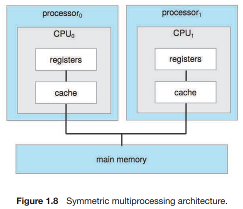
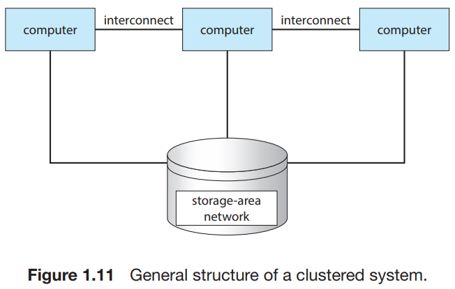

# 3. Computer-System Architecture

1. Single-Processor Systems
2. Multiprocessor Systems
3. Clustered Systems

---

### DEFINITIONS OF COMPUTER SYSTEM COMPONENTS

- CPU : 명령을 실행하는 하드웨어
- Processor : CPU 내부에서 1개 이상의 물리 칩
- Core : CPU의 기본 연산 유닛
- Multicore : 1개의 CPU processor, 2개 이상의 core
- Multiprocessor :2개 이상의 프로세서

컴퓨터 시스템을 프로세스 수에 따라 분류할 수 있다.

## 1. Single-Processor Systems

- 옛날에는 대부분의 시스템이 하나의 CPU를 가지는 단일 프로세서를 사용

#### special-purpose processors

- 디스크, 키보드, 그래픽 컨트롤러 등에 위치
- 제한된 명령 수행
- 프로세스를 구동하지 않음
- OS에 의해 관리될 수 있음
- ex.
    - 디스크 컨트롤러 마이크로프로세서 : 메인 CPU로부터 요청을 받아 자신의 디스크 큐에 실행

## 2. Multiprocessor Systems

- 전통적으로 싱글코어 CPU가 있는 프로세서가 2개 이상인 시스템
- 프로세서가 많아지면,
    - 동일 시간의 처리량이 늘어남
- N개의 프로세서에서 속도 향상 비율은 N보다 작음
    - 여러 프로세스가 협력 시 올바른 작동을 유지하도록 일정량의 오버헤드 발생

### symmetric multiprocessing SMP, 대칭형 다중 처리

  

- 다중 처리 프로세서 시스템의 가장 일반적인 형태
- 프로세서가 본인의 레지스터들을 가지지만,
- 시스템 버스의 물리적인 공유 메모리를 통해 데이터 공유
- N개의 프로세서가 N개의 일을 동시에 수행할 수 있음
- 하나의 프로세서서는 idle, 하나의 프로세서는 바쁜 상태일 수 있음
    - 프로세서 간에 프로세스, 메모리와 같은 자료구조 리소스를 동적으로 공유하여 해소
    - 주의 필요

### multicore system

  

- 1개의 프로세서, 멀티 코어
- 프로세서가 2개 이상인 전통적인 시스템보다 효율 높음
    - 칩 내부 커뮤니케이션이 칩-칩 커뮤니케이션보다 빠름
    - 전력 소모 덜함 모바일 디바이스 같은 곳에 특히 유효
- L1 Cache : 로컬 캐시
- L2 Cache : shared 캐시, 각 코어와 공유

#### non-uniform memory access NUMA

  

- CPU가 많아지면 전력소모가 많아지고, 시스템 버스에 보틀넥 발생, 성능 저하
- 그에 따른 대안으로
- 작고 빠른 로컬 버스를 통해 접근 가능한 로컬 메모리 배치
- 성능 향상 : 로컬 메모리를 통해 접근
- 시스템 전반의 성능 저하 없음
- CPU는 나의 물리적 주소 공간 공유
- 현대 고성능 서버의 인기가 많아지고 있음
- 단점
    - 레이턴시 : CPU가 다른 CPU의 메모리에 접근할 때는 시스템 버스를 통해 접근
    - OS는 CPU 스케줄링과 메모리 관리로 해소

### blade server

- 1 bay, 멀티 프로세서 보드 + IO 보드 + 네트워킹 보드
- 각 블레이드 프세서가 독립적으로 운용되고, 자신들의 OS를 가짐
- 2개 이상의 독집적인 멀티프로세서 시스템

## 3. Clustered Systems

  

- multiprocessor system
- multiprocessor system과 다른점
    - 개별 시스템 혹은 노드로 구성되며 각 노드는 일반적으로 멀티코어 시스템

#### 일반적인 정의

- 클러스터 컴퓨터는 storage를 공유하고,
- LAN 또는 InfiniBand와 같은 빠른 네트워크를 통해 긴밀하게 연결

#### 고가용성

- 시스템이 클러스터에서 실패해도 서비스에 이상없도록 가용성을 확보할 수 있음
- 시스템에 중복성 추가
- 각 노드가 네트워크를 통해 다른 노드 모니터링
- 모니터링 대상 머신이 실패하면 해당 실패 머신의 스토리지를 획득하여 응용 프로그램 재기동
- 고가용성은 신뢰도 증가시킴 : 사용자는 잠깐의 서비스 중지를 경험

#### graceful degradation 우아한 성능 저하

- 서비스 가능한 하드웨어에 비례하는 균형잡힌 서비스 능력을 가진 하드웨어의 능력
- fault tolerant 장애 허용
    - 단일 노드의 장애에도 불구 서비스 가능
    - 실패를 감지, 진단, 가능하면 복구할 수 있는 메커니즘까지 필요

### 클러스터링 비대칭 vs 대칭

- 비대칭 asymmetric
    - hot-standby mode 머신 : 아무것도 안하고, active server만 모니터링
    - active server가 실패하면 standby server가 active server로 승격
- 대칭 symmetric
    - 모든 노드가 active
    - 각 노드는 서로를 모니터링
    - 하나의 노드가 실패하면, 다른 노드가 해당 노드의 스토리지를 획득하여 서비스를 계속함
    - 모든 하드웨어를 서비스하기에 더 효율적
    - 2개 이상의 어플리케이션이 운영 가능해야함

### parallelization

- 클러스터는 고성능 컴퓨팅 환경 제공 가능
- 응용 프로그램이 클러스터의 이점을 활용할 수 있게 전문화되어 설계되어야함
- 병렬화 기술
    - 병렬적으로 나누어 실행된다는 전제하에 프로그래밍
    - 클러스터의 각 계산 노드가 문제를 해결한 뒤 최종 솔루션으로 결과를 결합

### parallel cluster

- WAN을 통해 클러스터링 가능
- 병렬 클러스터가 다수의 호스트가 같은 스토리지에 접근하도록 허용
- 특별한 버전의 소프트웨어나 어플리케이션 배포판이 필요
    - 다수의 호스트가 병렬적으로 동시에 데이터에 접근할 수 있게 구현
    - ex. Oracle Real Application Clusters, Distributed Lock Manager DLM

### 클러스터 기술의 진화

- 빠르게 진화하고 있음
- storage-area-network SAN
    - 마일 단위의 간격으로 클러스터링 가능하게 함
