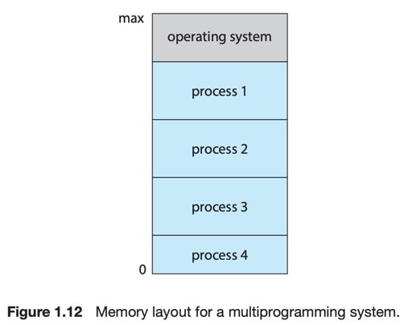

# 4. Operating-System Operations

1. Multiprogramming and Multitasking
2. Dual-Mode and Multimode Operation
3. Timer

OS 는 프로그램이 실행되는 환경을 제공한다.

### bootstrap program 과 Kernel

- 컴퓨터 부팅시 필요한 프로그램
    - CPU 레지스터, 장치 제어기, 메모리 초기화 등
- 하드웨어 내 펌웨어에 저장
- 부트스트랩 프로그램은 OS 커널을 메모리에 로딩

### 시스템 부팅

커널이 메모리에 올라가면, 서비스를 시스템과 사용자에게 제공 가능해진다.

- system daemon : 몇 서비스는 커널 외부에서 시스템 프로그램에 의해 제공
- systemd : 리눅스의 첫번쨰 프로그램으로서 많은 다른 데몬을 시작시킴

---

## 1. Multiprogramming and Multitasking

Multiprogramming : 2개 이상의 프로그램을 구동하는 능력

### Multiprogramming increases CPU utilization

- 싱글 프로그래밍은 다른 CPU가 놀고 있어서 비효율적
- 유저들은 **동시에** 여러개의 프로그램이 구동되기를 원함
- **process** : 실행 중인 **프로세스**

### idea : idle 시간 최소화

1. OS가 몇몇의 프로세스들을 동시에 메모리에 로딩해둠
2. 실행할 프로세스를 골라 실행
3. I/O 대기와 같은 대기상태에 돌입하면,
    - 다른 프로세스를 실행하러 감
4. CPU가 유휴상태에 빠지지 않음

### Multitasking

- Multitasking : Multiprogramming 의 논리적 확장
- 여러 프로세스들을 스위칭 하면서 실행
- ex. I/O 진행 시
    - display to user
    - touch screen
    - user keyboard, ...
    - 위 작업들을 기다릴바에야 다른 프로세스를 실행하러 감

### 추가 작업

- memory management : 메모리에 동시에 여러 프로세스를 올리려면 메모리 관리 필요
- CPU scheduling : 어떤 프로세스를 선택하여 실행할 것인가?
- virtual memory
    - 합리적인 응답시간을 제공하기 위해,
    - 프로세스의 실행을 완전히 메모리만을 이용하여 진행하지 않음
    - 실제 물리 메모리보다 큰 프로그램을 실행 가능
- storage management
- 프로세스 동기화 메커니즘 : deadlock 방지

## 2. Dual-Mode and Multimode Operation

## 3. Timer
