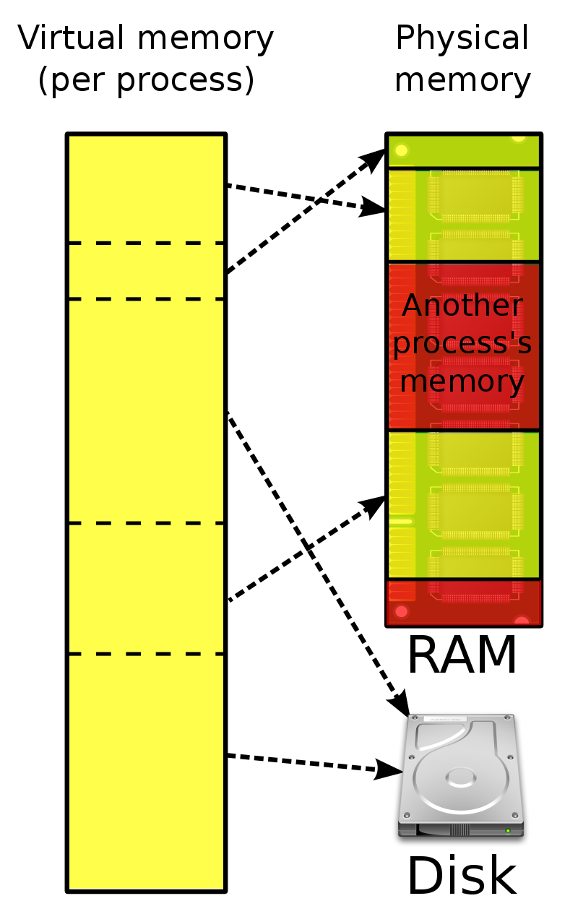

# 가상 메모리

- 가상 메모리
- 블록 단위 주소 변환
- 메모리 호출 기법

## 가상 메모리 Virtual Memory

### 연속 메모리 할당 vs 가상 메모리

- 연속 메모리 할당 : 메모리 크기보다 더 큰 공간이 필요한 프로세스는 실행이 불가
- 가상 메모리 : 메모리 크기보다 더 큰 기억 공간이 필요한 프로세스도 실행할 수 있게 함

### 가상 메모리의 개념

- 실행 중인 프로세스에 의해 참조되는 주소를 메모리에서 사용하는 주소와 분리
- 현재 필요한 일부만 메모리에 적재

  

### 사상 Mapping

- 프로세스 실행을 위해 가상주소를 실제 주소로 변환하는 과정
- 동적 주소변환 Dynamic Address Translation : 프로세스 실행 중 사상
- 인위적 연속성 : 가상 주소 공간에서 연속적인 주소가 실주소 공간에서도 연속적일 필요 없음

## 블록 단위 주소 변환 Block Address Translation

### 주소변환

- 주소변환 사상표 : 동적 주소변환을 위한 정보를 가진 표
- 주소변환이 바이트나 워드 단위로 이루어지면 변환에 필요한 정보량이 많아 비효율적임

### 블록 사상 시스템

- 블록 단위로 주소변환
- 가상 메모리의 각 블록이 메모리 어디에 위치하는지 관리
- 가상주소 v = (b, d)
    - b : 블록 번호
    - d : 블록의 시작점으로부터의 변위
- 실주소 r = (b', d')
- 블록의 크기를 적절히 정해야함
    - 크기가 클수록
        - 사상표 크기 감소
        - 블록 전송시간 증가
        - 동시에 적재하는 프로세스 수 감소
    - 크기가 작을수록
        - 사상표 크기 증가
        - 블록 전송시간 감소
        - 동시에 적재하는 프로세스 수 증가

### 블록 구성방식

- 페이지 : 블록의 크기 동일
- 세그먼트 : 블록의 크기 다를 수 있음

### 페이징 기법

- 가상 메모리를 페이지 단위로 나누어 관리하는 기법
- 메모리 영역도 페이지와 동일한 크기의 페이지 프레임 페이지를 담을 수 있는 틀으로 나눔
- 논리적 의미와 무관한 동일 크기의 페이지로 나눔
- 메모리 보호는 페이지 단위로 이루어짐
- 외부 단편화가 발생 안함
- 내부 단편화 발생 가능

#### 페이지 사상표

- 가상주소를 실주소로 동적 변환 할 수 있게 함
- 페이지 번호에 대한 페이지 프레임 번호 저장
- <페이지 번호, 페이지 존재 비트, 보조기억장치 주소, 페이지 프레임 번호>

#### 직접 사상에 의한 동적 주소변환

- 페이지 사상표를 직접 이용
- 예시
    1. 페이지 사상표 데이터 : <3, 1, s, 5>
    2. 가상수조 v = (3, 8)
    3. 페이지 크기 M = 1024
    4. 실주소 r = 5M + 8 = 5128

#### 연관 사상에 의한 동적 주소변환

- 페이지 변환 정보를 연관 메모리에 저장한 연관 사상표 이용
- 예시
    1. 연관 사상표 데이터 (페이지 번호, 페이지 프레임 번호) : <3, 5>
    2. 가상수조 v = (3, 8)
    3. 페이지 크기 M = 1024
    4. 실주소 r = 5M + 8 = 5128

#### 연관 / 직접 사상에 의한 동적 주소변환

- 연관 사상표에는 가장 최근 참조된 페이지만 보관
- 연관 사상표에 없을 때만 직접 사상 이용
- 예시
    1. 가상주소 v = (3, 8)
    2. 연관 상표에 페이지 3 데이터 확인
    3. 없으면 직접 사상표 조회, 있으면 해당 데이터의 페이지 프레임으로 사상

### 세그먼테이션 기법

- 가상 메모리를 세그먼트 단위로 나누어 관리하는 기법
- 세그먼트 : 논리적 의미를 가진 가변 크기의 논리적 단위
- 세그먼트 사상표를 이용하여 동적 주소변환

#### 세그먼트 사상표

- 세그먼트 번호에 대한 실주소에서의 시작위치 저장
- 세그먼트 길이는 오버플로 확인 용도
- <세그먼트 번호, 세그먼트 존재 비트, 보조기억장치 주소, 세그먼트 길이, 세그먼트 시작 주소>
- 동적 주소 변환
    - 가상주소 v = (2, 8)
    - 세그먼트 사상표 데이터 : <2, 1, s, 1500, 1200>
    - 실주소 r = 1200 + 8 = 1208

#### 페이징 / 세그먼테이션 혼용기법

- 세그먼테이션 기법의 논리적 장점 + 페이징 기법의 메모리 관리 측면의 장점
- 가상 메모리를 세그먼트 단위로 분할 후 각 세그먼트를 다시 페이지 단위로 분할
- 메모리는 페이지 프레임으로 분할
- 가상주소 v = (s, p, d)
    - s : 세그먼트 번호
    - p : 페이지 번호
    - d : 페이지 내 변위

## 메모리 호출 기법

- 어느 시점에 페이지 또는 세그먼트를 메모리에 적재할 것인가 결정하는 것
- 페이징 기법에서의 호출기법 종류
    - 요구 페이지 호출기법
    - 예상 페이지 호출기법

### 요구 페이지 호출기법

- 프로세스의 페이지 요구가 있을 때 페이지를 메모리에 적재하는 방법

### 예상 페이지 호출기법

- 곧 사용될 것으로 예상되는 페이지를 미리 메모리에 적재하는 방법

### 요구 페이지 호출기법 vs 예상 페이지 호출기법

- 요구 페이지 호출기법
    - 옮길 페이지 결정 오버헤드 최소화
    - 적재된 페이지는 실제로 참조됨
    - 프로세스 시작시점에는 연속적으로 페이지 부재 발생
- 예상 페이지 호출기법
    - 예상이 잘못될 경우 시간, 메모리 낭비
    - 프로세스 시작 시점에 적용 시 성능 개선
