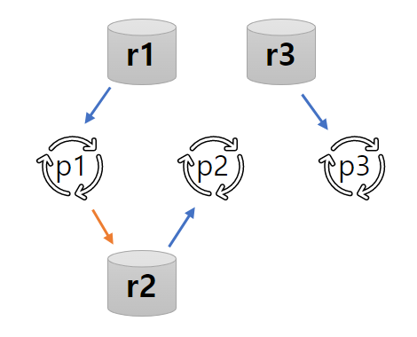
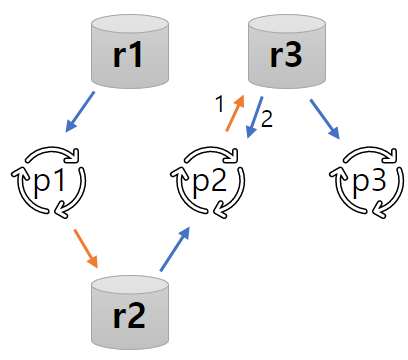
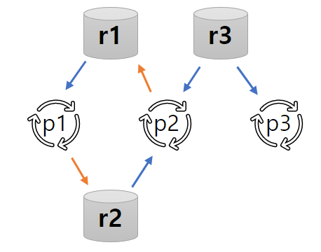

# 교착상태 (Deadlock)

- 교착상태의 개념
- 교착상태의 특성
- 교착상태 예방

## 교착상태의 개념

### 프로세스의 공유 자원 사용 절차

1. 요구 : 공유자원 사용 요구
    - **이미 사용중인 자원이면 획득할 때까지 대기**
2. 사용 : 공유자원 점유, 사용
3. 해제, 반납 : 공유자원 사용 완료 (다른 프로세스가 사용 가능)

교착상태란, 여러 프로세스가 서로 상대방의 작업이 끝나기만을 기다리고 있어서 영원히 진행될 수 없는 상태이다.  
ex. 형제 프로세스가 서로가 입고있는 바지 공유자원를 원해서 외출을 못하는 상황

### 교착상태 vs 기아상태 Starvation

- 기아 상태 : 프로세스의 우선순위가 늦어져 계속해서 자원을 할당받지 못하는 상태
    - 프로세스의 우선순위를 조정하여 해결 가능

## 교착상태의 특성

### 교착상태의 필요 조건

다음 네가지가 모두 만족 (and) 할 때 교착상태 발생 가능

- 상호배제
- 점유대기
- 비선점
- 환형대기

### 상호배제 Mutual Exclusion

- 프로세스가 자원의 배타적인 통제권 요구
- 요구시점에 다른 프로세스가 점유한 자원이면 반드시 대기 (포기 안함)

### 점유대기 Hold and Wait

- 프로세스가 하나의 자원을 점유한 상황에서,
- 다른 프로세스가 이미 점유한 자원을 요구

### 비선점 No Preemption

- 자원을 뺏을 수 없음 (타의에 의해 점유 해제 불가능)
- 점유한 자원의 해제는 점유한 프로세스가 사용을 마치고 스스로 반환해야함

### 환형대기 Circular Wait

- 프로세스의 점유 관계가 환형을 이루며 대기하는 상황
- 프로세스 1 :  자원 1 점유 and 자원 2 요구
- 프로세스 2 :  자원 2 점유 and 자원 1 요구

### 자원할당 그래프 G = (V, E)

> 정점의 집합 V = P U R
> - P : n개의 프로세스 p의 집합
> - R : m 개의 자원 r의 집합
>
> 간선의 집합 E = Q U S
> - Q : 프로세스 p가 자원 r 요구
> - S : 자원 r이 프로세스 p에 할당
>
> 그래프 화살표
> - 주황색 : 자원 요구 간선
> - 파란색 : 자원 할당 간선

##### p2가 r3 요구

1. 요구간선 (p2, r3) 추가
2. 가용 자원 존재하면 할당간선 (r3, p2) 로 바꿈

#### 교착상태의 필요조건 표현

교착상태가 상황 표현

- 상호배제 : 하나의 할당 간선
- 점유대기 : 한 프로세스가 할당간선, 요구간선 연결
- 비선점 : 요구간선
- 환형대기 : 사이클 형태

### 교착상태 다루기

- 예방 : 교착상태의 필요조건 네가지가 동시에 일어나는 것을 피한다
- 회피 : 프로세스가 필요한 자원의 양을 최대한 만족시키도록 정보를 수집한다
- 탐지, 복구 : 교착상태 발생여부를 조사, 모니터링해서 발생한 경우 적절한 조치를 통해 정상상태로 복구시킨다

## 교착상태 예방 : 교착상태 필요조건 제거

### 상호배제 조건 제거

- 굥유 가능 자원 : 상호배제가 필요 없음
    - ex. 읽기 전용 파일 (쓰기 없음)
- 공유 불가능 자원 : 상호배제 필요
    - ex. 프린터기 (한번에 한명만 사용 가능)

### 점유대기 조건 제거

- 자원이 할당 중일 때 대기하지 않기
    - 하나의 프로세스가 작업에 필요한 모든 자원을 한꺼번에 요구하여 할당
    - 자원 이용률이 낮고, 기아상태 가능성
- 대기중인 프로세스가 다른 자원을 점유하지 않기
    - 자원을 요구하는 프로세스는 기존에 할당 받은 자원 모두 반납
    - 자원 요구 시점에 해제할 수 없는 자원은 적용 불가능

### 비선점 조건 제거

- 비선점 프로세스에 대한 선점이 가능하도록 하기
    - 자원 특성에 따라 선점 불가능한 것도 존재
- 다른 프로세스가 대기할 가능성 줄이기
    - 점유대기 상황이 발생하면 할당 받았던 자원 모두 해제

### 환형대기 조건 제거

- 모든 자원에 일련번호 지정
    - 방법 1 : 프로세스가 자원 요구 시 일련변호 기준으로 오름차순이 되도록 요구
        - 가장 최근에 할당받은 자원이 ri 이면 다음 요구 자우너은 rk (i<k)
    - 방법 2 : 프로세스가 자원 요구시 일련번호가 더 작은 자원만 점유 가능
        - 자원 ri 요구시 현재 일련번호 i 보다 같거나 큰 자원 모두 반납
- 점유대기 중인 프로세스는,
    - 점유 중인 자원의 일련번호 < 대기 중인 자원의 일련번호
- 프로세스마다 요구 순위가 다를 수 있어 자원 일련번호 설정이 모호함
- 점유자원 해제가 필요할 때 적용 불가한 자원 존재 가능성
