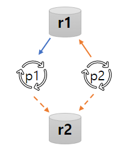

# 교착상태 (Deadlock)

- 교착상태의 개념
- 교착상태의 특성
- 교착상태 예방
- 교착상태 회피
- 교착상태 탐지, 복구

## 교착상태의 개념

### 프로세스의 공유 자원 사용 절차

1. 요구 : 공유자원 사용 요구
    - **이미 사용중인 자원이면 획득할 때까지 대기**
2. 사용 : 공유자원 점유, 사용
3. 해제, 반납 : 공유자원 사용 완료 (다른 프로세스가 사용 가능)

교착상태란, 여러 프로세스가 서로 상대방의 작업이 끝나기만을 기다리고 있어서 영원히 진행될 수 없는 상태이다.  
e.g. 형제 프로세스가 서로가 입고있는 바지 공유자원를 원해서 외출을 못하는 상황

### 교착상태 vs 기아상태 Starvation

- 기아 상태 : 프로세스의 우선순위가 늦어져 계속해서 자원을 할당받지 못하는 상태
    - 프로세스의 우선순위를 조정하여 해결 가능

## 교착상태의 특성

### 교착상태의 필요 조건

다음 네가지가 모두 만족 (and) 할 때 교착상태 발생 가능

- 상호배제
- 점유대기
- 비선점
- 환형대기

### 상호배제 Mutual Exclusion

- 프로세스가 자원의 배타적인 통제권 요구
- 요구시점에 다른 프로세스가 점유한 자원이면 반드시 대기 (포기 안함)

### 점유대기 Hold and Wait

- 프로세스가 하나의 자원을 점유한 상황에서,
- 다른 프로세스가 이미 점유한 자원을 요구

### 비선점 No Preemption

- 자원을 뺏을 수 없음 (타의에 의해 점유 해제 불가능)
- 점유한 자원의 해제는 점유한 프로세스가 사용을 마치고 스스로 반환해야함

### 환형대기 Circular Wait

- 프로세스의 점유 관계가 환형을 이루며 대기하는 상황
- 프로세스 1 :  자원 1 점유 and 자원 2 요구
- 프로세스 2 :  자원 2 점유 and 자원 1 요구

### 자원할당 그래프 G = (V, E)

> 정점의 집합 V = P U R
> - P : n개의 프로세스 p의 집합
> - R : m 개의 자원 r의 집합
>
> 간선의 집합 E = Q U S
> - Q : 프로세스 p가 자원 r 요구
> - S : 자원 r이 프로세스 p에 할당
>
> 그래프 화살표
> - 주황색 : 자원 요구 간선
> - 파란색 : 자원 할당 간선

##### p2가 r3 요구

1. 요구간선 (p2, r3) 추가
2. 가용 자원 존재하면 할당간선 (r3, p2) 로 바꿈

#### 교착상태의 필요조건 표현

교착상태가 상황 표현

- 상호배제 : 하나의 할당 간선
- 점유대기 : 한 프로세스가 할당간선, 요구간선 연결
- 비선점 : 요구간선
- 환형대기 : 사이클 형태

### 교착상태 다루기

- 예방 : 교착상태의 필요조건 네가지가 동시에 일어나는 것을 피한다
- 회피 : 프로세스가 필요한 자원의 양을 최대한 만족시키도록 정보를 수집한다
- 탐지, 복구 : 교착상태 발생여부를 조사, 모니터링해서 발생한 경우 적절한 조치를 통해 정상상태로 복구시킨다

## 교착상태 예방 : 교착상태 필요조건 제거

### 상호배제 조건 제거

- 굥유 가능 자원 : 상호배제가 필요 없음
    - e.g. 읽기 전용 파일 (쓰기 없음)
- 공유 불가능 자원 : 상호배제 필요
    - e.g. 프린터기 (한번에 한명만 사용 가능)

### 점유대기 조건 제거

- 자원이 할당 중일 때 대기하지 않기
    - 하나의 프로세스가 작업에 필요한 모든 자원을 한꺼번에 요구하여 할당
    - 자원 이용률이 낮고, 기아상태 가능성
- 대기중인 프로세스가 다른 자원을 점유하지 않기
    - 자원을 요구하는 프로세스는 기존에 할당 받은 자원 모두 반납
    - 자원 요구 시점에 해제할 수 없는 자원은 적용 불가능

### 비선점 조건 제거

- 비선점 프로세스에 대한 선점이 가능하도록 하기
    - 자원 특성에 따라 선점 불가능한 것도 존재
- 다른 프로세스가 대기할 가능성 줄이기
    - 점유대기 상황이 발생하면 할당 받았던 자원 모두 해제

### 환형대기 조건 제거

- 모든 자원에 일련번호 지정
    - 방법 1 : 프로세스가 자원 요구 시 일련변호 기준으로 오름차순이 되도록 요구
        - 가장 최근에 할당받은 자원이 ri 이면 다음 요구 자우너은 rk (i<k)
    - 방법 2 : 프로세스가 자원 요구시 일련번호가 더 작은 자원만 점유 가능
        - 자원 ri 요구시 현재 일련번호 i 보다 같거나 큰 자원 모두 반납
- 점유대기 중인 프로세스는,
    - 점유 중인 자원의 일련번호 < 대기 중인 자원의 일련번호
- 프로세스마다 요구 순위가 다를 수 있어 자원 일련번호 설정이 모호함
- 점유자원 해제가 필요할 때 적용 불가한 자원 존재 가능성

## 교착상태 회피

사전 정보를 활용하여 교착상태가 발생하지 않는 상태에 머물게 하는 방법  
사전정보 : 현재 할당된 자원, 가용상태 자원, 프로세스들의 최대 요구량

- 교착상태는 불안전상태에서만 발생 가능
- 항상 안전상태 유지
- 프로세스가 가용상태의 자원을 요구하더라도
    - 프로세스는 대기상태가 될 수 있음 =자원 이용율이 낮아질 수 있음

### 안전상태와 안전순서열

교착상태는 **불안전상태에서만 발생이 가능하다.**

- 안전상태 : 안전순서열이 존재
- 불안전상태 : 안전순서열 존재 X, 불안전상태이지만 교착상태가 발생하지 않을수도 있음

#### 안전순서열 : 순서 있는 프로세스 집합 {p1, p2, ... pn}

- 각 프로세스 p 들에 대해 p가 추가로 요구할 수 있는 자원의 양이 현재 가용상태의 자원으로 충분하거나,
- 이전 순서 프로세스들에 할당된 자원까지 포함하면 충당 가능한 경우
- e.g.
    - 프로세스 3개 (p1~p3)가 요구하는 최대 요구량 10, 총 자원 개수 11
    - 총 자원수가 10개보다 작아도 이미 할당된 자원까지 포함하여 충당이 가능하면 됨

### 교착상태 회피 알고리즘

- 변형된 자원할당 그래프 : 각 자원의 단위자원이 하나밖에 없는 경우
- 은행원 알고리즘 : 각 자원의 단위자원이 여러개일 수 있는 경우

#### 변형된 자원할당 그래프

- 자원 할당 그래프에서 각 자원의 단위자원이 하나밖에 없는 경우
- 자원 정점에 표시하던 단위 자원 개수 제거
- 선언간선 (pi, rj) 추가
    - pi 프로세스가 rj 자원을 요구할 예정
    - 점선으로 표시
- 선언 -> 요구 -> 할당
- 자원을 요구받으면 선언 간선을 요구간선으로 변경
- 요구간선을 할당간선으로 변환해도 사이클이 생기지 않는 경우에만,
    - 자원을 할당하고 할당간선으로 변경

- p1이 r2를 요구하면 할당 가능
- p2가 r2를 요구하면 사이클이 생겨 할당 불가능

#### 은행원 알고리즘

- 자원을 요구받으면,
    - 자원을 할당해주고 난 다음 상태가 안전상태인지 미리 계산
- 안전상태가 보장되어야 자원 할당

## 교착상태 탐지, 복구

- 교착상태에 대한 사후처리
- 탐지
    - 시스템의 교착상태 여부를 지속적으로 상태 조사 알고리즘 수행
- 복구
    - 교착상태 탐지 시 적절히 복구

### 교착상태 탐지

- Shoshani, Coffman 알고리즘 시간복잡도 O(mn^)
- 수행시점
    - 즉시 받아드일 수 없는 자원요구 시
    - 정해진 시간 간격
    - CPU 효율이 떨어졌을 때

### 교착상태 복구

- 사람이 발견 : 수작업으로 복구
- 운영체제가 발견 : 자동 복구

#### 복구 방법

- 교착상태 프로세스 종료
    - 모든 교착상태 프로세스 종료
        - 단점 : 진행 중이던 작업에 대한 복원 비용 큼
    - 사이클 제거될 때 까지 교착 프로세스 하나하나 종료
        - 단점 : 제거 대상 프로세스 식별 비용, 제거 후 사이클 제거 여부 확인 비용
- 교착상태 프로세스에게 할당한 자원 해제
    - 사이클이 제거될 때 까지 할당된 자원을 단계적으로 선점하여 다른 프로세스에게 할당
    - 프로세스, 자원 선택 기준
        - 프로세스 진척도, 할당된 자원 수 등
    - 프로세스 복귀 시점도 제반요소를 고려하여 결정
    - 기아상태 방지를 위해 프로세스 선택 시 복구 횟수 고려
