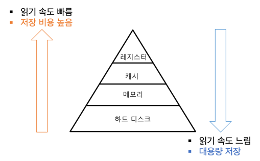
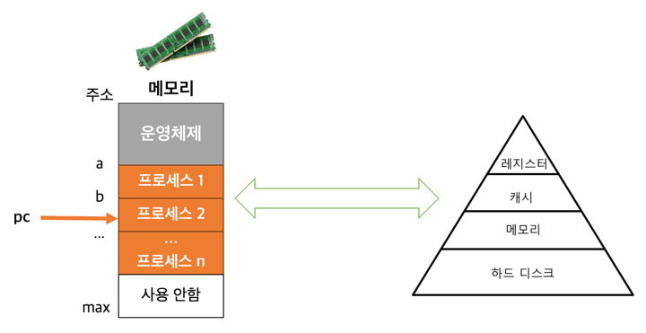
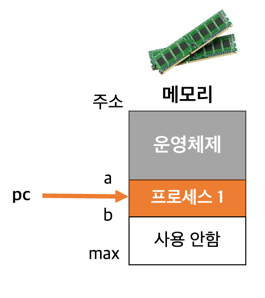
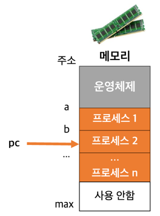
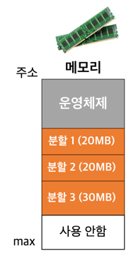
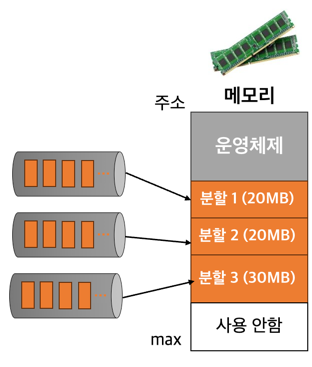
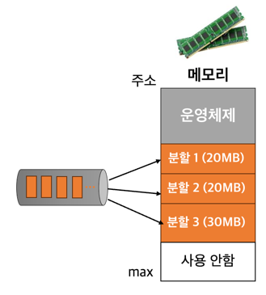
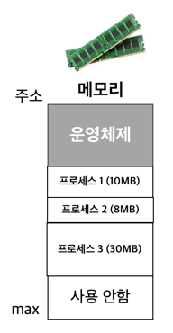
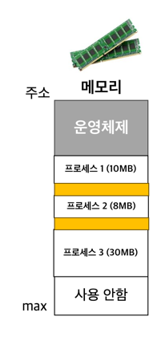

# 메모리 관리

- 프로세스와 메모리
- 단일 프로그래밍
- 다중 프로그래밍
- 메모리 배치기법

## 프로세스와 메모리

### 기억장치 계층구조

### 프로세스의 동작

1. 프로그램이 기억장치에 있다가 실행단위로 메모리에 올라옴
2. 프로그램 카운터 PC가 메모리 참조 중
3. PC가 가리키는 명령어를 메모리에서 CPU로 가져옴
4. CPU로 연산

### 메모리 관리

- 메모리 호출 : 언제 새로운 프로세스를 메모리에 올릴 것인가?
- 메모리 배치 : 다음에 실행될 프로세스를 메모리 내 어디에 배치할 것인가?
- 메모리 교체 : 메모리가 찬 상태에서 새로운 프로세스를 메모리에 올려야한다면 어떤 프로세스를 제거할 것인가?
- 기타 : 고정 / 동적 분할, 고정 / 유동 적재영역 등

## 단일 프로그래밍

- 하나의 프로세스가 메모리를 전용으로 사용하는 것
- 연속 메모리 할당 : 프로세스는 하나의 연속된 블록으로 메모리에 할당

### 문제점

- 메모리 용량을 초과하는 프로세스 실행 불가
- 메모리 낭비
    - 지속적으로 사용되지 않는 프로세스도 메모리에 계속 적재되어있음
- 주변 장치 자원의 낭비
    - 계산 위주의 프로세스 동작 시 :  CPU 장치 말고는 사용하지 않는 주변 장치 자원이 낭비

## 다중 프로그래밍

- 여러 프로세스가 메모리에 동시에 적재됨
- 전체적인 CPU 이용률, 시스템 처리량 증가

### 메모리 분할

- 여러 프로세스를 메모리에 적재하기 위해 고안된 방법
- 하나의 분할에 하나의 프로세스가 적재됨

#### 고정 분할

- 메모리를 여러개의 고정된 크기의 영역으로 분할
- 문제점 : 내부 단편화
    - 프로세스의 크기가 할당된 분할영역보다 작으면 잉여 메모리 공간 발생
    - 프로세스의 크기를 미리 알고 그에 맞춰 고정 분할해야함
    - 현실적이지 못함

- 프로세스 배치 방법 1
    - **분할 영역마다 큐**를 두고 큐 배치
    - 큐에 들어온 프로세스는 해당 분할 영역에만 적재
    - 절대 번역, 적재
    - 효율성이 낮음

- 프로세스 배치 방법 2
    - **하나의 큐** 두고 큐에 들어온 프로세스는 어느 분할 영역에든 적재
    - 재배치 가능 번역 및 적재
    - 복잡함

#### 동적 분할

- 메모리의 분할경계가 고정적이지 않음
- 각 프로세스에 필요한 메모리 만큼만 메모리 영역 할당

  

- 문제점 : 외부 단편화
    - 메모리의 할당과 반환이 반복되면서 작은 크기의 잉여 메모리 공간이 흩어져 발생
- 해결방법 : 통합, 집약
    - 통합 : 인접된 공백을 하나의 큰 공백으로 통합
    - 집약 : 메모리 내의 공백을 모두 모음

### 메모리 보호

- 프로세스가 다른 할당영역을 침범하지 않게 하는 것
- 하한-상한 또는 하한-크기 레지스터 쌍으로 제한
    - 하한-상한 : CPU 레지스터에 참조해야할 주소 시작~끝 저장
    - 하한-크기 : CPU 레지스터에 참조해야할 주소 시작~크기 저장
- 이 제한 넘어 운영체제 호출하려면 시스템 호출 이용

## 메모리 배치기법

- **동적 분할 다중 프로그래밍**에서 새로 반입된 프로그램이나 데이터를 메모리 어디에 배치시킬 것인가
- 종류
    - 최초 적합
    - 후속 적합
    - 최적 적합
    - 최악 적합

#### 최초 적합

- 프로세스가 적재가능한 빈 공간 중 가장 먼저 발견된 곳에 할당

#### 후속 적합

- 최초 적합의 변형
- 이전에 탐색이 끝난 다음 부분부터 시작하여 가장 먼저 발견된 곳에 할당

#### 최적 적합

- 제공 가능한 공간 중 가장 작은 곳을 할당
- 큰 빈 공간을 최대한 많이 확보해놓기 위한 방법

#### 최악 적합

- 제공 가능한 공간 중 가장 큰 곳을 할당
- 아주 작은 자투리가 남아 쓰지 못하는 것을 방지하기 위한 방법
