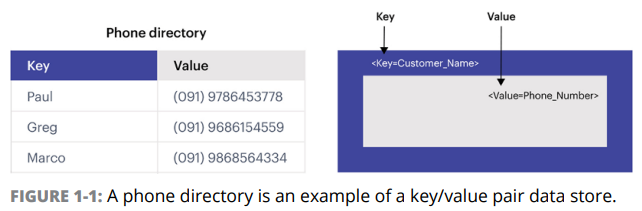
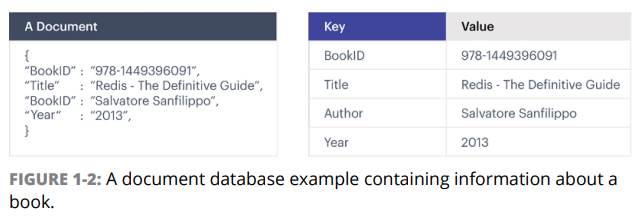

# Chapter 1 What is Redis?

- Introducing NoSQL
- Seeing WHere Redis Fits
- Working with Multi-Model Application Requirements

---

- NoSQL overview
- NoSQL DB type : key-value, document, column, graph
- multi-model database server

## Introducing NoSQL

- _NoSQL_ : data 저장 기술 집합

### Defining NoSQL

- NoSQL : Not Only SQL
- SQL : Structured Query Language
    - relational db에서 사용하는 언어
- 현대 Intenet 규모가 요구하는 성능을 제공할 수 있는 DB

### Identifying types of NoSQL databases

#### Key/value

- _keys_ : relational db에서의 식별자
- _values_ : 식별자에 대응하는 데이터

#### Column

- row가 아닌 column을 기준으로 데이터를 저장
- 집계함수에 최적화

#### Document

- key/value와 유사
- key/value가 문서처럼 집합되어 있는 형태 (JSON, XML)

#### Graph

- 데이터 저장에 그래프를 사용 (edge, vertex)

### Knowing when to use NoSQL vs a relational database

- Relational DB : 데이터 요소를 table간의 relation으로 다룸
    - app이 클수록, 데이터 구조가 복잡할수록 쿼리가 복잡해짐 -> 성능 저하
    - 구조 (structured) 가 잘 정의되어 있어야 함
- 대부분의 NoSQL DB는 program (API)로 접근
- 복잡한 구조에도 적합

### Deciding when to Use NoSQL database

| 특징             | NoSQL DB                                               | Relational DB                                                  |
|----------------|--------------------------------------------------------|----------------------------------------------------------------|
| 특징             | 대량의 데이터에 빠르게 접근                                        |                                                                |
| 고가용성 (replica) | Primary/Secondary replication 필요 없음  scale-out이 쉬움 | Primary replication : Read/Write, Secondary replication : Read |
| 속도             | Read/Write 속도가 relational DB보다 빠름                      | Read/Write 속도가 느림                                              |
| 데이터 구조         | 데이터 구조가 복잡해도 적합                                        | schema 필요                                                      |

## Seeing Where Redis Fits

- NoSQL 이상을 제공
- multi-model database : search, messaging, streaming, graph, data store

### Data storage

- 데이터의 빠른 액세스를 위해 in-memory DB로 구현
- 영구 저장을 위해 disk에 저장할 수 있음
    - 고가용성 : in-memory db의 replica를 disk에 저장
- _Durability_ : database component failure에 대한 데이터 손실 방지
- Redis는 다양한 모드의 Durability 제공

### Data structure storage

- Redis는 몇개의 자료구조를 지원
- Redis를 자료구조 저장소로 보는게 이로움 (key/value 저장소로 보는것 보다)
- Strings, Lists, Sets, Sorted Sets, Hashes, Bit Arrays, HyperLogLogs, Streams, Geospatial Indexes
- Pub/Sub pattern 지원
- geospatial data : 거리 측정, 위치 기반 검색 등

## Working with Multi-Model Application Requirements

- multi-model application : 다양한 데이터 모델을 사용하는 application
- Redis Modules : 다양한 데이터 모델을 지원하는 Redis의 확장 기능
- graph, full text search, JSOn, secondary index, linear algebra, SQL, image processing 등

### The single-model problem

- application이 커짐에 따라 bottleneck이 발생

### The modules solution

- Redis external module을 사용함으로서 single-model problem 해결
- Redis module은 오픈소스 Redis DB에 플러그인 가능
- in-memory 처리, scalability, HA 등을 제공