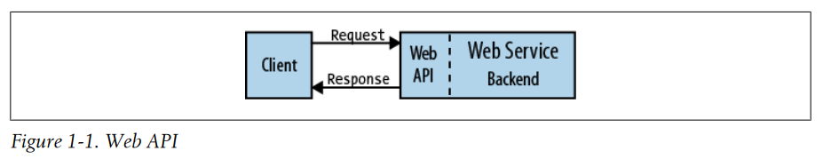

# Chapter 1. Introduction

- Hello World Wide Web
- Web Architecture
- Web Standards
- REST
- REST APIs
- REST API Design
- Recap

---

## Hello World Wide Web

- URI (Uniform Resource Identifier) : web 문서를 식별하는 고유 주소
- HTTP(HyperText Transfer Protocol) : 다른 인터넷과 상호작용하는 메시지 전송 기반 언어
- HTML(HyperText Markup Language) : 웹 페이지 형식 (다른 문서와 link 가능)
- web server
- web browser World Wide Web (WWW)

## Web Architecture

- Roy Fielding (Apache HTTP 서버 프로젝트 공통 창시자)가 정의한 _web architecture style_

1. Client-Server
2. Uniform Interface
3. Layered System
4. Cache
5. Stateless
6. Code-On-Demand

### Client-Server

- Web 은 Client-server 기반의 시스템
- Client와 Server는 각각 독립적으로 개발/배포될 수 있음 (서로 다른 언어, 기술)
- _uniform interface_ : 웹의 균일한 인터페이스를 준수해 client-server는 각각 독립적으로 개발/배포됨

### Uniform Interface

- _uniform interface_ 를 통해 Web 컴포넌트들 간에 상호작용 (통신)

1. Identification of resources
2. representation(표현) 을 사용하여 resrouce 조작
3. Self-descriptive messages
4. HATEOAS(Hypermedia As The Engine Of Application State)

#### 1. Identification of resources

- 모든 것은 resource
- resource는 URI와 같은 고유 주소로 식별됨
- e.g. http://www.example.com/employees/1234

#### 2. representation(표현) 을 사용하여 resrouce 조작

- client는 repereentation을 통해 resource를 조작
- 동일한 resource도 다양한 방법으로 표현 가능
- e.g. Web Browser client에게는 HTML, 프로그램 client에게는 JSON, XML

#### 3. Self-descriptive messages

- Client는 resource에 대한 원하는 상태를 request message에 실을수 있음
- resource의 현재 상태는 Server의 response message에 실려 client에게 전달됨
- e.g. 위키 편집기에서 resource에 대한 변경 상태를 request message에 실어 보냄
    - 서버는 변경된 resource의 상태를 response message에 실어 보냄 (or 상태를 보고 request 거부)
- _metadata_ : resource의 상태 설명을 위한 추가 정보
    - HTTP header

#### 4. HATEOAS(Hypermedia As The Engine Of Application State)

- 관련되 resource에 대한 링크
- 사용자가 resource를 조작하기 위해 링크를 따라가면 됨

## Layered System

- client와 server 사이에 다양한 중간 계층이 존재할 수 있음 (e.g. 프록시, 게이트웨이)
- 주로 캐시, 보안 강화, 부하 분산 등을 위해 중개자를 배치

### Cache

- _cacheablitiy_ : web server가 응답 데이터에 대한 캐시 여부를 지정
- 캐시 응답 데이터는 client에게 더 빠른 latency 제공 -> availability, reliability 향상, web server 부하 감소
- 캐시는 다양한 곳에 존재
    - client, web server, proxy, gateway, reverse proxy, CDN(Content Delivery Network)

### Stateless

- web server는 client applcaiton의 상태를 기억하지 않음
- 따라서 client는 모든 문맥(상태) 정보를 포함해서 request를 보내야함
- trade-off
- 서버는 상태를 기억하지 않기 때문에 scalability 향상
- client는 모든 문맥 정보를 포함해서 request를 보내야 하기 때문에 overhead 발생

### Code-On-Demand

- web server는 일시적으로 실행 가능한 프로그램을 client에게 전송 가능
    - e.g. script, plugin, Java applet, JavaScript
- web server와 client의 coupling
- 클라이언트는 코드를 이해하고 실행 가능해야함

## Web Standards

- Fielding은 HTTP/1.1 명세
- RFC 3986에서 URI 구문 공식화

## REST

- 2000년에 Fielding은 박사학위 논문에 REST를 소개
    - _Representational State Transfer_
- REST는 위에서 언급한 web architecture style에 대한 부연 설명

## REST APIs

- WEb service : site나 다른 application을 지원하기위해 Web server를 통해 공급
- CLient는 API를 사용하여 Web service에 접근
- Web API는 web service의 _face_
    - client와 web service 사이의 통신을 위한 인터페이스
- REST architecture style을 따르는 Web API를 _REST API_ 라고 함
- REST API는 web service를 "RESTful"하게 만듦
- REST API _resource model_ : interlinked resource 집합

## REST API Design

- REST API 설계 기준은 간혹 과학보다 예술에 가까움
- Best REST API practice는 주로 HTTP 표준을 따름

#### REST API 바로미터

- URI 경로 세그먼트에 복수 명사를 사용할 떄는 언제인가
- 어떤 request method가 resource의 상태를 update하는가
- nont-CRUD operation은 어떻게 URI에 매핑하는가
- 주어진 시나리오에 걸맞는 HTTP response status code는?
- resource 상태 버전을 관리하는 방법
- JSON에서 hyperlink를 설계하기 위한 방법

### Rules

- 위 바로미터에 답을 제시할 수 있는 명확한 **rule** (기준) 필요

### WRML (Web Resource Modeling Language, "웜러")

- REST APIs를 구현하고 설계하기 위한 언어
- 

## Recap