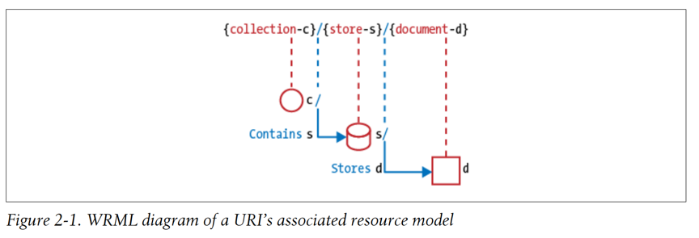

# Chapter 2. Identifier Design with URIs

- URIs
- URI Format
- URI Authority Design
- Resource Modeling
- Resource Archetypes
- URI Path Design
- URI Query Design
- Recap

---

## URIs

- resource의 주소
- API의 resource model

````
http://api.example.com/v1/employees/1234
````

````
The only thing you can use an identifier for is to refer to an object. When you are
not dereferencing, you should not look at the contents of the URI string to gain other
information.

—Tim Berners-Lee http://www.w3.org/DesignIssues/Axioms.html
````

- URI는 불투명한 식별자
- URI로 리소스에 대한 정보를 얻으려고하지 말것

## URI Format

- RFC 3986이 정의한 URI format

````
URI = scheme "://" authority "/" path [ "?" query ] [ "#" fragment ]
````

### Rule :  Forward slash separator (/) must be used to indicate a hierarchical relationship

- forward slash (/)는 계층적 관계를 나타내기 위해 사용

````
http://api.example.com/shapes/squares/blue
````

### Rule : A trailing forward slash (/) should not be included in URIs

- trailing(후행) forward slash (/)는 포함하지 말 것
- 아래 두 URI는 동일한 resource를 가리킴 (그러나 URI가 다름)
- 모호함을 없애기 위함
- 일부 API는 후행 슬래시를 없애고 리다이렉트를 수행

````
http://api.canvas.restapi.org/shapes/
http://api.canvas.restapi.org/shapes
````

### Rule : Hyphens (-) should be used to improve the readability of URIs

- 하이픈(-)은 URI의 가독성을 높이기 위해 사용

````
http://api.example.com/shapes/squares/blue/this-is-first-shape
````

### Rule : Underscores (_) should not be used in URIs

- 주로 _clickable_ 을 표현하기위해 사용
- URI에 언더스코어는 혼동을 줄 수 있음

### Rule : Lowercase letters should be preferred in URI paths

- 대문자는 종종 문제를 일으킴
- RFC 3986에서 case-sensitive한 URI로 정의 (scheme, host 제외)

````
## 1. 
http://api.example.restapi.org/my-folder/my-doc
## 2.
HTTP://API.EXAMPLE.RESTAPI.ORG/my-folder/my-doc
## 3.
http://api.example.restapi.org/My-Folder/my-doc
````

1. OK
2. 1번 처럼 작성하는게 좋음 (RFC 3986)
3. 1,2와 다른 URI임

### Rule : File extensions should not be included in URIs

- `.` 문자는 URI에서 파일 이름과 확장자를 구분하는데 사용
- REST API에서는 `.` 으로 확장자를 표시하지 말고, 응답 message body의 content-type header를 사용
- HTTP client는 `Accept` header를 사용하여 서버에게 원하는 content-type을 알림

````
http://api.example.com/students/1234/trasncripts/2005/fall.json
http://api.example.com/students/1234/trasncripts/2005/fall
````

## URI Authority Design

- URI authority : host
- URI authority naming convention

### Rule : Consistent subdomain names should be used for your APIs

````
http://api.soccer.restapi.org
````

- top-level domain (TLD) : `.com`, `.org`, `.net` 등
- first subdomain
- top-level domain과 first subdomain으로 service owner 판별 가능해야함

### Rule : Consistent subdomain names should be used for your client developer portal

- _developer portal_ : API를 사용하는 client를 위한 문서, 샘플 코드, 테스트 도구 등을 제공하는 웹사이트
- 관례적으로 `developer` 라는 subdomain을 사용

````
http://developer.soccer.restapi.org
````

## Resource Modeling

- RDB Schema 모델링과 유사
- REST API 설계시 resource modeling을 먼저 해보는 것이 도움이 됨

```
http://api.soccer.restapi.org/teams/barcelona/players/messi
```

위 URI는 아래처럼 각 리소스를 식별 할 수 있어야함

````
http://api.soccer.restapi.org/teams/barcelona/players/messi
http://api.soccer.restapi.org/teams/barcelona/players
http://api.soccer.restapi.org/teams/barcelona
http://api.soccer.restapi.org/teams
````

## Resource Archetypes

- API resource 모델링시 사용하는 기본 resource archetypes
- _document_, _collection_, _store_, _controller_
- 투명하고 깔끔한 REST API를 위해 하나의 API에서는 하나의 resource archetype만 사용하는 것이 좋음

### Document

- 객체, db record와 유사
- _fields_ with values
- _links_ to other resources
- _base archetype_ 임
- _docroot_ : document의 root

````
http://api.soccer.restapi.org/teams/barcelona
http://api.soccer.restapi.org/teams/barcelona/players/messi
http://api.soccer.restapi.org/teams/barcelona/players/messi/awards/ballon-dor-2023

## docroot
http://api.soccer.restapi.org
````

### Collection

- resource의 _directory_

````
http://api.soccer.restapi.org/teams/
http://api.soccer.restapi.org/teams/barcelona/players
````

### Store

- client가 관리하는 resource repository
- API Client가 resource를 생성, 수정, 삭제
- store는 절대 스스로 새로운 URI를 생성하지 않음

```Bash
## user001이 barcelona001 팀에 속한 messi 선수를 생성
PUT /users/user001/teams/barcelona001/players/messi

## 아래와 같은 REST API가 생성됨
http://api.soccer.restapi.org/teams/barcelona001/players/messi
````

### Controller

- 절차적 컨셉
- executable funtion과 비슷 : paramter를 받아서 실행한뒤 return
- CRUD를 구현한 REST API

```Bash
## 1311 user에게 재전송
POST /alerts/1311/resend
````

## URI Path Design



- 각 URI path segment는 forward slash (/)로 구분
- 각 segment를 의미있게 모델링

### Rule: A singular noun should be used for document names

- document는 단수 명사를 사용

````
http://api.soccer.restapi.org/teams/barcelona001/players/messi
````

### Rule: A plural noun should be used for collection names

- collection은 복수 명사를 사용

````
http://api.soccer.restapi.org/teams/barcelona001/players
````

### Rule: A plural noun should be used for store names

- store는 복수 명사를 사용

````
http://api.music.restapi.org/users/user001/playlists
````

### Rule: A verb or verb phrase should be used for controller names

- controller는 동사나 동사구를 사용해서 controller의 action을 표현
- 컴퓨터 function과 같음

````
http://api.soccer.restapi.org/teams/barcelona001/matches/2015-01-01/cancel
http://api.soccer.restapi.org/teams/barcelona001/rename
````

### Rule: Variable path segments may be substituted with identity-based values

- URI path segment는 identity-based value로 대체 가능
- _URI Template_ : identity-based value와 고정 문자열을 조합한 URI

````
- REST API에서의 식별자값은 UUID, GUID, DB record ID 등이 될 수 있음
    - 이게 DB record ID인지는 알 수 없음 (설사 그렇다해도 Client는 신경쓰지 않아야함!)
    - resource 식별자 그 이상으로 사용하지 말것

````

http://api.soccer.restapi.org/teams/{teamId}/players/{playerId}
http://api.soccer.restapi.org/teams/barcelona001/players/messi

http://api.soccer.restapi.org/players/{playerId}
http://api.soccer.restapi.org/players/3fd6b6f9-6e7a-4a1a-8b5d-7a7f1a2a1a2a

````

### Rule: CRUD function names should not be used in URIs

- CRUD function 이름을 URI에 사용하지 말것

````

## good

DELETE /players/messi0001

## bad

DELETE /deletePlayer/messi0001
GET /getPlayer/messi0001
POST /createPlayer

````

## URI Query Design

- RFC 3986에서 URI는 optional query가 path 다음, fragment 앞에 올 수 있음
- 쿼리로 캐시 여부를 판단하면 안됨
    - 캐시 여부는 header에서 판단되어야함

````

URI = scheme "://" authority "/" path [ "?" query ] [ "#" fragment ]

## 1.

http://api.soccer.restapi.org/players/messi001/send-sms

## 2.

http://api.soccer.restapi.org/players/messi001/send-sms?msg=hello

````

1. controller resource를 사용해 SMS를 전송
2. controller resource를 사용해 SMS를 전송 & SMS 내용을 query parameter로 전달

### Rule: The query component of a URI may be used to filter collections or stores

- collection이나 store를 search 할 때 적합

````Bash
## 1.
GET /users

## 2.
GET /users?role=admin
````

1. collection의 모든 user를 반환
2. colleciton에서 role이 admin인 user를 반환

### Rule: The query component of a URI should be used to paginate collection or store results

- collection이나 store를 paginate 할 때 적합
- `pageSize` : response에 담길 최대 item 수
- `pageStartIndex` : response에 담길 item의 시작 index

```Bash
GET /users?pageSize=25&pageStartIndex=50
````

복잡한 쿼리들이 필요할 때는 아래처럼 request entity body에 담아서 전송

```Bash
POST /users
{
    "pageSize": 25,
    "pageStartIndex": 50,
    "sort": "lastName",
    "filter": {
        "role": "admin"
    }
}
````

## Recap