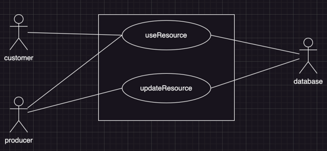
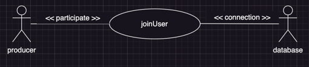
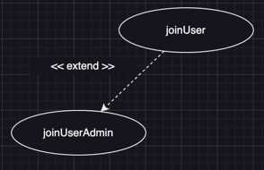
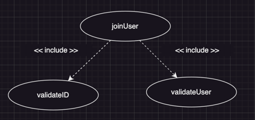
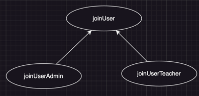
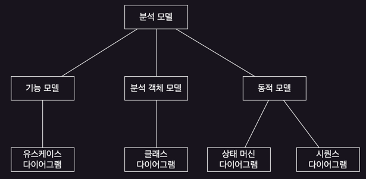
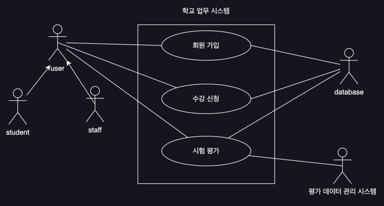
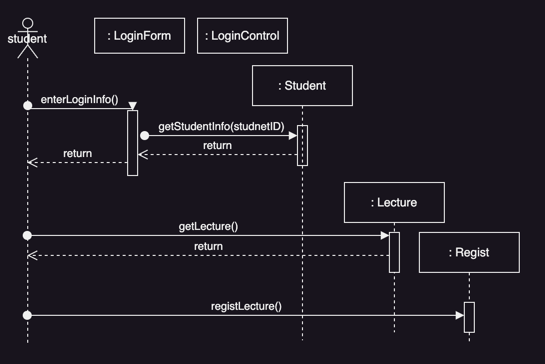
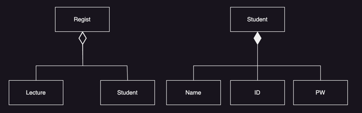
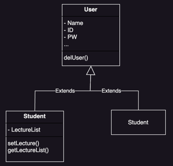

# 객체지향 분석과 설계

## 객체지향 분석과 설계

- 시스템을 상호작용하는 객체로 모델링
    - 모델 : 객체의 협력과 상호작용을 표현
    - UML : 시스템 구성, 정적 구조, 동적 행위 등을 표현
- OOA Object-Oriented Analysis : 객체지향 분석
    - 시스템의 요구사항을 파악하고 객체로 모델링하는 과정
- OOD Object-Oriented Design : 객체지향 설계
    - OOA를 통해 도출된 객체를 소프트웨어 구성요소로 변환하는 과정
- OOA와 OOD를 반복적, 점증적으로 수행함

### OOA Object-Oriented Analysis

- 시스템의 기능적인 무엇을 수행하는가
- 유스케이스 다이어그램, 유스케이스 명서
- 문제 도메인을 분석하여 개념 모델 작성
- 클래스 다이어그램, 상호작용 다이어그램

### OOD Object-Oriented Design

- 시스템을 어떻게 만들것인가
- 분석 과정의 모델을 비기능적 요구사항과 아키텍처를 고려하여 변환
- 개념 클래스는 구현클래스로 변환
- 응답시간, 처리율, 실행 플랫폼, 개발 환경, 프로그래밍 언어 고려

## 요구사항 추출

- 고객이 이해할 수 있는 요구사항 명세서 작성
- 요구사항 명세서를 분석활동을 진행하면서 구조화, 정형화
    - 초기에는 자연어로 표시
- 시나리오에 기초하여 요구사항 추출
    - ex. 액터, 유스케이스, 시나리오, 유스케이스 상세화, 비기능 요구사항 등을 정의

### 액터

- 액터 : 시스템과 상호작용하는 사람 or 외부 시스템
- 액터 식별
    - 요구사항 추출의 첫 단계
    - 시스템이 지원해야하는 사용자 식별
    - 액터는 시스템 경계 외부에 존재

#### 액터 찾기

- 시스템 지원을 받는 사용자
- 시스템 기능을 실행하는 사용자 그룹
- 유지보수, 감독하는 사용자 그룹
- 시스템과 상호작용하는 외부 하드웨어, 소프트웨어 시스템

### 시나리오

- 액터가 보는 시스템의 단일 기능을 이야기 식으로 기술
- 응용 분야의 용어를 사용하여 단일기능 표현

#### 시나리오 vs 유스케이스

- 시나리오는 특정 상황에 초점을 두어 기술하지 않음

#### 시나리오 찾기

- 시스템이 수행해주길 바라는 작업
- 액터가 액세스하는 정보
- 액터가 알려주어야하는 외부 환경 변화
- 시스템이 알려주어야하는 사건

> 시라니오 예시 : 회원가입 > 학생  
> 시나리오 이름 : joinStudent
> 액터 : 비회원 홍길동
> 1. 홍길동이 사이트에 접속하여 학생 회원가입 버튼을 누른다
> 2. 회원가입 페이지에 들어온다
> 3. 아이디 중복 검사를 한다.
> 4. 데이터베이스에서 아이디 중복 일치여부를 확인해 알려준다.
> 5. 학번을 입력한다
> 6. ... (생략)

### 유스케이스

- 해당 기능의 **모든 가능한 시나리오**에 대한 명세
    - 액터에 의해 실행되며 상호작용에 관한 완전한 흐름 표현
    - 실행 후 다른 액터와 상호작용
    - 유스케이스 이름은 액터 입장의 동사구로 표현
- 유스케이스의 인스턴스가 시나리오
    - 시나리오는 특정 하나의 사례
    - 유스케이스는 유사 기능의 모든 사례
    - joinUser : 시나리오
    - joinStudent : 유스케이스
- 참여 액터 : 유스케이스를 시작시키는 액터와 정보를 제공받는 액터

#### 유스케이스 명세 예시

- 선행 조건과 종료조건 : 유스케이스 발생가능 조건과 종료 조건 기술
- 기본 이벤트 흐름 : 시스템과 액터의 성공적 상호작용
- 대체 이벤트 흐름 : 부수적이며 선택적인 상호작용
- 특수 요구사항 : 비기능적 요구사항

> 유스케이스 예시 : 회원가입  
> 유스케이스 이름 : joinUser  
> 참여 액터 : 비회원이 유스케이스 시작, 비회원이 정보를 제공하고 제공받음  
> 선행 조건 : 회원이 아니어야 하며, 홈페이지에 들어와 본인이 가입하고자 하는 등급을 선택한다. 데이터 정합성 검사를 위한 데이터베이스 가동 중
>
> 기본 이벤트 흐름
>    1. 비회원이 홈페이지에 접속하여 회원가입 버튼을 누르면 유스케이스 시작
>    2. 시스템이 등급을 제시
>    3. 비회원이 등급을 선택하고 가입 정보 제공
>    4. ... (생략)
>
> 대체 흐름  
> 2a. 시스템이 등급을 제시하지 못할 경우, 홈페이지로 되돌아가게 한다  
> 3a. ... (생략)
>
> 종료 조건
> - 아이디 비밀번호를 정상적으로 입력받아 가입이 완료
>
> 특수 요구사항 : 회원 가입 페이지에서 10분 이상 머물 수 없다.

#### 유스케이스 상세화

- 요구사항을 상세히 명세
    - 시스템이 제공하는 기능 자세히
    - 유스케이스의 완성도와 정확성을 높임
    - 시나리오에 포함되지 않았던 기능을 파악해 예외사항으로 기술하거나 새로운 유스케이스 추가
- 고려 사항
    - 시스템이 다루는 대상을 상세히
    - 저수준의 상호작용, 예외 사항으 파악과 처리를 명시
    - 유스케이스들에서 공통 기능 추출

### 액터와 유스케이스의 관계 찾기

- 모델의 복잡성을 줄이고, 이해도를 높이기 위함
- 통신, 확장, 포함, 상속 관계 정리

##### 통신 관계

- 유스케이스와 액터 혹은 유스케이스 간의 관계 표시
- 시스템의 접근 권한 표시

##### 확장 관계

- 특정 조건 하에 확장된 행위를 유스케이스를 분리하여 표시
- **예외적이며 선택적인 흐름**
- 기본 유스케이스는 그 자체로 완전한 유스케이스

#### 포함 관계

- 유스케이스들에서 존재하는 공통 기능 분리
- 재사용성, 중복성
- 화살표 방향에 유의

#### 상속 관계

## 분석

### 기능 모델

- 요구 추출에 유스케이스와 사용자 스토리 방법 사용
    - 사용자 스토리?
        - 초기 요구사항 발견과 프로젝트 계획에 사용되는 짧은 대화형 텍스트
        - 애자일에 많이 사용
        - 2~4 문장 정도로 간단하게 작성
- 계속적 수정 보완

#### 유스케이스 다이어그램

- 소프트웨어 시스템과 외부 환경과의 상호작용 표현
- 막대인간 :  액터
- 사각 박스 : 시스템 경계
- 타원 : 유스케이스
- 직선 : 유스케이스 시작시키거나 결과를 받음

### 분석 객체 모델

- 응용 도메인을 설명하는 개념 모델

### 동적 모델

- 시퀀스 다이어그램 : 개념 모델을 확장하여 액터와 시스템의 상호작용 표현
- 상태 머신 다이어그램 : 단일 객체의 상태 변화를 모델링

#### 시퀀스 다이어그램

- 단일 유스케이스에서 객체들의 상호작용 표현
- 개별 클래스에 책임 할당
- 설계 과정을 거침녀 하나의 클래스는 소스 코드상 하나 이상의 구현 클래스에 대응

#### 상태 머신 다이어그램

- 단일 객체 관점에서 시스템의 행위 표현
- 긴 생명주기와 상태 종속적 행위를 하는 객체를 표현하는 것이 적합
- 주로 제어 객체를 대상으로 작성

### 자연언어 분석 방법

- 명사 : 클래스
- have 동사 : 집합 관계
- be 동사 : 상속 관계
- 형용사 : 속성

### 주요 활동

- 엔터티 / 경계 / 제어 객체 찾기
    - 엔터티 객체 찾기 Entity
        - 엔터티 객체는 시스템이 유지하는 정보 표현
        - 유스케이스 작성을 위해 명확히 규정한 용어, 반복적으로 동사 등장
        - 실세계의 개체나 유지해야하는 행위 정보, 데이터 소스나 종착지 등
    - 경계 객체 찾기 Boundary
        - 사용자 인터페이스를 모델링
        - 액터에게 받은 정보를 엔터티 객체나 제어 객체가 사용할 수 있는 형태로 변환
        - 각 액터는 적어도 하나의 경계 객체를 통해 상호작용
        - 사용자 인터페이스 컨트롤, 데이터 입력 폼, 사용자에게 제공하는 메시지 등
    - 제어 객체 찾기 Control
        - 실제적 기능을 수행하는 부분
        - 경계객체와 엔터티 객체 사이의 조정자
        - 경계 객체로부터 정보를 받아 엔터티 객체로 보냄
        - 유스케이스당 하나 또는 액터당 하나의 제어 객체 필요
        - 유스케이스가 시작될 때 생성되고 종료될 때 제거
- 유스케이스 -> 시퀀스 다이어그램 변환
- 연관, 집합체 찾기
- 속성찾기
- 객체의 상태 종속적 행위 모델링
- 객체 간의 상속 관계 모델링

### 객체 종류를 구분 표기법

- 스테레오 타입을 사용하여 메타정보 추가
    - ex. <<boundary>>, <<control>>, <<entity>>
- 이름에 접미사 사용
    - ex. Loan은 엔터티, LoanForm은 경계 객체, LoanControl는 제어 객체

### 유스케이스 -> 시퀀스 다이어그램 변환

- 유스케이스를 실현하는 객체들의 협력 표현
- 위 그림은 수강신청 유스케이스 예시

### 집합체 연관 찾기

- 전체 - 부품관계를 표현하는 특별한 유형
- 구성 집합체는 부품의 존재가 전체에 의존하는 경우
- 공유 집합체 연관은 독립적으로 존재하거나 여러 집합체에 의해 공유될 수 있음

### 속성 찾기

- 객채의 특성을 표현
- 소유의 의미를 가지는 단어, 형용사를 조사로
- ex. Student와 Lecture 사이의 LectureList 속성

### 객체의 상태 종속적 행위 모델링

- 상태 머신 다이어그램은 단일 객체의 행위를 기술
- 긴 생명주기와 상태 종속적 행위를 가지는 제어 객체들 표현

### 객체간의 상속 관계 모델링

- 상속관계를 모델링하여 중복성 제거

## 시스템 설계

- 분석 모델을 시스템 설계 모델로 변환하는 작업
    - 분석 모델은 시스템의 내부 구조, 하드웨어 등의 관한 정보는 포함 안함
- 시스템 설계 결과물
    - 설계 목표 정의
    - **시스템 아기텍처 결정**
    - 경계 조건 기술 : 시스템 설치, 시작, 종료 및 예외 처리 사항

### 설계 목표 설정

- 시스템 설계의 시작
- 비기능 요구사항과 응용 도메인으로부터 유도

#### 성능 요인

- 반응 속도, 처리량, 메모리 용량 등

#### 의존성 요인

- 강건성 : 부정확한 사용자 입력에 견디는 것
- 신뢰도 : 소장없이 명세된대로 행위
- 가용성 : 시스템을 사용할 수 있는 시간의 백분율
- 결함 내성 : 잘못된 조건하에서 동작할 수 있는 능력
- 보안 : 악의적 공격을 이길 수 있는 능력
- 안전 :오류나 고장이 생겨도 생명의 위협을 피할 수 있는 능력

#### 그 외 요인

- 비용 요인
    - 개발, 배포 비용
    - 유지보수, 관리 비용
    - 새제품 호환, 하위 호환성 보장 비용
- 유지보수 요인 : 확장성, 수정성, 적응성, 이식성 등
- 사용자 요인 : 유용성, 사용성 등

### 아키텍처 설계에서 다루는 문제

### 하드웨어와 소프트웨어의 연결

- 하드웨어 기능 결정
- 컴퓨터 간의 통신 구현 방법
- 기성 컴포넌트나 COTS를 이용 할 수 있는가
- 데이터 관리
    - 데이터베이스 관리 시스템이나 데이터 관리를 전담하는 서브 시스템 선정
- 접근 제어
    - 데이터 접근에 관한 정책을 정하고 구현 방법을 정함
- 제어 흐름
    - 시스템 동작 순서
    - 이벤트 중심 제어, 동시 사용자 허용 여부 등
- 경계 조건
    - 시스템의 시작과 종료 방법
    - 예외 상황 저리 방법

## 통합 프로세스 Unified Process

- **객체지향 분석과 설계를 위한 방법론**
- 여러 개발 방법론의 장점 통합
- 반복적이고 점증적인 프레임워크
- RUP Rational Unified Process
    - UP를 다듬어서 HTML로 문서화한 제품

#### UP 강조사항

- 반복적 개발
- 유스케이스 기반의 개발
- 아키텍처를 중요시 여김
- 프로젝트 초기에 위험을 다룰 것

### UP 생명주기

- RUP는 작업을 프로세스 분야 discipline에 따라 구분
    - 공학 6 : 비즈니스 모델링, 요구사항, 분석과 설계, 구현, 테스트, 배포
    - 지원 3 : 형상관리, 프로젝트 관리, 환경
- 생명주기
    - 도입, 정련, 구축, 전이 4단계
    - 정련, 구축, 전이는 일련의 반복으로 구성
- 도입, 정련, 구축, 전이의 반복단계에서 각 분야의 비중은 다름
    - 초기에는 요구사항, 분석과 설계 비중이 큼
    - 후반에는 구현, 테스트 비중이 높아짐

#### 도입 Inception

- 1주 정도의 짧은 기간 수행
- 시스템 범위 정하고, 비즈니스 사례를 파악
- 주요 요구사항 나열, 10% 정도의 유스케이스 상세히 작성
- 아키텍처를 정하고, 위험 목록 작성
- 일정, 비용 추정, 실현 가능성 조사

#### 정련 Elaboration

- 핵심 아키텍처 구축, 요구사항 명확히 정의
- 높은 ㅜ이험 요소 해결, 일정 / 자원을 상세히 추정
- 2~6주 기간의 반복을 2~4회 수행
- 주요 요구사항 설계 및 구현
- 전체적으로 15% 정도 구현

#### 구축 Construction

- 남은 부분 설계 및 구현, 통합
- 고객에게 인도 준비

#### 전이 Transition

- 고객에게 인도
- 사용자 지원, 유지보수
