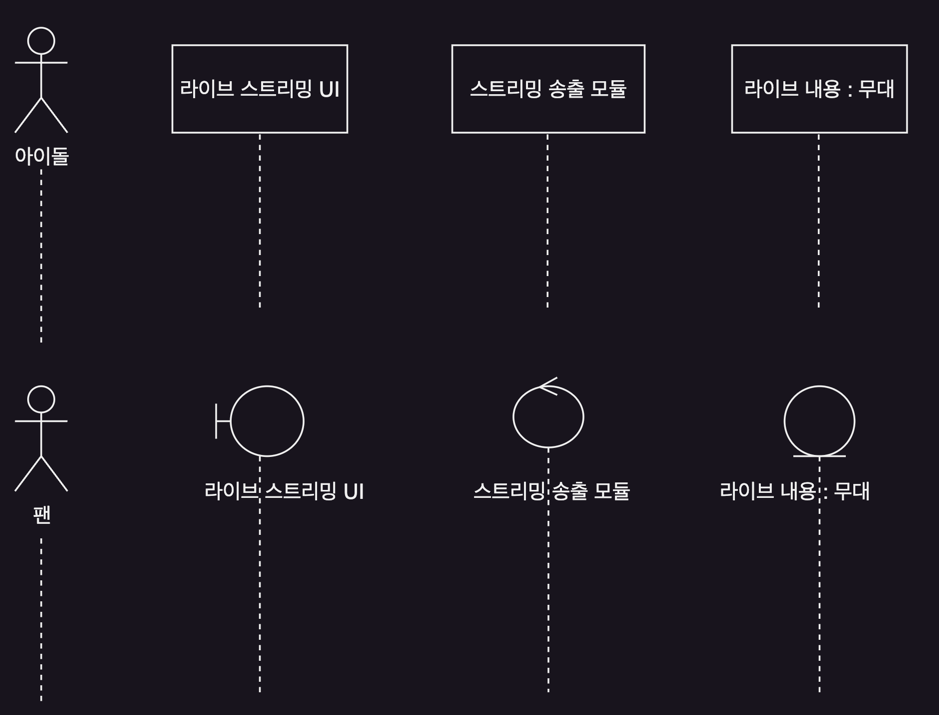
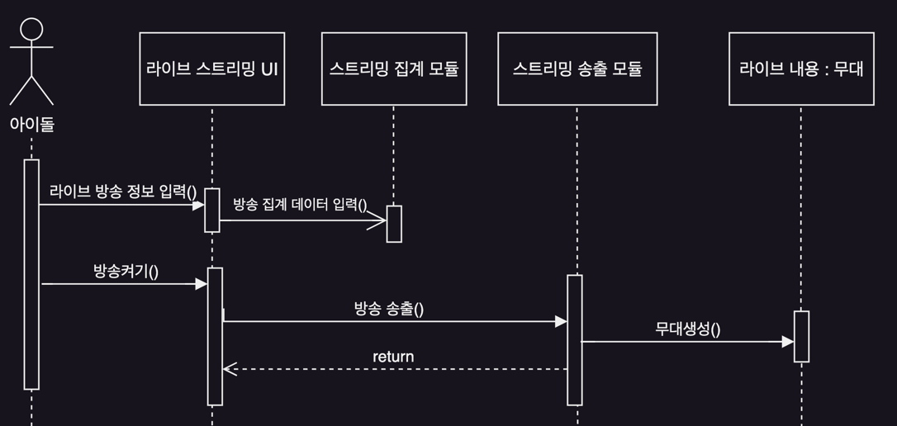
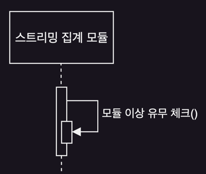
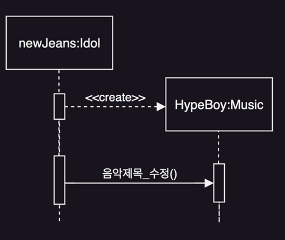
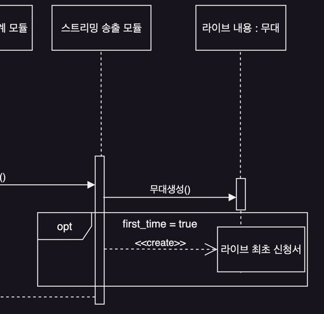

# 상호작용 다이어그램

- 상호작용 다이어그램
- 시퀀스 다이어그램
- 통신 다이어그램

## 상호작용 다이어그램

- 구성 요소 사이의 상호작용 표시
- 유스케이스를 수행하기 이전 객체들이 어떻게 상호작용하는지 표현
- 하나의 유스케이스에 대해 객체간의 상호작용을 다이어그램으로 표시함
- ex. 시퀀스 다이어그램, 통신 다이어그램
    - 시퀀스 다이어그램과 통신 다이어그램은 1:1 변환 가능

## 시퀀스 다이어그램

#### 시스템의 구성요소들이 어떻게 상호작용하는지 시각화

- 목표 시스템의 논리 명세
- 특정 객체들이 활성화, 동작, 호출하는 순서 나타냄
- 메시지, 시간의 흐름에 따라 표시
- 동적 행위 표현 모델 중 가장 많이 활용됨

#### vs 통신 다이어그램

- 시퀀스 다이어그램 : 울타리 형태, 메시지 흐름, 시간 파악에 용이
- 통신 다이어그램 : 상호작용하는 객체들의 관계파악에 용이

### 참여 요소와 생명선

  

- 참여 요소 : 메시지를 주고 받는 주체
    - 객체, 서브 시스템, 외부 시스템, 하드웨어 등
    - 사각형, 다이어그램 상단에 적당한 간격으로 수평 배치
- 참여 요소 순서 : 액터 -> 경계 객체 -> 제어 객체 -> 엔터티 객체
- 생명선
    - 참여 요소에서 아래쪽으로 향하는 점선
    - 상호작용 순서를 나타내는 시간 축
    - 위에서 아래로 시간 흐름
- 참여 요소 이름 표기법
    - 이름[선택자] : 클래스명 ref 상호작용 다이어그램
    - :Student - Student 클래스의 익명 객체
    - admin:Administer - Administer 클래스의 admin 객체
    - :RegistrationSystem ref reg_detail - RegistrationSystem 서브시스템이고, 세부내용은 상호작용 다이어그램 reg_detail 참조

### 메시지

  

#### 이벤트 발생 : 메시지, 시그널 전송

- 화살표 표시
- 이벤트 발생 = 상호작용 존재
- 메시지 전송 = 수신자에게 메서드 실행 요청 이벤트 발생
- 메시지 실행순서는 위에서 아래로

#### 활성자 막대

- 수신 객체가 활성화된 상태
- 수신자가 주어진 이벤트에 대한 행위를 하는 상황 표현

#### 메시지 호출자와 메시지 수신자

- 메시지를 보내고 받는 참여 요소
- 호출 메시지가 동기화 메시지면 검은 삼각형 화살표 머리로 표시
- 리턴 메시지는 점선의 화살표
- 의미가 명확하면 리턴 메시지 생략 가능

### 메시지 형식

- 속성 = 메시지 이름(파라미터) : 리턴 형식
    - 파라미터
        - 여러 파라미터는 ,로 구분
        - 형식은 '이름:타입'
    - doSomething(num1:Number, num2:Number) : void
    - temp=method():MyClass
        1. 리턴 형식이 MyClass인 메서드 호출
        2. 메서드 결과를 temp 변수에 저장
- 메시지 형식이 자세하면 시퀀스 다이어그램으로 코드 생성 가능
    - 정적 클래스 골격 생성
    - 클래스 다이어그램과 함께 설계와 구현의 매개체

### 동기화 / 비동기화 메시지

- 동기화 메시지
    - 송신자가 메시지를 보낸 후, 수신자의 메시지를 처리와 리턴 메시지를 기다림
    - 일반적인 메서드
- 비동기화 메시지
    - 메시지를 보낸 후 리턴을 기다지 않고 다음 작업 진행

### 기타 메시지

    

   

- 자기 메시지 self message
    - 활성화 상태가 중첩되게 표시
    - 객체가 자신에게 메시지를 전송하는 경우
- 생성과 삭제 메시지
    - 참여 요소를 생성, 삭제 하는 경우
    - 생성은 \<\<create>>
    - 삭제는 \<\<destroy>>
    - java, C#과 같이 가비지 컬렉션을 지원하는 언어에서는 삭제 메시지를 사용하지 않음

### 시퀀스 프래그먼트

    

- 시퀀스 다이어그램 안에서 박스로 표시된 영역
- 다이어그램의 복잡성을 줄이고 구조화하기 위함
- 복잡한 상호작용 표현 : 선택적 실행, 반복 실행 등
- 박스 좌측 상단의 프레그먼트 유형을 표현사는 operator
    - opt : 가드 조건 만족시만 수행되는 상호작용
    - alt : 점선으로 나뉜 여러 부분 영역 중 조건에 따라 하나가 선택적 수행
    - loop : 가드 조건이 만족하는 동안 반복 수행
    - ref : 외부에 정의된 시퀀스 다이어그램 참조
    - par : 상호작용들을 병렬 수행

## 통신 다이어그램

####                 