# 액티비티 다이어그램

- 액티비티 다이어그램
- 객체와 객체 흐름
- 조건과 병합 노드
- 병렬 처리와 확장 영역
- 시그널과 파티션

## 액티비티 다이어그램

### 액티비티

- 액티비티는 작업의 실행을 의미
- 일련의 액션들과 제어 흐름으로 표현
- 액션보다 상위 개념의 행위
- 액션
    - 액티비티를 수행하기 위해 필요한 단일 작업
    - 액티비티에 포함되는 하나의 세부 단계
    - 더 이상 분해되지 않는 단일 작업

### 액티비티 다이어그램

- 업무 흐름이나 계산 과정을 액션들의 흐름을 통해 단계적 표현
- 흐름도와 유사, 순차실행, 조건 분기, 병행 처리 등의 제어 흐름 표현 가능
- 비즈니스 프로세스, 오퍼레이션 제어 흐름 표현 가능
- 4+1 뷰에서 프로세스 뷰를 표현하는 UML 다이어그램
- 구성요소
    - 액션과 액티비티
    - 제어 노드
    - 화살표 : 제어 / 객체 흐름 표현
    - 객체 노드
- 표기법
    - 모서리가 둥근 사각형 : 액티비티와 액션
    - 액티비티 내부에 액션들 포함
    - 실선 화살표 : 액션 사이의 제어 흐름  
      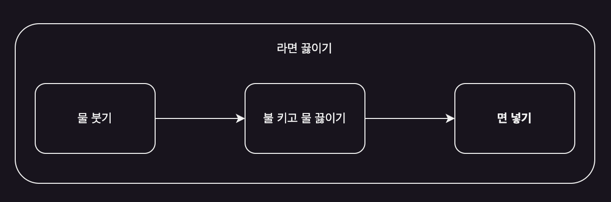

### 액티비티 시작과 종료

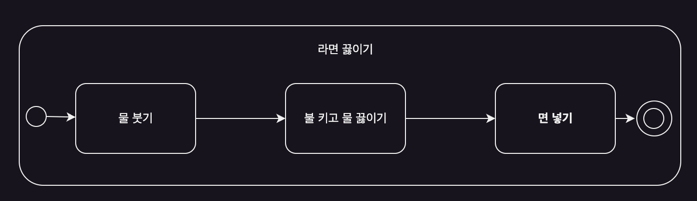

- 시작 노드 : 액티비티의 출발을 의미
    - 대개 하나의 액티비티에서 하나의 시작노드 존재
    - 입력 데이터나 시그널을 받아 시작하는 경우 시작노드가 없기도 함
    - 검은색 원으로 표시
- 종료 노드 : 액티비티의 종료를 의미
    - 액티비티 종료 노드 activity final node라고도 함
    - 액티비티 내의 모든 흐름을 종료
    - 일반적으로 하나이나 1개일 필요는 없음
    - 검은 원이 있는 원
- 흐름 종료 노드 : 해당 흐름 하나만 종료하는 노드
    - 전체 액티비티 종료 아님
    - 병렬 흐름이 발생할 때 특정 흐름을 종료하기 위함
    - X 표시를 포함한 원

## 객체와 객체 흐름

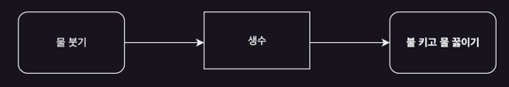

- 객체 : 액션의 입력이나 출력으로 사용되는 데이터
    - 물리적인 객체를 의미할 때도 있음
    - 사각형으로 표시
    - 이름에 밑즐을 그어 인스턴스임을 강조 가능
- 객체 흐름
    - 객체와 액션 사이의 화살표
    - 객체를 제공하거나, 객체를 입력 받아 사용하는 액션 표현
    - 액티비티에서 테이터의 흐름을 강조

#### 객체 사용의 이유

- 액티비티 다이어 그램은 객체 노드를 사용하여 데이터 흐름 표현
- 객체의 생성, 사용, 변경 명세가 가능
- 액션을 통해 객체의 상태 변화 명세

### 입력핀과 출력핀 pin

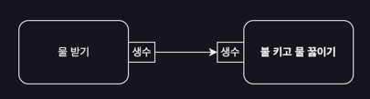

- 입/출력 핀을 사용하여 객체 흐름 표현 가능
    - 핀 : 입/출력에 필요한 파라미터
- 액션의 입출력이 필요함을 강조하는 편
- 출력핀 : 액션의 결과로 객체가 출력됨
- 입력 핀 : 객체가 액션의 입력으로 사용됨

### 객체 흐름에 스테레오 타입 사용하기

#### 객체 전체가 아닌 일부만 전달되는 상황 표현

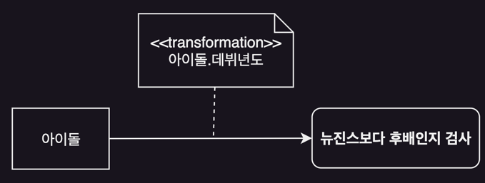

- 객체 흐름에 노트 추가, \<\<transformation>> 스테레오 타입 사용
- 복수 개의 정보를 가진 객체에서 필요한 일부만 사용을 의미

#### 특정 조건을 만족하는 객체들만 전달되는 상황을 표현할 때

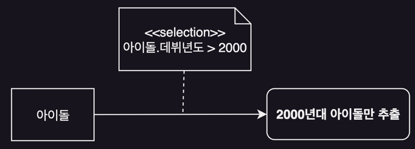

- 객체 흐름에 노트를 추가하고, \<\<selection>> 스테레오 타입 사용

### 객체 상태 표현하기

- 액션들의 흐름을 따라가며 객체의 상태가 바뀌는 것을 표현
- [] 표시를 사용

### 액티비티의 입출력 activity parameter

- 액티비티 자체의 입출력 표현을 위한 객체 사용
    - 액티비티에 사용되는 입출력을 표현
- 액티비티의 좌우 경계 부분에 객체 노드를 위치하여 표현
- 시작 / 종료 노드 생략 가능

## 조건과 병합 노드

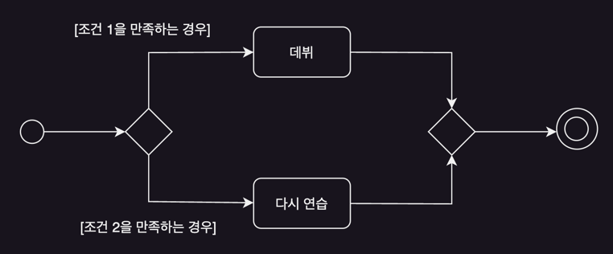

### 조건 노드 decision node

- 조건에 따른 선택적 흐름의 실행 표현
    - 마름모
    - 1개의 입력 화살표와 2개 이상의 분기
    - 조건 노드에서 나오는 흐름에 조건을 [] 안에 표시

### 병합 노드 merge node

- 조건 표시 주의 점
    - 모든 조건은 서로 배타적
    - 모든 경우를 조건들로 표시
    - else와 같은 조건 사용 가능
- 조건에 따른 액션흐름들은 병합 노드로 합쳐짐
- 병합 노드의 진입 흐름 중 하나가 완료되면 진행될 수 있음

## 병렬 처리와 확장 영역

- 병렬 처리를 표현하기 위해 포크 fork와 조인 join 노드 사용
- 수직 (또는 수평) 의 굵은 막대료 표시

### 포크와 조인

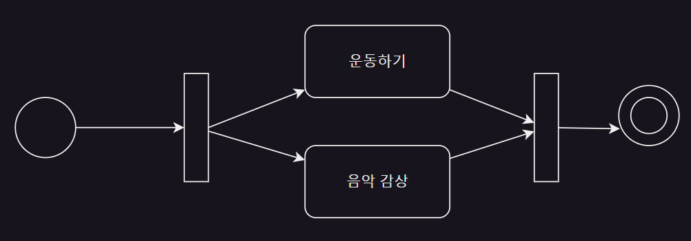

- 포크 : 포크 뒤의 흐름은 2개 이상으로 나뉘어 동시에 진행
- 조인
    - 동기화 : 동시에 진행되었던 흐름들이 조인을 통해 동기화
    - 동기 : 동시 수행되었던 흐름들이 모두 종료되어야 조인을 통해 다음 흐름으로 이어짐

### 확장 영역

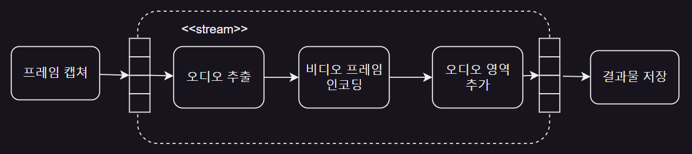

- 입력 객체가 collection 일 때
- 이 모든 요소들이 수행하는 액션들을 하나의 그룹으로 표현
- 확장 영역으로 액션들을 포함하는 모서리가 둥근 사각형의 점선으로 표현
- 개별요소들로 나뉘어 연속적으로 처로딘 후 다시 조합됨
- 양쪽에 연결된 4개의 사각형을 위치시켜 입/출력 표현
- \<\<parallel>> : 요소들의 병행 처리
- \<\<iterative>> : 요소들을 하나씩 순차적으로 처리
- \<\<stream>> : 요소들을 스틞으로 처리

## 시그널과 파티션

### 시그널

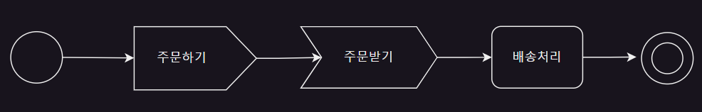

- 시그널 주고받기 : 외부의 사람, 시스템, 프로세스등과 상호작용
    - e.g. 이벤트 발생으로 메시지를 송/수신
    - 신용카드 결제를 위해 카드회사와 상호작용, 버튼 클릭 시 이벤트 처리, 고객에게 메시지 전송 등
- 비동기적 : 시그널을 보내고 응답을 기다리지 않고 바로 다음 액션을 수행 가능
    - 동기화하기 위해서는 시그널 송신과 수신을 나란히 위치

#### 시그널 수신 액션

- 시그널 발생을 기다리는 액션
- 오목 오각형으로 표시
- 시그널을 수신하면 연결된 다음 액션을 실행
- 시그널이 언제 올지는 모르고 기다리는 중
- 입력 흐름이 없는 시그널 수신은 액티비티의 시작점이 될 수 있음

#### 시그널 송신 액션

- 시그널을 생성하여 전송
- 볼록 오각형
- 외부 참여자에게 시그널을 보내면 응답을 기다리지는 않음

### 인터럽트

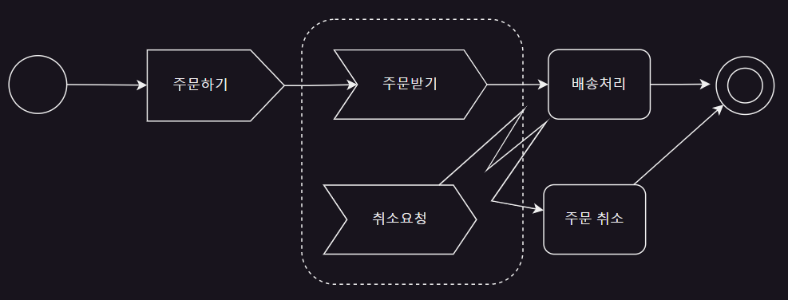

- 시그널을 이용하여 인터럽트 상황 표현
- 인터럽트 : 특정 사건 발생 시 영역 내 모든 프로세스가 종료되는 상황
- 인터럽트 영역
    - 인터럽트가 발생할 수 있는 영역으로 취소 가능한 액션들을 포함
    - 모서리가 둥근 점선 사각형으로 영역 표시

### 파티션

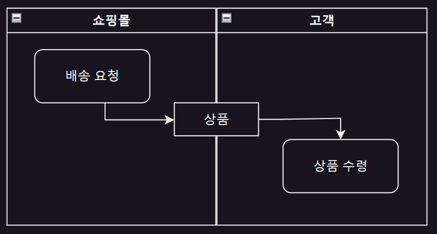

- 액션에 책임지는 참여자를 표현하기위해 파티션 또는 레인으로 구분
- 액티비티에 포함된 액션을 수행하는 주체는 하나 이상 가능
- swimlane 이라고도 함

### 액티비티 호출과 재사용성

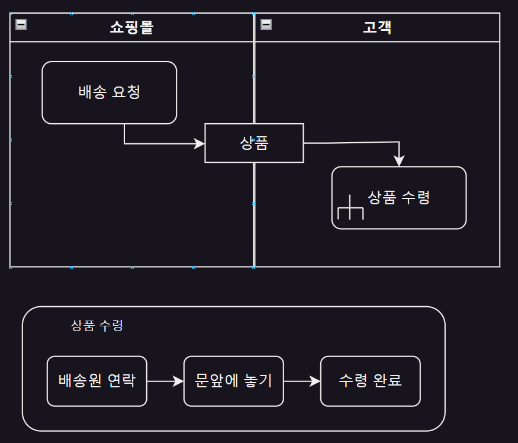

- 호출 액티비티 액션
    - 다른 액티비티를 호출하는 액션
    - 가독성과 재사용성을 높이기 위해 익티비티를 별도의 다이어그램으로 분리
    - 액티비티 다이어그림이 너무 커질 때, 또는 자주 사용되는 일련의 액션들이 중복될 때
    - 분리된 다이어그램은 다른 액티비티 다이어그램에서 호출 가능

### 타임 이벤트

#### 액티비티의 실행 흐름에서 시간적 요인을 표현해야 하는 경우

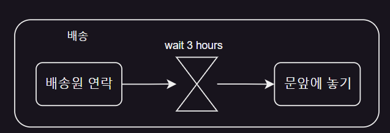

- 모래시계 기호로 표시
- 정해진 시간을 기다려야하는 상황
- 입력 흐름을 가진 타임이벤트는 한번만 일ㅇ남

#### 규칙적 시간 간격을 두고 반복되는 상황 표현

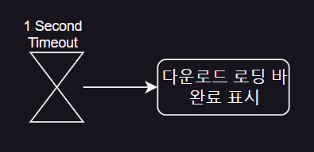
