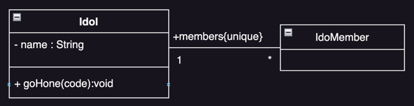
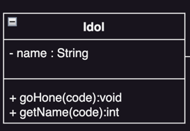

# 클래스 다이어그램과 객체 다이어그램

- 객체지향 개념과 클래스
- 클래스 표기
- 클래스 다이어그램
- 객체 다이어그램

---

## 객체지향 개념과 클래스

- 클래스 : 객체의 설계도
- 객체 : 클래스로부터 생성된 인스턴스
- 클래스 다이어그램
    - 크랠스의 명세, 관계 표시
    - 동작에 필요한 구성요소
    - UML에서 가장 활용도가 높음
    - 개념 클래스 -> 구현 클래스

### 클래스의 구성

#### 상태 state

- 데이터, 객체가 가지는 정보
- 실제 구현에서는 객체에 소속된 변수
- e.g. `Student` 클래스의 `name`, `id`, `department` 등

#### 동작 behavior

- 객체가 수행하는 기능
- 실제 구현에서는 객체에 소속된 메서드
- e.g. `Student` 클래스의 `register()`, `drop()`, `changeDepartment()` 등

### 객체지향 개념

#### 추상화 abstraction

- 복잡한 것을 간단하게
- 클래스의 설계 목적에 맞는 속성과 메서드를 선택
- 불필요 속성과 메서드는 제거

#### 캡슐화 encapsulation

- 캡슐에 담아 상호작용에 필요한 것만 노출
- 외부에서 접근 가능한 것과 불가능한 것을 구분
- 정보 은닉 : 내부 속성, 메서드를 숨김
- 인터페이스가 그대로 유지되면 내부 구현 변경에도 영향 없음

## 클래스 표기

- 위에서부터 클래스명, 속성, 메서드 표시
- 속성, 메서드 생략 가능

#### 접근제어

- `+` : public
- `#` : protected
- `~` : packagej
- `-` : private

### 속성

- 클래스 두번쨰 영역 표시
- 연관 관계 표시 가능
- 접근제어/이름:타입 관계수
    - e.g. `+name:String[1]` : public, 이름은 `name`, 타입은 `String`, 관계수는 `1`
- 관계수 : 클래스 간의 관계, 1:1, 1:N, N:M 등
- 제약 사항 : 제약조건, 속성의 성질
    - e.g. {unique, ordered, readOnly, ...}

### 메서드

- 클래스 세번째 영역 표시
- 접근제어 이름(인자):반환타입 {제약사항}
    - e.g. `+register(course:Course):boolean` : public, 이름은 `register`, 인자는 `course`, 반환타입은 `boolean`

### 정적 요소 static

- 속성이나 메서드를 정적으로 선언
- 이름에 밑줄을 그음
- 특정 객체 소속 아님
- e.g. 현재 객체의 실행횟수를 저장하는 변수

## 클래스 다이어그램

## 객체 다이어그램
